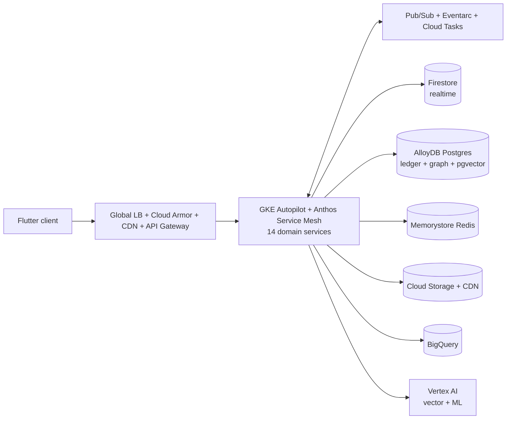

# 00 — Overview

## 1. Why we are doing this

GreenGo has reached the point where its **Firebase-native monolith** — a Flutter client over **~200 Cloud Functions** and **~90 Firestore collections / 151 composite indexes** — is a liability for the next order of magnitude of growth. The specific pressures:

- **Function sprawl.** ~200 individually-deployed functions (164 `onCall`, ~31 scheduled, ~26 Firestore triggers) with no domain boundaries, cold-start tax, and no coherent way to reason about blast radius.
- **Wrong tool for the money.** Coins, payments, and subscriptions run on Firestore documents with **duplicate schemas** (`coinTransactions` *and* `coin_transactions`, `coinBalances` *and* `coin_balances`). Ledgers demand ACID, reconciliation, and auditability.
- **Cost & query ceilings at scale.** Firestore read/index cost and query expressiveness become limiting for the social graph (matches/likes/swipes) and analytics.
- **No real platform.** The `terraform/` in the repo references five modules that do not exist on disk and hardcodes `nodejs18`; the `backend/` Django skeleton imports ten app packages that do not exist; there is **no Kubernetes anywhere**. There is nothing to safely stand behind a "millions of users" claim.
- **Security debt.** The Cloud Text-to-Speech API key is **exposed client-side** (`lib/core/services/pronunciation_service.dart`, key stored in Firestore `app_config`).

## 2. What we are (and are not) doing

**We ARE** building a hybrid platform: Firestore stays for realtime; a managed-data + GKE platform takes everything else; we migrate one domain at a time.

**We are NOT** doing a big-bang rewrite, and we are NOT ripping Firestore out. Firestore is genuinely best-in-class for realtime chat, presence, feeds, and fan-out at millions of users — GreenGo already implements the right patterns there (fan-out inboxes, sharded index, geohash, precomputed candidate pools). Discarding that would be the most expensive and riskiest possible path.

## 3. Guiding principles

| Principle | Meaning in practice |
|-----------|---------------------|
| **Strangler-Fig** | Route new/rebuilt domains to the new platform behind a facade; retire the old path only after the new one proves out. Never a flag day. |
| **Always live, always earning** | No phase takes the app down. Revenue paths (coins, subscriptions, IAP) migrate with dual-write + reconciliation, never a cutover-and-pray. |
| **Reversible by default** | Every migration step has a documented rollback. Cohort cutovers via Remote Config (already in the app) so we can flip back in seconds. |
| **Right tool per domain** | Realtime → Firestore. Ledger/graph/relational → AlloyDB Postgres. Analytics → BigQuery. Search/recs → Vertex. No dogma. |
| **Everything as code** | Infra in Terraform, K8s in Git (Argo CD). No console click-ops in staging/prod. |
| **Observability before traffic** | SLOs, dashboards, and alerts exist *before* a domain takes production load. |
| **Least privilege** | Workload Identity, per-service accounts, VPC-SC, no secrets in code, no client-side keys. |

## 4. The target in one diagram

Full detail: [02-target-architecture.md](02-target-architecture.md).

## 5. Phases at a glance

| Phase | Name | Outcome | User risk |
|-------|------|---------|-----------|
| **P0** | Foundation & landing zone | Org/projects, VPC, GKE, IaC, CI/CD, observability | none |
| **P1** | De-risk & baseline | Fix migration debt, remove client TTS key, SLOs, load test | low |
| **P2** | First domain to GKE | Media/analytics domain on GKE (golden path) | low |
| **P3** | Event backbone | Pub/Sub replaces trigger sprawl incrementally | low–med |
| **P4** | Money domain → AlloyDB | Coins/payments/subscriptions on Postgres (dual-write) | **high** |
| **P5** | Discovery/graph → AlloyDB + Vertex | Recommendations at scale | med |
| **P6** | Realtime scale-out & search | Optional WS tier, full-text search | med |
| **P7** | Decommission, multi-region, DR | Retire legacy, add Americas region, game days | low |

Full runbooks: [10-phased-roadmap.md](10-phased-roadmap.md).

## 6. The 14 domain services

Derived from the existing 19 function folders (deduped and consolidated):

`identity` · `profile/discovery` · `messaging/realtime` · `groups` · `events/catalog` · `payments/coins-ledger` · `subscriptions` · `notifications` · `safety/moderation` · `media` · `gamification` · `language-learning` · `analytics` · `admin`

## 7. Glossary

| Term | Meaning |
|------|---------|
| **Strangler-Fig** | Incremental replacement pattern; new system grows around the old until the old can be removed. |
| **Landing zone** | The baseline org/project/network/security scaffolding all workloads sit in. |
| **Golden path** | The blessed, templated way to build & ship a service (repo template + pipeline + manifests). |
| **Dual-write** | Writing to both old (Firestore) and new (AlloyDB) stores during migration for safety. |
| **Backfill** | Bulk-copying historical data from old store to new (via Dataflow). |
| **Reconciliation** | Automated diff between old and new stores to prove data parity before cutover. |
| **Cohort cutover** | Flipping a percentage/segment of users to the new path via Remote Config. |
| **ASM** | Anthos Service Mesh (managed Istio): mTLS, traffic splitting, telemetry. |
| **GitOps** | Desired K8s state lives in Git; Argo CD continuously reconciles the cluster to it. |
| **SLO / error budget** | Reliability target; the allowed unreliability before we freeze features. |

## 8. Assumptions to confirm during Phase 0

1. **Primary region `europe-west1`** — chosen for a globally-central, cross-cultural user base. Flip via [ADR-0005](adr/0005-region-strategy.md) if the majority of MAU is in the Americas (then `southamerica-east1` or `us-central1`).
2. Target NFRs (§ below) are the working contract until product signs off.
3. Team of ~8–12 engineers across the squads in [12-team-raci.md](12-team-raci.md).

### Working NFR targets

| Dimension | Target |
|-----------|--------|
| Scale | 1M → 5M MAU; 200–500k concurrent; headroom to 10M |
| Availability (core APIs) | 99.95% |
| Latency | API p95 < 250 ms; message delivery p95 < 500 ms |
| DR | RPO ≤ 5 min, RTO ≤ 30 min |
| Security | mTLS in-mesh, WAF at edge, no client-side keys, least-privilege IAM |
| Compliance | GDPR/CCPA deletion, audit logs, PII isolation |
