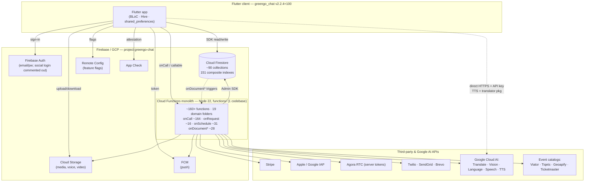

# 01 — Current-State Assessment

> Baseline inventory of the GreenGo platform **as it exists today** (Firebase project `greengo-chat`, number `666632803027`; Flutter app `greengo_chat` v2.2.4+100). This document is descriptive, not prescriptive — it describes *what is*, so every later migration phase has a measurable starting line. Proposed changes live in [00-overview.md](00-overview.md) and [02-target-architecture.md](02-target-architecture.md).
>
> Repo root: `C:\Users\Software Engineering\Desktop\Projects\GreenGo\GreenGo-App-Flutter`

---

## 1. System summary

GreenGo is a mobile-first, Firebase-native social/discovery platform delivered as a single Flutter application backed by a **Cloud Functions monolith** ("monolith" in the deployment sense: ~160+ functions live in one `functions/` codebase, sharing one runtime, one deploy unit, and one Firestore database). The client speaks directly to Firebase Auth, Cloud Firestore, Cloud Storage and FCM for the bulk of its work, and reaches Cloud Functions for anything requiring a trusted server (payments, IAP verification, moderation, translation, fan-out, ingestion, analytics). Firestore is both the operational database and, effectively, the event bus — most server logic is driven by `onDocument*` triggers and `onSchedule` cron rather than a dedicated messaging backbone. Third-party services (Stripe, Apple/Google IAP, Agora, Twilio, SendGrid/Brevo, Google Cloud AI APIs, and several event-catalog providers) are integrated almost entirely server-side, with two notable client-side exceptions (translation and Google Cloud TTS).

---

## 2. Client stack

The Flutter client (`pubspec.yaml`) is a broad Firebase consumer plus Google Maps/ML and cross-platform IAP.

### 2.1 Firebase packages

| Package | Version | Role |
|---|---|---|
| `firebase_core` | ^3.0.0 | SDK bootstrap |
| `firebase_auth` | ^5.0.0 | Auth (social login **commented out**) |
| `cloud_firestore` | ^5.0.0 | Primary datastore client |
| `firebase_storage` | ^12.0.0 | Media/voice/video blobs |
| `firebase_analytics` | ^11.0.0 | Product analytics |
| `firebase_messaging` | ^15.0.0 | Push (paired w/ `flutter_local_notifications` ^18.0.1) |
| `firebase_crashlytics` | ^4.0.0 | Crash reporting |
| `firebase_performance` | ^0.10.0 | Perf tracing |
| `firebase_remote_config` | ^5.0.0 | **Feature flags** |
| `firebase_app_check` | ^0.3.0 | Attestation |
| `cloud_functions` | ^5.0.0 | Callable-function client |

### 2.2 Google / Maps / ML packages

| Package | Role |
|---|---|
| `google_maps_flutter` | Map surfaces |
| `geolocator`, `geocoding` | Location + reverse-geocode |
| `google_mlkit_face_detection` | On-device face detection |
| `google_mlkit_text_recognition` | On-device OCR |
| `google_mlkit_image_labeling` | On-device labeling |
| `flutter_tts` | Device TTS (distinct from server Chirp TTS) |
| `translator` | Client-side translation (**53 references** across `lib/`) |

### 2.3 In-app purchase packages

| Package | Version | Role |
|---|---|---|
| `in_app_purchase` | ^3.3.0 | Cross-platform IAP facade |
| `in_app_purchase_android` | ^0.5.1 | Play Billing 8.x |
| `in_app_purchase_storekit` | (pinned) | StoreKit (iOS) |

### 2.4 Notable client observations

- **Agora is commented out** in `pubspec.yaml` (`agora_rtc_engine`) due to NDK build issues, yet **13 `lib/` files still reference it** — dead/blocked video-calling client surface.
- **Google Cloud TTS is called directly from the client** — `lib/core/services/pronunciation_service.dart` issues direct HTTPS to `texttospeech.googleapis.com` using an API key fetched from Firestore `app_config.cloud_tts_api_key` (voices `{lang}-Chirp3-HD-{Orus|Kore}`, cached in Firestore `pronunciation_cache`). See §8 — **security debt**.

---

## 3. Cloud Functions layer

### 3.1 Runtime & toolchain (`functions/`)

| Attribute | Value |
|---|---|
| Runtime | **Node 22** |
| `firebase-functions` | ^7.0.5 (**v2 API**) |
| `firebase-admin` | ^13.6.1 |
| TypeScript | 5.3 |
| Deploy | `firebase deploy` (codebase `default`, TS build predeploy) |
| Backend GCP libs | `@google-cloud/` bigquery, firestore, language, pubsub, secret-manager, speech, storage, tasks, translate, vision |
| Third-party libs | `stripe` ^14.8, `@apple/app-store-server-library`, `agora-access-token`, `twilio`, `@sendgrid/mail`, `googleapis`, `jsonwebtoken`, `sharp`, `fluent-ffmpeg`, `pdfkit` |

> Note: functions source is Node 22, but Terraform hardcodes `nodejs18` (see §7/§8 — **stale runtime**).

### 3.2 Trigger inventory (raw grep across `functions/src`)

| Trigger type | Count |
|---|---|
| `onCall` (callable) | ~164 |
| `onRequest` (HTTP/webhook) | ~16 |
| `onDocumentCreated` | 17 |
| `onDocumentUpdated` | 8 |
| `onDocumentWritten` | 1 |
| `onDocumentDeleted` | 1 |
| `onSchedule` (cron) | ~31 |
| `export const` (total symbols) | 427 |

`index.ts` re-exports ~200+ named functions; internal docs cite *"160+ functions across 12 domains."* The dominant integration pattern is **callable-first** (`onCall`), with Firestore document triggers as the secondary async mechanism — there is **no dedicated event bus** in production today.

### 3.3 The 19 active domain folders

All under `functions/src/`. Trigger column lists the mechanisms each domain uses.

| Domain folder | Purpose | Trigger types |
|---|---|---|
| `media/` | Image/video/voice processing, Speech API, disappearing-media cleanup | onCall + Storage + scheduled |
| `messaging/` | Translation via Cloud Translate, scheduled send/cancel | onCall + scheduled |
| `group_chat/` | "Culture Circles" fan-out to `user_group_inbox` | onDocumentCreated + triggers |
| `external_events/` | Ingesters (Viator/Tiqets/Geoapify/Ticketmaster), shard-index builder, geohash backfill | scheduled + onRequest |
| `events/` | Native per-country event aggregation, broadcast/message push fan-out, denormalized like counter, scheduled reminders | scheduled + triggers |
| `backup/` | Conversation backup/restore, PDF export (`pdfkit`), auto-backup | onCall + scheduled |
| `subscription/` | Purchase verify (Apple/Google), expiry, store server notifications | onCall + onRequest webhooks + scheduled |
| `payments/` | Stripe Checkout session + webhook | onCall + onRequest |
| `coins/` | Play/App Store coin verify, monthly allowances, expiry, rewards | onCall + scheduled |
| `coupons/` | Redeem/validate/admin, signup grants | onCall + onRequest |
| `analytics/` | Revenue dashboard, cohort, churn prediction (BigQuery), A/B tests, MRR/ARPU, fraud, tax, segmentation | onCall + scheduled (`predict-churn-daily`) |
| `gamification/` | XP, achievements, challenges, leaderboard rankings | onCall + scheduled |
| `safety/` | Content moderation (Vision/Language API), reporting/blocking, identity/photo verification, trust score | onCall |
| `admin/` | Dashboard metrics, roles, user mgmt, moderation queue, MVP access control, 2FA, AI support chat | onCall + triggers |
| `notifications/` | FCM send/bundle/analytics, push triggers (likes/matches/messages), SendGrid+Brevo email, welcome/digest/re-engagement | onCall + triggers + scheduled |
| `video_calling/` | Agora call init/answer/end/signaling, quality, recording, virtual bg/AR/beauty, group calls, breakout rooms | onCall + scheduled cleanup |
| `security/` | Security audit run/report | onCall + scheduled |
| `language_learning/` | Teacher applications, lessons CRUD, purchase/progress, learning analytics | onCall |
| `discovery/` | Candidate-pool precompute by country/gender/age | scheduled (every 10 min) + onCall |
| `presence/` | Presence update + location enrichment, stale cleanup | onDocumentUpdated + scheduled |

> `shared/` also exists as a common-utility folder (not a domain).

### 3.4 Legacy / duplicate folders (dead weight)

| Folder(s) on disk | Status | Live replacement |
|---|---|---|
| `notification/` (singular) | **Legacy, not exported** | `notifications/` |
| `video/` (singular) | **Legacy, not exported** | `video_calling/` |
| `subscriptions/` (plural) | **Commented out** | `subscription/` |

Three duplicate folder pairs (`notification`/`notifications`, `subscription`/`subscriptions`, `video`/`video_calling`) inflate the tree and create ambiguity for anyone reading the codebase cold. See §8.

**Implications for migration:** the callable-heavy, trigger-driven monolith maps cleanly onto the 14 target domain services, but the lack of an explicit event contract means every async coupling is currently *implicit in Firestore document shapes* — these have to be discovered and made explicit before extraction. Dead folders should be deleted at baseline (Phase 1) to avoid migrating debt.

---

## 4. Firestore data model

Firestore is the operational store, the trigger surface, and the de-facto integration point between the client and every domain.

### 4.1 Scale

| Metric | Value | Source |
|---|---|---|
| Top-level collections | **~90** | `firestore.rules` |
| Composite indexes | **151** | `firestore.indexes.json` |
| Field-override entries | **336** | `firestore.indexes.json` |
| `COLLECTION_GROUP`-scoped indexes | **only 2** | `firestore.indexes.json` |

### 4.2 Core / hot collections

`users`, `profiles`, `conversations`, `messages`, `matches`, `swipes`, `likes`, `photo_likes`, `notifications`, presence (via `profiles`), `external_events`, `events`, `groups`, `coinBalances` / `coinTransactions`, `subscriptions` / `memberships`, `support_chats` / `support_messages`, `lessons`, `vocabulary_words`, `flashcards`, `xp_transactions`, `user_levels`, `claimedRewards`.

### 4.3 Index-heaviest collections

| Collection | Composite indexes |
|---|---|
| `profiles` | 9 |
| `conversations` | 9 |
| `matches` | 8 |
| `external_events` | 8 |
| `swipes` | 7 |
| `events` | 6 |
| `coinOrders` | 5 |

The near-total absence of `COLLECTION_GROUP` indexes (only 2 of 151) tells us the data model is **flat/top-level**, not deeply nested — reads are collection-scoped rather than subcollection-fan-in.

### 4.4 Duplicated-schema debt

Several concepts exist under **two competing collection names** — the classic symptom of schema drift over time:

| Concept | Variant A | Variant B |
|---|---|---|
| Coin ledger entries | `coinTransactions` | `coin_transactions` |
| Coin balances | `coinBalances` | `coin_balances` |
| Blocked users | `blocked_users` | `blockedUsers` |
| Notifications | `notification` | `notifications` |

**Implications for migration:** the money and social-graph collections (`coin*`, `matches`, `swipes`, `likes`, `profiles`) are the highest-value extraction targets (Phases 4–5 → AlloyDB), but the duplicated coin schemas must be reconciled to a single source of truth *before* the ledger migrates, or the duplication propagates into the relational model.

---

## 5. Third-party integrations

| Integration | Where called | File path(s) | Gating key / status |
|---|---|---|---|
| **Stripe** | Server | `functions/src/payments/stripeCheckout.ts` (`createStripeCheckoutSession`, `stripeWebhook`) | **Inert until `STRIPE_SECRET_KEY` set** |
| **Play / App Store IAP** | Client + server verify | `functions/src/coins/coinManager.ts`, `functions/src/subscription/` | Client `in_app_purchase`; server verify active |
| **Agora (video)** | Server tokens | `functions/src/video/index.ts`, `functions/src/video_calling/videoCalling.ts`, `agora-access-token` | Client SDK **commented out** (NDK) |
| **Google Cloud TTS (Chirp 3 HD)** | **Client** | `lib/core/services/pronunciation_service.dart` | Direct HTTPS + API key from Firestore `app_config.cloud_tts_api_key` — **SECURITY DEBT** |
| **Translation** | Client + server (two paths) | client `translator` pkg (53 refs); `functions/src/messaging/translation.ts` (`@google-cloud/translate`) | Dual-path |
| **Viator** | Server | `functions/src/external_events/ingest.ts` (`ingestExternalEvents`) | Scheduled ingester |
| **Tiqets** | Server | `functions/src/external_events/tiqets.ts` | Ingester |
| **Geoapify** | Server | `functions/src/external_events/geoapify.ts` | `GEOAPIFY_API_KEY`; **no schedule** |
| **Ticketmaster** | Server | `functions/src/external_events/ticketmaster.ts` | Scheduled ingester |
| **Twilio** | Server only | `functions/src` | Server-only |
| **SendGrid** | Server only | `functions/src/notifications/` | Server-only |
| **Brevo** | Server only | `functions/src/notifications/` | **Primary email** |
| **Vision / Language API** | Server | `functions/src/safety/` | Moderation |
| **Speech API** | Server | `functions/src/media/` | Voice processing |
| **BigQuery** | Server | `functions/src/analytics/` | Dataset `greengo_analytics` |

**Implications for migration:** Stripe and IAP verification are the transactional touch-points that must move together with the coin ledger (Phase 4). The client-side TTS key is a P0-class remediation independent of any phase.

---

## 6. Existing scale / performance patterns

Despite the monolith framing, several **production-grade scale patterns are already implemented** and worth preserving verbatim:

| Pattern | Implementation | File |
|---|---|---|
| **Sharded index** | `external_events_index` with `{source}_meta` + `{source}_{i}` shards, `SHARD_SIZE=500` | `functions/src/external_events/build_index.ts` |
| **Geohash spatial index** | Backfills geohashes onto `external_events` + `events` | `functions/src/external_events/geohash.ts` |
| **Precomputed candidate pools** | Scheduled every 10 min; groups by country/gender/age-bucket into `candidate_pools`, `MAX_POOL_SIZE` cap (<1 MB doc), batch writes | `functions/src/discovery/candidatePoolPrecompute.ts` |
| **Fan-out (group)** | `onGroupMessageCreated` → `user_group_inbox` | `functions/src/group_chat/fanout.ts` |
| **Fan-out (broadcast)** | Event broadcast push fan-out | `functions/src/events/broadcast.ts` |
| **Denormalized counters** | `likeCount` counter | `functions/src/events/likes.ts` |
| **Country aggregation** | `external_country_stats` | `functions/src/events/country_aggregate.ts` |
| **Transactional coin balances** | `runTransaction` on balance updates | `functions/src/coins/coinManager.ts` |
| **Pagination** | `startAfter` cursors in **9 `lib/` files** | `lib/` (client) |
| **Caching layers** | `pronunciation_cache` (Firestore) + Hive + `shared_preferences` + Remote Config flags | client + Firestore |

**Implications for migration:** the fan-out, sharded-index, geohash and candidate-pool patterns encode hard-won scale learnings. They map onto the target event backbone (Phase 3) and Discovery/graph work (Phase 5) and should be treated as *reference designs to port*, not rewritten from scratch.

---

## 7. "Enterprise" scaffolding reality check

The repo contains substantial infrastructure scaffolding that **overstates what is actually deployable today.** Distinguishing real from aspirational is essential so the migration does not assume a landing zone that does not exist.

| Area | Real & runnable today | Aspirational / broken |
|---|---|---|
| **Terraform (root `terraform/main.tf`)** | Declares APIs, Firestore, 4 buckets, 3 KMS keys, 3 SAs, 6 Pub/Sub topics, BigQuery dataset `greengo_analytics`. Modules present: `cloud_functions`, `kms`, `storage` | References modules `./modules/cdn`, `network`, `pubsub`, `bigquery`, `monitoring` that **do not exist on disk**; runtime hardcoded `nodejs18` (stale vs Node 22); **no remote state bucket** |
| **Terraform microservices (`terraform/microservices/main.tf`)** | Only `modules/media-processing/` exists | Describes 160+ per-domain Cloud Functions, 8 Scheduler jobs, 6 media buckets, BigQuery tables, Secret Manager, SA + 10 IAM roles; references **12 module dirs, 11 missing** |
| **Kubernetes / GKE** | — | **None anywhere** — zero `google_container_cluster` / `Deployment` / `kubectl` hits |
| **Django backend (`backend/`)** | `config/settings.py`, `manage.py`, `requirements.txt` only | `INSTALLED_APPS` references `apps.authentication/users/profiles/matching/messaging/payments/notifications/analytics/moderation/core` that **do not exist — would fail import on startup**. Designed stack: Django 4.2 + DRF + SimpleJWT + Channels + Celery/Redis + PostgreSQL + Stripe/Twilio/SendGrid + scikit-learn + Sentry + gunicorn |
| **Docker (`docker/`)** | **REAL & runnable** — `docker-compose.yml` runs Firebase emulators, Postgres 15, Redis 7, Adminer, redis-commander, Nginx; plus `docker-compose.prod.yml` | Local dev only |
| **CI/CD** | `codemagic.yaml` (Flutter build) + pre-commit hooks; deploy scripts `deploy-all.sh`/`.ps1`, `deploy-microservices.sh`, `deploy.sh` (**all `firebase deploy`**) | No GitOps / no cluster deploy |
| **DevOps (`devops/`)** | Shell scripts for Firebase env setup | — |

**Bottom line:** the *only* production deploy mechanism today is `firebase deploy`. There is **no GKE, no working Terraform landing zone, and no functioning Django backend.** The Django tree and microservices Terraform are design artifacts, not running systems. This is precisely why the migration begins with **P0 Foundation / landing zone** rather than assuming one.

### 7.1 firebase.json snapshot

| Facet | Config |
|---|---|
| Functions | codebase `default`, TS build predeploy |
| Firestore | rules + indexes |
| Storage | rules |
| Hosting | **two targets** — `app` → `build/web`; `admin` → `../greengo-admin-panel/dist` (**separate repo**) |
| Emulators | auth 9099, functions 5001, firestore 8080, storage 9199, pubsub 8085, UI 4000 |

---

## 8. Migration & security debt register

| # | Debt | Type | Severity | Evidence |
|---|---|---|---|---|
| D1 | **Client-exposed Cloud TTS API key** — key pulled from Firestore `app_config.cloud_tts_api_key` and used in direct client→`texttospeech.googleapis.com` HTTPS calls | Security | **Critical** | `lib/core/services/pronunciation_service.dart` |
| D2 | **Duplicated coin schemas** — `coinTransactions`/`coin_transactions`, `coinBalances`/`coin_balances` (money-critical) | Migration | **High** | `firestore.rules`, `firestore.indexes.json` |
| D3 | **Stale runtime** — Terraform pins `nodejs18` while functions source is Node 22 | Infra | **High** | `terraform/main.tf` |
| D4 | **No remote Terraform state** — local state only; no state bucket | Infra | **High** | `terraform/main.tf` |
| D5 | **Broken Terraform modules** — 11 of ~12 referenced module dirs missing (root + microservices) | Infra | **High** | `terraform/main.tf`, `terraform/microservices/main.tf` |
| D6 | **Non-functional Django backend** — `INSTALLED_APPS` references 10 apps that don't exist; fails on import | Migration | **Medium** | `backend/config/settings.py` |
| D7 | **Duplicate function folders** — `notification`/`notifications`, `video`/`video_calling`, `subscription`/`subscriptions` (legacy/commented out) | Migration | **Medium** | `functions/src/` |
| D8 | **Duplicated block/notify schemas** — `blocked_users`/`blockedUsers`, `notification`/`notifications` | Migration | **Medium** | `firestore.rules` |
| D9 | **Blocked video stack** — Agora client SDK commented out (NDK) but 13 `lib/` files still reference it | Correctness | **Medium** | `pubspec.yaml`, `lib/` |
| D10 | **Dual translation paths** — client `translator` pkg (53 refs) + server `@google-cloud/translate`; inconsistent behavior/cost | Migration | **Low** | `lib/`, `functions/src/messaging/translation.ts` |
| D11 | **Ungated integrations** — Stripe inert until `STRIPE_SECRET_KEY`; Geoapify ingester has no schedule | Ops | **Low** | `functions/src/payments/stripeCheckout.ts`, `functions/src/external_events/geoapify.ts` |

---

## 9. Strengths to preserve vs liabilities to fix

| # | Strengths to preserve | Liabilities to fix |
|---|---|---|
| 1 | Mature, production-tested scale patterns (sharded index, geohash, candidate-pool precompute, fan-out, denormalized counters) — §6 | No event bus: async coupling is implicit in Firestore doc shapes |
| 2 | Transactional coin balances via `runTransaction` (`coins/coinManager.ts`) | Duplicated money schemas (`coin*`) must be reconciled before ledger extraction (D2) |
| 3 | Clean domain foldering (19 domains) maps to the 14 target services | Legacy/duplicate folders + dead Agora references pollute the tree (D7, D9) |
| 4 | Real, runnable local dev via Docker emulator stack (`docker/`) | "Enterprise" Terraform/Django/GKE scaffolding is aspirational — no working landing zone (§7) |
| 5 | Modern client/runtime baseline (Flutter Firebase v3+, Functions v2 API on Node 22) | Terraform pins stale `nodejs18`, no remote state, broken modules (D3–D5) |
| 6 | Server-side gating of Stripe/IAP/Agora/comms; Remote Config feature flags already in use | Client-exposed TTS key is a critical leak (D1); dual translation paths (D10) |
| 7 | Rich analytics + moderation surface (BigQuery, Vision/Language) already wired | Callable-first monolith = single deploy blast radius; no per-domain isolation |

---

### Cross-references

- Program overview & phasing: [00-overview.md](00-overview.md)
- Target architecture (GKE Autopilot, AlloyDB, Pub/Sub backbone): [02-target-architecture.md](02-target-architecture.md)

*This document is the measured baseline. Every subsequent phase (P0–P7) is evaluated against the facts recorded here.*
