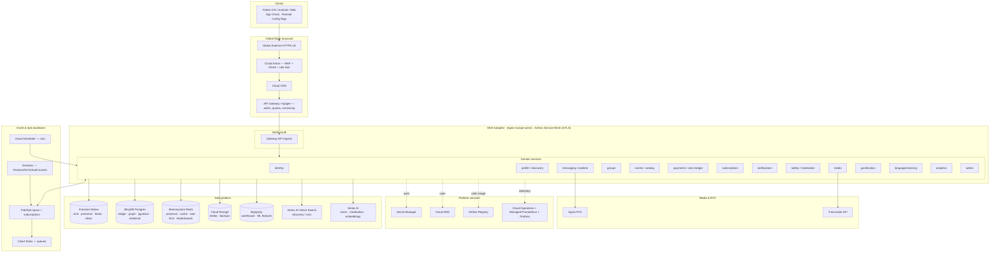
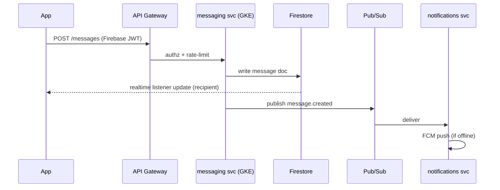

# 02 — Target Architecture

This is the **canonical** description of the target platform. Other documents reference layer names and service names defined here. When they conflict, this document wins.

---

## 1. Architecture at full detail



---

## 2. Layer-by-layer

### 2.1 Edge
| Component | Choice | Notes |
|-----------|--------|-------|
| Load balancing | Global External Application LB | Single anycast IP, TLS termination, HTTP/3 |
| WAF / DDoS | **Cloud Armor** | OWASP preconfigured rules, per-IP + per-user rate limiting, geo rules, bot management |
| CDN | **Cloud CDN** | Media + cacheable GET; signed URLs for private media |
| API management | **API Gateway** (upgrade to **Apigee** if/when partner APIs appear) | JWT validation (Firebase Auth tokens), quotas, API versioning, request/response transforms |

### 2.2 Compute — GKE Autopilot
- **GKE Autopilot**, regional (3 zones) in `europe-west1`. No node management, per-pod billing, secure defaults.
- **Anthos Service Mesh (managed Istio)**: automatic **mTLS** between services, L7 traffic splitting for canaries, distributed tracing, per-service SLOs.
- **Gateway API** for ingress (successor to Ingress). **HPA + VPA** for autoscaling; **PodDisruptionBudgets**; **Workload Identity** for GCP auth (no key files).
- Cloud Run retained for a few **spiky, stateless, or webhook** workloads (e.g. Stripe/Play/App-Store webhooks) where scale-to-zero beats a pod.

Details: [06-gke-platform.md](06-gke-platform.md).

### 2.3 Domain services (14)
Consolidated from the 19 existing function folders (duplicates merged). Each service = its own container, repo module, database schema/namespace, Pub/Sub topics, and on-call owner.

| Service | Consolidates (functions/src) | Primary datastore | Sync/async |
|---------|------------------------------|-------------------|------------|
| identity | (auth glue), `admin` (2FA/roles) | Firebase Auth + AlloyDB (roles) | sync |
| profile / discovery | `discovery`, `presence`, profile bits | AlloyDB (+pgvector) + Firestore (presence) + Redis | both |
| messaging / realtime | `messaging` | Firestore (messages) + Redis | both |
| groups | `group_chat` | Firestore (fan-out) + AlloyDB (membership) | both |
| events / catalog | `events`, `external_events` | AlloyDB (catalog) + Firestore (feeds) + Redis (geo) | both |
| payments / coins-ledger | `coins`, `payments`, `coupons` | **AlloyDB (ledger)** | sync + webhook |
| subscriptions | `subscription` | **AlloyDB** | sync + webhook |
| notifications | `notifications` | Firestore (inbox) + Pub/Sub | async |
| safety / moderation | `safety`, `security` | AlloyDB + Vertex AI | both |
| media | `media` | Cloud Storage + Transcoder + Redis | async |
| gamification | `gamification` | AlloyDB + Redis (leaderboards) | both |
| language-learning | `language_learning` | AlloyDB | sync |
| analytics | `analytics` | BigQuery + Vertex AI | async |
| admin | `admin` | AlloyDB + BigQuery | sync |

Full data-ownership + migration order: [04-data-migration.md](04-data-migration.md).

### 2.4 Event & task backbone
| Need | Service | Replaces |
|------|---------|----------|
| Domain events (decoupled, replayable) | **Pub/Sub** | direct Firestore triggers |
| React to Firestore/GCS/Audit-Log changes | **Eventarc** | inline triggers |
| Work queues w/ backpressure & retries | **Cloud Tasks** | ad-hoc |
| Cron (~31 scheduled functions today) | **Cloud Scheduler** → Pub/Sub → service | scheduled functions |

Firestore triggers are **not** deleted wholesale — they are migrated to Eventarc/Pub/Sub consumers per domain during P3, so fan-out and notifications become buffered and replayable. Details: [04](04-data-migration.md).

### 2.5 Data platform — the core decision

| Store | Keeps / gets | Why |
|-------|--------------|-----|
| **Firestore Native** | Chat messages, presence, feeds, group inboxes, notification inbox | Realtime listeners, offline sync, proven fan-out. Retained deliberately. |
| **AlloyDB for PostgreSQL** | Coins ledger, payments, subscriptions, matches/likes/swipes graph, catalog, roles, gamification, discovery vectors (**pgvector**) | ACID, reconciliation, relational queries, HA, read pool for scale, columnar engine for analytics, vector search co-located with data |
| **Memorystore (Redis)** | Presence bitmaps, hot caches, rate-limit counters, leaderboards (sorted sets), sessions | Sub-ms; offloads Firestore reads |
| **Cloud Storage** | Media, backups, exports | Already used; add lifecycle + CDN + signed URLs |
| **BigQuery** | Warehouse, cohort/churn/MRR, feature store | Dataset `greengo_analytics` already exists; formalize pipeline |
| **Vertex AI Vector Search** | Large-scale discovery/recommendation ANN | Beyond precomputed `candidate_pools` |
| **Vertex AI** | Churn prediction, content moderation, embeddings | Replaces in-function ML |

Rationale for AlloyDB over Spanner is in [ADR-0002](adr/0002-alloydb-for-relational.md): regional Postgres gives ACID + horizontal read scale + pgvector at a fraction of Spanner's cost; we design multi-region-ready and can promote the money domain to Spanner later if global write-consistency becomes a hard requirement.

### 2.6 Media & RTC
- **Cloud Storage → Transcoder API → Cloud CDN** for adaptive video and image variants. Signed URLs for private media. Ingest via resumable uploads.
- **Agora** retained for realtime video/voice; tokens minted by the `media`/`messaging` service (server-side, as today in `video_calling/`). App-ID/certificate stay in Secret Manager.

### 2.7 AI / ML
- **Vertex AI Vector Search** + **AlloyDB pgvector** for discovery/recommendations.
- **Vertex AI** pipelines for churn (moving `analytics/predictChurn`), content moderation (moving `safety/` Vision/Language calls), and embedding generation.
- **BigQuery ML** for lightweight in-warehouse models (segmentation, forecasting).

### 2.8 Observability, security, delivery
- **Cloud Operations** (Logging, Monitoring, Trace, Profiler, Error Reporting) + **Managed Service for Prometheus** + **Grafana**; **OpenTelemetry** SDK in every service; **SLOs + error budgets**. → [08](08-observability-slo.md)
- **Secret Manager + Cloud KMS + Workload Identity + VPC Service Controls + Binary Authorization + Cloud Armor**; App Check enforced; **client TTS key removed** and proxied. → [09](09-security-compliance.md)
- **Terraform** (infra) + **Config Connector/Argo CD** (GitOps) + **Cloud Build/GitHub Actions → Artifact Registry → Argo Rollouts** (canary). → [05](05-iac-terraform.md), [06](06-gke-platform.md), [07](07-cicd.md)

---

## 3. Request lifecycles (reference flows)

### 3.1 Send a chat message (stays realtime on Firestore)


### 3.2 Spend coins (moves to AlloyDB ledger, P4)
```mermaid
sequenceDiagram
  participant App
  participant PAY as coins-ledger svc (GKE)
  participant AL as AlloyDB
  participant FS as Firestore (legacy, dual-write window)
  participant PS as Pub/Sub
  App->>PAY: POST /coins/spend
  PAY->>AL: BEGIN; check balance; insert ledger entry; COMMIT
  PAY->>FS: mirror balance (dual-write, until cutover)
  PAY->>PS: publish coins.spent
  PAY-->>App: new balance
```

---

## 4. What is explicitly retained from today

GreenGo already does several things right; the target **builds on** them rather than replacing them:

| Existing asset | Fate |
|----------------|------|
| Firestore fan-out inboxes (`group_chat/fanout.ts`, `events/broadcast.ts`) | **Kept**, fronted by Pub/Sub for buffering |
| Sharded external-events index (`external_events/build_index.ts`) | **Kept** short-term; superseded by AlloyDB catalog + Redis geo in P5 |
| Geohash indexing (`external_events/geohash.ts`) | **Kept**; complemented by AlloyDB PostGIS/geo |
| Precomputed candidate pools (`discovery/candidatePoolPrecompute.ts`) | **Kept** until Vertex Vector Search lands in P5 |
| Remote Config feature flags | **Kept** — becomes the cohort-cutover control plane |
| Secret Manager + KMS usage in functions | **Kept & extended** |
| BigQuery dataset `greengo_analytics` | **Kept & formalized** |

---

## 5. What is retired

- ~200 individual Cloud Functions → **14 containerized services** (functions live on only as thin webhook endpoints on Cloud Run where scale-to-zero is ideal).
- Duplicate collections/folders (`coinTransactions`/`coin_transactions`, `notification`/`notifications`, `subscription`/`subscriptions`, `video`/`video_calling`) → **deduped in P1** before any migration.
- Broken `terraform/` modules and non-functional `backend/` Django skeleton → **replaced** by the Terraform in [05](05-iac-terraform.md); Django skeleton **deleted**.
- Client-side Cloud TTS key → **removed**, proxied through the `language-learning`/`media` service.
