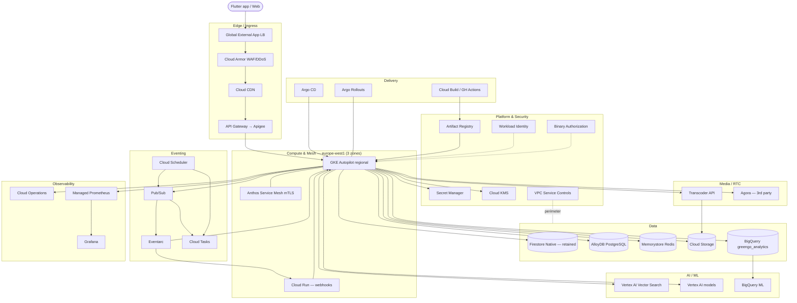

# 03 — GCP Service Catalog

> **Scope.** A service-by-service reference for the GreenGo hybrid platform (GKE + managed data on GCP), migrating from the Firebase monolith (`greengo-chat`, Flutter app v2.2.4+100). Each card states its purpose, what it replaces today, concrete sizing at **1M** and **5M MAU**, IAM/access model, cost driver, and gotchas.
>
> **Reads with.** [02-target-architecture.md](02-target-architecture.md) (how these compose), [11-cost-finops.md](11-cost-finops.md) (authoritative cost model — this doc names *cost drivers*, not dollar figures).
>
> **Locked decisions in force.** Hybrid strangler-fig (Firestore retained for realtime); AlloyDB for money-ledger + social-graph + pgvector (Spanner is the future escape hatch, not now); GKE Autopilot + Anthos Service Mesh; Pub/Sub + Eventarc + Cloud Tasks; single region `europe-west1` first, Americas region in Phase 7; Terraform + Argo CD GitOps.
>
> **Sizing caveat.** Numbers below marked *(est.)* are planning estimates for capacity shape and relative scale, not procurement figures. Exact spend, commitment/CUD strategy, and per-service budgets live in [11-cost-finops.md](11-cost-finops.md).

---

## 0. Service map

### Summary table

| Layer | Service | Role | Retained / New |
|---|---|---|---|
| Compute & Mesh | GKE Autopilot (regional) | Runs the 14 domain services | New |
| Compute & Mesh | Anthos Service Mesh | mTLS, traffic policy, L7 telemetry | New |
| Compute & Mesh | Cloud Run | Webhook/callback sinks only | New |
| Edge | Global External Application LB | Single global anycast ingress | New |
| Edge | Cloud Armor | WAF, DDoS, rate-limit, geo/bot rules | New |
| Edge | Cloud CDN | Cache static + signed media | New |
| Edge | API Gateway | Managed north-south API façade (→ Apigee later) | New |
| Data | Firestore Native | Chat, presence, feeds, inbox (realtime) | **Retained** |
| Data | AlloyDB for PostgreSQL | Ledger, social graph, pgvector, relational | New |
| Data | Memorystore for Redis | Presence, cache, rate-limit, leaderboards | New |
| Data | Cloud Storage | Media, backups, exports (lifecycle + signed URLs) | New (from Firebase Storage) |
| Data | BigQuery | Analytics warehouse (`greengo_analytics`) | **Retained/extended** |
| AI/ML | Vertex AI Vector Search | Discovery ANN | New |
| AI/ML | Vertex AI | Churn, moderation, embeddings | New |
| AI/ML | BigQuery ML | In-warehouse propensity/segmentation | New |
| Eventing | Pub/Sub | Async backbone / domain events | New |
| Eventing | Eventarc | CloudEvents routing from GCP sources | New |
| Eventing | Cloud Tasks | Rate-shaped, deferred, retriable work | New (from Functions queues) |
| Eventing | Cloud Scheduler | Cron triggers | New (from scheduled Functions) |
| Media/RTC | Transcoder API | VOD/media transcode | New |
| Media/RTC | Agora | Voice/video RTC (3rd-party) | Retained (server tokens) |
| Platform/Sec | Secret Manager | Secrets/config material | New |
| Platform/Sec | Cloud KMS | CMEK + envelope keys | New |
| Platform/Sec | Artifact Registry | Container + Helm/OCI artifacts | New |
| Platform/Sec | Workload Identity | Keyless pod→GCP auth | New |
| Platform/Sec | Binary Authorization | Admission attestation | New |
| Platform/Sec | VPC Service Controls | Data-exfil perimeter | New |
| Observability | Cloud Operations | Logs, metrics, trace, profiler, errors | New/extended |
| Observability | Managed Prometheus | K8s/app metrics at scale | New |
| Observability | Grafana | Unified dashboards | New |
| Delivery | Cloud Build / GH Actions | CI build, test, sign | New |
| Delivery | Argo CD | GitOps continuous delivery | New |
| Delivery | Argo Rollouts | Canary/blue-green progressive delivery | New |

---

## 1. Compute & Mesh

### GKE Autopilot — regional (`europe-west1`, 3 zones)

| | |
|---|---|
| **Purpose in GreenGo** | Primary runtime for all 14 domain services (identity, profile/discovery, messaging, groups, events, payments, subscriptions, notifications, safety, media, gamification, language-learning, analytics, admin). Autopilot removes node-pool ops; we manage workloads, not machines. |
| **Replaces (today)** | The ~200 Cloud Functions monolith (HTTP + trigger handlers), plus any implicit "backend" logic living in Firestore rules/client. |
| **Key config / sizing** | Regional cluster spanning 3 zones for zonal fault tolerance. Autopilot bills per Pod vCPU/memory/ephemeral-storage *requests*. Baseline services request 0.25–1 vCPU / 0.5–2 GiB each; hot paths (messaging, discovery, payments) run higher. **1M MAU (est.):** aggregate steady-state ~120–180 vCPU / ~300–450 GiB across all services at ~200k concurrent, HPA 2–8 replicas/service. **5M MAU (est.):** ~500–800 vCPU / ~1.2–2.0 TiB at ~500k concurrent, HPA ceilings raised, plus Balloon/`Performance` compute class for latency-critical pods. Use **HPA** (CPU + custom Prometheus/PubSub-depth metrics) and workload **PodDisruptionBudgets**; Spot compute class for analytics/batch only. Multi-cluster fleet extends to Americas region in Phase 7. |
| **IAM / access** | Cluster is **private** (no public node IPs); control-plane access via authorized networks + IAP/bastion. RBAC per namespace-per-domain. Pods authenticate to GCP via **Workload Identity** (no node SA keys). Cluster runs under a minimally-scoped GKE node SA. |
| **Cost driver** | Sum of Pod resource *requests* × runtime (right-sizing requests is the #1 lever) + egress. |
| **Notes / gotchas** | Autopilot enforces resource requests and rejects privileged/hostPath workloads — vet third-party charts. Some DaemonSet patterns are restricted; use managed add-ons. Set requests≈limits for predictable Autopilot billing. Regional control plane = higher availability but cross-zone traffic can add egress; keep chatty pairs zone-affine where practical. |

### Anthos Service Mesh (managed Istio)

| | |
|---|---|
| **Purpose in GreenGo** | Zero-trust east-west networking: automatic **mTLS** between all services, L7 traffic policy (retries, timeouts, outlier detection, locality LB), and golden-signal telemetry feeding SLOs. Backbone for canary routing used by Argo Rollouts. |
| **Replaces (today)** | Implicit trust between Cloud Functions; no service-to-service authn/authz exists in the monolith today. |
| **Key config / sizing** | Managed control plane (Google-operated), sidecar or **ambient** data plane. Enforce **STRICT mTLS** mesh-wide via `PeerAuthentication`; default-deny `AuthorizationPolicy`, allow-list per service identity. Sidecar overhead ~50–100m vCPU / ~60–128 MiB per pod (*est.*) — budget into Autopilot requests; evaluate ambient mode to cut per-pod overhead at 5M scale. |
| **IAM / access** | Service identity = Kubernetes SA ↔ Workload Identity ↔ Google SA. Mesh policies key off SPIFFE identities, not IPs. |
| **Cost driver** | Managed ASM per-cluster/endpoint fees + sidecar compute overhead (folded into Autopilot). |
| **Notes / gotchas** | mTLS everywhere breaks naive health checks and non-mesh clients — use mesh-aware probes; put permissive→strict migration behind a flag. Ambient mode reduces overhead but verify feature parity for the L7 policies you rely on before committing. |

### Cloud Run — webhooks only

| | |
|---|---|
| **Purpose in GreenGo** | Narrowly scoped: inbound **webhook/callback sinks** where a stateless, scale-to-zero, HTTPS-addressable endpoint is simpler than a mesh service — e.g., Stripe/Play/App Store billing callbacks, Agora/Transcoder completion callbacks, third-party ingest. Not a general compute tier. |
| **Replaces (today)** | HTTP-triggered Cloud Functions acting as webhook receivers. |
| **Key config / sizing** | 2nd-gen, `min-instances=0` (scale to zero) for low-traffic sinks; `min-instances=1` only for latency-sensitive billing callbacks. Concurrency 40–80/instance, 0.5–1 vCPU / 512 MiB–1 GiB. Ingress restricted; ingest via Eventarc/Pub/Sub push where possible. |
| **IAM / access** | Each service has a dedicated runtime SA; invocations authenticated (OIDC from Pub/Sub/Eventarc, or provider signature verification). No `allUsers` except where a provider cannot send auth — then verify signatures + Cloud Armor. |
| **Cost driver** | Request count + allocated vCPU/mem × request time (near-zero at idle). |
| **Notes / gotchas** | Keep business logic thin — validate/verify, publish to Pub/Sub, return fast; heavy work belongs on GKE. Cold starts are acceptable for async webhooks; pin min-instances for synchronous billing verifications. Do **not** let Cloud Run become a shadow backend. |

---

## 2. Edge / Ingress

### Global External Application Load Balancer

| | |
|---|---|
| **Purpose in GreenGo** | Single global anycast entry point for all client HTTPS traffic; terminates TLS, routes by host/path to GKE (via container-native NEGs) and steers users to the nearest healthy region (europe-west1 now, Americas in Phase 7). |
| **Replaces (today)** | Firebase Hosting / direct Functions URLs / GCLB implicit in Firebase. |
| **Key config / sizing** | Global LB with **container-native load balancing** (NEGs to GKE Gateway API). Managed TLS certs, HTTP/2 + HTTP/3 (QUIC) enabled, host/path routing map per API surface. Auto-scales — no capacity sizing; enable connection draining + outlier ejection. |
| **IAM / access** | Managed by Terraform; frontend config references Armor policy + certs. |
| **Cost driver** | Forwarding rules + data processed + inter-region traffic. |
| **Notes / gotchas** | Realtime chat still flows Flutter SDK → Firestore directly (not via this LB) — see Firestore card; LB fronts the REST/gRPC API plane. Use the **Gateway API** on GKE for multi-cluster ingress readiness ahead of Phase 7. |

### Cloud Armor (WAF / DDoS / rate-limit)

| | |
|---|---|
| **Purpose in GreenGo** | Edge security: L3–L7 DDoS absorption, OWASP WAF rules, per-client **rate limiting**, geo/bot controls, and Adaptive Protection in front of the API plane. |
| **Replaces (today)** | Nothing equivalent — the monolith has no WAF; App Check is the only abuse control. |
| **Key config / sizing** | Security policy attached to the LB backend. Preconfigured WAF rules (SQLi/XSS/LFI) in preview→enforce; `rate-based-ban` per IP + per-identity token; Adaptive Protection ON; named IP/geo allow/deny lists. Bot management for signup/login endpoints. |
| **IAM / access** | Policy edits gated to platform/security team via IAM + Terraform review. |
| **Cost driver** | Policies + rules evaluated + requests inspected; Adaptive Protection/Enterprise tier add-on. |
| **Notes / gotchas** | Roll WAF rules out in **preview** first to avoid false-positive lockouts of real users. Rate-limit keys should include authenticated identity, not just IP (mobile carriers NAT millions behind few IPs). Coordinate with Firebase App Check so client attestation and edge rules reinforce, not duplicate. |

### Cloud CDN

| | |
|---|---|
| **Purpose in GreenGo** | Caches static assets and public/derived media (profile thumbnails, event images, transcoded posters) at Google edge; offloads origin and cuts media latency globally. |
| **Replaces (today)** | Firebase Hosting CDN + Firebase Storage direct download. |
| **Key config / sizing** | Enabled on the LB backend for GCS buckets and cacheable API GETs. Cache keys exclude auth/signature params; TTLs by content class (immutable media hashed URLs = long TTL; feeds = short/`no-store`). Signed-URL media served through CDN with cache-control tuned per object. |
| **IAM / access** | Public cache for public assets only; private media uses **signed URLs/cookies** with short expiry. |
| **Cost driver** | Cache egress + cache-fill; cache-hit ratio is the lever. |
| **Notes / gotchas** | Never cache authenticated/personalized JSON without a per-user cache key — leakage risk. Use content-hashed object names for cache-busting instead of purges. |

### API Gateway (with Apigee upgrade path)

| | |
|---|---|
| **Purpose in GreenGo** | Managed north-south API façade: API-key/JWT validation, quota, routing to backend services, and a stable versioned contract for the Flutter client during the strangler migration (route legacy → Firestore/Functions, new → GKE). |
| **Replaces (today)** | Ad-hoc Functions HTTP endpoints with no unified gateway. |
| **Key config / sizing** | OpenAPI-defined config per API; JWT auth (Firebase/Identity Platform issuer), per-key quotas, backend routing to GKE via LB. Stateless/auto-scaled. |
| **IAM / access** | Backend auth via SA/OIDC; consumer auth via API keys + Firebase JWT. |
| **Cost driver** | API calls processed. |
| **Notes / gotchas** | **Apigee upgrade path:** when we need monetization tiers, advanced quota/spike-arrest, developer portal, and deep analytics/mediation, promote the gateway to **Apigee X** (regional instance in europe-west1). Design API configs now to be Apigee-portable (clean OpenAPI, no gateway-specific hacks). Gateway is not a policy engine — keep security at Armor + mesh. |

---

## 3. Data

### Firestore Native — **retained**

| | |
|---|---|
| **Purpose in GreenGo** | Stays the realtime store: **chat/messaging, presence, feeds, inbox/notifications fan-out** — anything needing live client listeners and offline sync via the Flutter SDK. This is the deliberate half of the hybrid strangler-fig. |
| **Replaces (today)** | Itself — ~90 collections / 151 composite indexes remain, but non-realtime/relational/ledger data migrates *out* to AlloyDB. |
| **Key config / sizing** | Native mode, multi-region or regional per RPO needs; keep the existing index set, prune indexes freed by migrated collections. Enforce **≤1 write/sec/document** hot-doc rule — shard counters (e.g., leaderboard/group-member counts) and use fan-out collections for inbox. PITR enabled (7-day window) for RPO. At 5M MAU, watch the 10k writes/sec/database soft ceilings on hot collections; shard by design. |
| **IAM / access** | Security Rules for direct client access (least-privilege, App Check enforced); backend services use Workload Identity + Firestore Admin scoped per collection group. |
| **Cost driver** | Document reads/writes/deletes + stored data + egress; **reads dominate** (feeds/listeners) — cache in Redis and denormalize. |
| **Notes / gotchas** | Never run money logic or multi-entity invariants here — that's AlloyDB. Beware listener fan-out storms on popular groups; cap listeners and paginate. Composite index sprawl is real — every new query may need an index; track in Terraform. Cross-refs on read-heavy screens should hit Redis first. |

### AlloyDB for PostgreSQL

| | |
|---|---|
| **Purpose in GreenGo** | System of record for anything needing **strong consistency, transactions, joins, or vector search**: the **coins/money ledger** (double-entry, immutable), **social graph** (follows/blocks/matches), subscriptions/entitlements state, and **pgvector** embeddings for discovery/semantic features. Chosen over Spanner for cost/Postgres-compatibility now; **Spanner is the escape hatch** if we outgrow single-region write scaling. |
| **Replaces (today)** | Money/ledger and relational logic currently forced into Firestore documents + Functions transactions (which cannot guarantee cross-collection invariants at scale). |
| **Key config / sizing** | Regional cluster in europe-west1 with HA (primary + standby, automatic failover). **1M MAU (est.):** primary **8–16 vCPU / 64–128 GiB**; **1 read pool** with 2 nodes (8 vCPU each) for graph/vector reads. **5M MAU (est.):** primary **32–64 vCPU / 256–512 GiB**; read pool scaled to **4–8 nodes**, columnar engine enabled for analytical/graph traversals, pgvector indexes (IVFFlat/HNSW) on dedicated read pool. Continuous backup + PITR for RPO≤5min. Connect via **Auth Proxy / private IP**; PgBouncer/connection pooling in-mesh to protect connection limits. |
| **IAM / access** | Private IP only (VPC), no public exposure; IAM database authentication + per-service DB roles (ledger-writer, graph-reader, etc.). CMEK via Cloud KMS. Inside VPC-SC perimeter. |
| **Cost driver** | vCPU/memory of primary + each read-pool node (billed continuously) + storage + backup retention. |
| **Notes / gotchas** | **Ledger integrity:** append-only, double-entry, `SERIALIZABLE` or explicit constraints; never `UPDATE` posted entries. Read pools are **read-only** — route writes to primary; watch replication lag for read-after-write on balances (read own writes from primary). Connection storms from many pods → mandatory pooler. pgvector index build is memory-hungry — size the read pool for it. Keep a documented Spanner exit path (schema kept relational-portable, no exotic PG extensions in the money path beyond pgvector). |

### Memorystore for Redis

| | |
|---|---|
| **Purpose in GreenGo** | Low-latency shared state: **presence** (online/last-seen), hot-object **cache** (profiles, feeds, entitlements), **rate-limit** counters (token buckets backing Cloud Armor/app limits), and **leaderboards** (gamification sorted sets). |
| **Replaces (today)** | Firestore hot-document reads and per-Function in-memory caches (which don't share across instances). |
| **Key config / sizing** | **Memorystore for Redis Cluster** (sharded) for horizontal scale. **1M MAU (est.):** 3-shard cluster, ~5 replica-1 topology, ~20–40 GiB total. **5M MAU (est.):** 6–10 shards, ~100–200 GiB, replicas for read scale + HA. Enable in-transit TLS + AUTH. TTLs on all cache keys; separate logical uses (or instances) for cache vs. durable-ish presence to isolate eviction. |
| **IAM / access** | Private IP within VPC; AUTH + TLS; accessed via Workload Identity-bound services only. |
| **Cost driver** | Provisioned GiB × node count (memory is billed whether used or not) + replicas. |
| **Notes / gotchas** | Treat as a **cache, not a source of truth** — everything reconstructable from Firestore/AlloyDB. Leaderboards can grow unbounded; cap and window them. Cluster mode requires cluster-aware clients and hash-tag keying for multi-key ops. Avoid using Redis as the rate-limit store *and* leaderboard store on the same shard set if hot keys collide. |

### Cloud Storage

| | |
|---|---|
| **Purpose in GreenGo** | Object storage for **user media** (images/video/audio originals + transcoded renditions), **backups/exports**, and analytics staging. Origin behind Cloud CDN; access via **signed URLs**. |
| **Replaces (today)** | Firebase Storage (which is GCS underneath — migration is largely bucket/rules remapping). |
| **Key config / sizing** | Buckets by purpose/region: `media-eu` (Standard, CDN-fronted), `derived-eu` (transcoded, Standard→Nearline), `backups-eu` (Nearline/Coldline), `analytics-staging`. **Lifecycle rules:** originals Standard→Nearline @30d→Coldline @90d; delete abandoned uploads @7d; version + retention-lock on backups. Uniform bucket-level access; **signed URLs** (short expiry) for up/download; resumable uploads for large video. |
| **IAM / access** | Uniform bucket-level IAM (no ACLs); no public buckets for user media — signed URLs only; CMEK via KMS; inside VPC-SC. |
| **Cost driver** | Stored GiB by class + operations + egress (CDN offloads most egress). |
| **Notes / gotchas** | Enforce upload size/type limits and run media through Transcoder + safety/moderation before serving. Lifecycle mis-tiering silently inflates cost — validate rules. Signed-URL expiry must balance CDN cacheability vs. leak window. Migrate Firebase Storage security-rules semantics into signed-URL issuance logic on the backend. |

### BigQuery — `greengo_analytics` (**exists**)

| | |
|---|---|
| **Purpose in GreenGo** | Central analytics warehouse: product events, Firestore/AlloyDB CDC exports, GA4/Firebase export, financial reconciliation, and feature store for BQML/Vertex. Dataset **`greengo_analytics` already exists** — extend, don't recreate. |
| **Replaces (today)** | Ad-hoc Firestore exports / BigQuery Firebase-extension sinks. |
| **Key config / sizing** | Datasets: `greengo_analytics` (curated), `greengo_raw` (landing), `greengo_marts`. **Partition** by event date + **cluster** by user/event keys on large tables. Start **on-demand** pricing; move to **editions/slot reservations** (autoscaling) once query spend stabilizes at 5M scale. Streaming inserts / Storage Write API from Pub/Sub for near-real-time events; batch loads for CDC. |
| **IAM / access** | Dataset-level IAM per team; **authorized views** + column/row-level security for PII; analysts get views, not raw. Inside VPC-SC. |
| **Cost driver** | Bytes scanned (on-demand) or slot-hours (editions) + storage + streaming inserts. |
| **Notes / gotchas** | Always partition+cluster and `SELECT` needed columns — full scans are the top cost trap. Keep PII in restricted datasets with policy tags. Don't let it become an operational store — it's OLAP, not a serving DB. |

---

## 4. AI / ML

### Vertex AI Vector Search

| | |
|---|---|
| **Purpose in GreenGo** | Production **ANN** index powering discovery/recommendation at scale — semantic/embedding-based candidate retrieval for profile & content matching beyond what pgvector serves for smaller/transactional lookups. |
| **Replaces (today)** | Naive Firestore query filtering / no true similarity search. |
| **Key config / sizing** | Index (Tree-AH/ScaNN) with streaming updates for fresh embeddings; deployed to an index endpoint. **1M MAU (est.):** endpoint on ~2 mid-tier nodes (e.g., `e2`/`n1` class) autoscaling; **5M MAU (est.):** 4–8 nodes, sharded index, tuned `leaf-node-embedding-count`/recall vs latency. Dimensions per the embedding model (e.g., 256–768). |
| **IAM / access** | Backend services (discovery) call via Workload Identity; index management restricted to ML platform team. |
| **Cost driver** | Deployed index-endpoint node-hours (always-on) + index build/update. |
| **Notes / gotchas** | Two-tier vector strategy — **pgvector in AlloyDB** for transactional/filtered small-scale semantic queries and joins; **Vertex Vector Search** for large-scale, high-QPS ANN. Keep embeddings consistent (same model/version) across both. Endpoint nodes bill even at low QPS — right-size and consider off-peak scale-down. |

### Vertex AI (churn, moderation, embeddings)

| | |
|---|---|
| **Purpose in GreenGo** | Model serving + pipelines for: **churn/propensity** (retention), **content moderation** (image/text safety alongside safety-domain rules), and **embedding generation** for discovery/language features. Vertex Pipelines for training/retraining; online + batch prediction. |
| **Replaces (today)** | No ML capability — moderation is manual/heuristic today. |
| **Key config / sizing** | Online endpoints for low-latency moderation (autoscaled, min 1–2 replicas), batch prediction for churn scoring (scheduled). Use managed foundation/embedding models where possible; custom models via Vertex training. Feature inputs from BigQuery feature tables. |
| **IAM / access** | Per-model endpoints with dedicated SAs; PII-touching inference inside VPC-SC; data access via authorized BQ views. |
| **Cost driver** | Online endpoint node-hours + batch prediction compute + training jobs + foundation-model tokens/calls. |
| **Notes / gotchas** | Moderation must be **fail-safe** (degrade to stricter/manual review on model outage), latency-bounded, and audit-logged. Keep human-in-the-loop for enforcement decisions. Version and monitor models for drift; log inputs/outputs for appeal/audit within retention policy. |

### BigQuery ML

| | |
|---|---|
| **Purpose in GreenGo** | In-warehouse ML for analytics-driven use cases — segmentation, LTV/propensity, forecasting — trained and served **where the data lives**, no data movement. Feeds marketing/lifecycle and feature tables consumed by Vertex. |
| **Replaces (today)** | Manual SQL heuristics for cohorts/segments. |
| **Key config / sizing** | Models in `greengo_marts`; scheduled retraining via Cloud Scheduler → BQ jobs. Uses same slots/on-demand as BigQuery. |
| **IAM / access** | BQ dataset IAM; model creation restricted to analytics/ML team. |
| **Cost driver** | Bytes processed for training/eval + slot usage. |
| **Notes / gotchas** | Great for tabular/warehouse problems; hand off deep/online-latency use cases to Vertex. Watch training cost on huge tables — sample and partition. |

---

## 5. Eventing

### Pub/Sub

| | |
|---|---|
| **Purpose in GreenGo** | Async **backbone**: domain events (`payment.posted`, `user.matched`, `message.sent`, `media.uploaded`) decouple the 14 services, enable fan-out (notifications, analytics, gamification), and buffer spikes. Core to the choreographed/event-driven design. |
| **Replaces (today)** | Firestore-trigger Cloud Functions chaining (brittle, hard to observe, per-collection). |
| **Key config / sizing** | Topic-per-event-type with schema (Avro/Protobuf) validation; push (to Cloud Run/Eventarc) and pull (GKE consumers) subscriptions. **Dead-letter topics** + retry policy on every subscription; ordering keys only where needed (per-user ordering). Autoscales to millions of msgs/sec; consumers scale on subscription backlog (HPA custom metric). BigQuery/GCS subscriptions for direct analytics sink. |
| **IAM / access** | Publisher/subscriber SAs per service via Workload Identity; topic-level IAM; inside VPC-SC. |
| **Cost driver** | Message volume (bytes) published + delivered + retained backlog + snapshots. |
| **Notes / gotchas** | Design consumers **idempotent** (at-least-once delivery → duplicates). Ordering keys throttle throughput — use sparingly. Always configure DLQ + alert on it; a poison message can stall a subscription. Don't route money-critical state transitions through fire-and-forget without an outbox/exactly-effect pattern in AlloyDB. |

### Eventarc

| | |
|---|---|
| **Purpose in GreenGo** | Uniform **CloudEvents** routing from GCP sources (GCS object finalize, Firestore changes, Audit Logs, Pub/Sub) to targets (GKE services, Cloud Run) — e.g., media-uploaded → transcode pipeline, Firestore doc change → CDC/analytics. |
| **Replaces (today)** | Source-specific Cloud Functions triggers. |
| **Key config / sizing** | Triggers per source→target; GKE destination via the Eventarc GKE integration, Cloud Run via push. Backed by Pub/Sub under the hood. |
| **IAM / access** | Trigger SA needs source read + target invoke; scoped per trigger. |
| **Cost driver** | Underlying Pub/Sub events (Eventarc itself is thin). |
| **Notes / gotchas** | Same at-least-once + idempotency rules as Pub/Sub. Firestore-source triggers can be high-volume on hot collections — filter narrowly. Prefer explicit app-published Pub/Sub events over Audit-Log-sourced triggers for core flows (lower latency, clearer contract). |

### Cloud Tasks

| | |
|---|---|
| **Purpose in GreenGo** | **Rate-shaped, deferred, retriable** unit-of-work dispatch to HTTP targets: outbound webhooks, third-party API calls with rate caps (push providers, Agora), scheduled-per-entity actions (delayed notifications, retryable payment reconciliations). Complements Pub/Sub (which is stream fan-out, not per-task rate control). |
| **Replaces (today)** | Cloud Functions + Firestore "job" documents / `setTimeout`-style hacks. |
| **Key config / sizing** | Queues per workload with `max-dispatches-per-second` + `max-concurrent` + retry/backoff config to respect downstream rate limits. Targets = GKE/Cloud Run HTTP endpoints with OIDC auth. |
| **IAM / access** | Enqueuer SA + target-invoker OIDC token per queue. |
| **Cost driver** | Task operations (create/dispatch). |
| **Notes / gotchas** | Use Tasks (not Pub/Sub) when you need **precise per-target rate limiting** or scheduled-single delivery. Set sane max-attempts + DLQ-equivalent handling; ensure targets are idempotent. |

### Cloud Scheduler

| | |
|---|---|
| **Purpose in GreenGo** | Managed **cron**: periodic jobs — BQML retraining, churn scoring, subscription renewal sweeps, leaderboard rollovers, cache warms, housekeeping/lifecycle checks. |
| **Replaces (today)** | Pub/Sub-scheduled Cloud Functions (`functions.pubsub.schedule`). |
| **Key config / sizing** | Jobs target Pub/Sub topics, Cloud Tasks queues, or HTTP endpoints; cron in europe-west1 timezone. Keep jobs thin — trigger, don't compute. |
| **IAM / access** | Per-job SA with OIDC to target. |
| **Cost driver** | Per-job count (negligible). |
| **Notes / gotchas** | Scheduler guarantees *at-least-once* firing — jobs must be idempotent and safe on overlap; add locking (Redis) for singleton jobs. Prefer Scheduler→Pub/Sub→GKE consumer over Scheduler→HTTP for ret/observability. |

---

## 6. Media / RTC

### Transcoder API

| | |
|---|---|
| **Purpose in GreenGo** | Server-side **VOD transcoding**: normalize user-uploaded video/audio into adaptive renditions (HLS/DASH, H.264/H.265), thumbnails, and posters for consistent playback across devices. |
| **Replaces (today)** | No real transcoding — clients upload raw media, inconsistent playback. |
| **Key config / sizing** | Triggered via Eventarc on GCS upload → transcode job → output renditions to `derived-eu` bucket → CDN. Job templates per content type (short clips vs. long video); presets tuned for mobile bitrates. Scales per-job; no standing capacity. |
| **IAM / access** | Service SA reads source bucket, writes derived bucket; jobs orchestrated by media service. |
| **Cost driver** | Per-minute output transcoded × resolution/codec. |
| **Notes / gotchas** | Run **safety/moderation before publishing** transcoded output. H.265 saves bandwidth but check device support. Cap input length/size; charge coins/entitlement for heavy media per product rules. |

### Agora (3rd-party RTC)

| | |
|---|---|
| **Purpose in GreenGo** | Real-time **voice/video** (calls, live rooms) — specialized low-latency RTC that GCP doesn't natively provide. Retained as the RTC provider. |
| **Replaces (today)** | Itself (already in use) — no change of provider, only tightened token security. |
| **Key config / sizing** | **Tokens minted server-side** by the messaging/RTC service (GKE) using the Agora app-cert held in Secret Manager; short-lived per-channel tokens, per-user roles. Capacity is Agora-side (their SLA); we scale token issuance with the mesh. |
| **IAM / access** | App certificate in Secret Manager, accessed via Workload Identity; **never** ship the cert to clients. Client gets only a scoped, expiring token. |
| **Cost driver** | Agora per-minute usage (external billing) + our token-issuance compute (negligible). |
| **Notes / gotchas** | Client-side token generation = credential leak — always server-mint. Rotate app cert via Secret Manager versions. Reconcile Agora usage into BigQuery for cost attribution. This is the one intentional non-GCP dependency; keep the token interface abstracted for portability. |

---

## 7. Platform & Security

### Secret Manager

| | |
|---|---|
| **Purpose in GreenGo** | Central store for secrets/config material: Agora app-cert, third-party API keys (Stripe, push, Geoapify, Viator/Ticketmaster ingesters), DB credentials, signing keys, service tokens. |
| **Replaces (today)** | Firebase Functions config / env vars / committed config files (the thing the memory rules forbid committing). |
| **Key config / sizing** | Secret-per-item with versioning; automatic rotation where supported; CMEK-encrypted; regional replication (europe-west1) or user-managed replication. Accessed at runtime (or projected as CSI volumes) by pods. |
| **IAM / access** | `secretAccessor` granted per-service SA per-secret (least privilege) via Workload Identity; access audit-logged. Inside VPC-SC. |
| **Cost driver** | Active secret versions + access operations (negligible). |
| **Notes / gotchas** | Never bake secrets into images (Binary Authorization + scanning help catch this). Rotate on a schedule and on suspected exposure. Per the project standard, all keys stay out of git — Secret Manager is the runtime source of truth. |

### Cloud KMS

| | |
|---|---|
| **Purpose in GreenGo** | Key management for **CMEK** (AlloyDB, GCS, BigQuery, Pub/Sub) and envelope encryption of sensitive app-level fields (PII, payment metadata). Root of the crypto trust chain. |
| **Key config / sizing** | Key rings per environment/region; separate keys per data domain (money, PII, media); rotation policies (e.g., 90-day) on symmetric keys; HSM protection level for high-sensitivity keys. |
| **IAM / access** | `cryptoKeyEncrypterDecrypter` per-service, separated from key admins (dual control). Audit-logged. |
| **Cost driver** | Active key versions + crypto operations. |
| **Notes / gotchas** | Losing/mis-scheduling key destruction can brick data — use scheduled destruction with long delay + guards. Separate duty: app teams use keys, security team manages them. |

### Artifact Registry

| | |
|---|---|
| **Purpose in GreenGo** | Stores container images and Helm/OCI charts for all services; the artifact source GKE pulls from and Binary Authorization attests. |
| **Replaces (today)** | No container pipeline exists in the Functions world. |
| **Key config / sizing** | Regional (europe-west1) Docker + OCI repos; **vulnerability scanning** on push; cleanup policies to prune old/untagged images. Immutable tags for releases (digest-pinned deploys). |
| **IAM / access** | CI writer SA (Cloud Build/GH Actions) push; GKE node/Workload Identity SA read-only pull. |
| **Cost driver** | Stored artifact GiB + scanning + egress. |
| **Notes / gotchas** | Deploy by **digest**, not mutable tag, for reproducibility + BinAuthz. Enforce scan-gate in CI; prune aggressively — image sprawl is silent cost. Keep regionally colocated with GKE to avoid pull egress. |

### Workload Identity

| | |
|---|---|
| **Purpose in GreenGo** | Keyless authentication mapping Kubernetes SAs to Google SAs so pods access GCP APIs (AlloyDB, Firestore, Pub/Sub, Storage, Secret Manager) **without service-account keys**. Foundational to the whole security model. |
| **Replaces (today)** | Functions' implicit runtime SA / any exported key files. |
| **Key config / sizing** | Workload Identity Federation enabled on the cluster; KSA↔GSA binding per service (1:1), each GSA minimally scoped. |
| **IAM / access** | `workloadIdentityUser` binding per KSA→GSA; downstream IAM on the GSA. |
| **Cost driver** | None (free). |
| **Notes / gotchas** | The reason we can ban SA keys org-wide. Over-broad GSA scoping defeats the purpose — one GSA per service, least privilege. Mesh identity (ASM/SPIFFE) layers on top for east-west. |

### Binary Authorization

| | |
|---|---|
| **Purpose in GreenGo** | Admission control: only **signed, attested** images (built by our CI, scanned, provenance-verified) can deploy to GKE — supply-chain integrity gate. |
| **Key config / sizing** | Policy requiring attestations from the CI attestor + vuln-scan attestor; enforce (not dry-run) in prod, dry-run in dev. Breakglass documented + audited. |
| **IAM / access** | Attestor keys in KMS; policy admin restricted to security team. |
| **Cost driver** | Negligible. |
| **Notes / gotchas** | Start in **dry-run** to avoid blocking deploys during rollout, then enforce. Breakglass must be logged and alerted. Pairs with digest-pinned deploys and Artifact Registry scanning. |

### VPC Service Controls

| | |
|---|---|
| **Purpose in GreenGo** | **Data-exfiltration perimeter** around sensitive services (AlloyDB, BigQuery, Cloud Storage, Secret Manager, Pub/Sub, Vertex) — blocks data egress to outside the perimeter even if credentials leak. |
| **Key config / sizing** | Service perimeter enclosing data/AI/secret services; ingress/egress rules for allowed identities/services; access levels (device/IP/context) via Access Context Manager. Private Google Access from GKE. |
| **IAM / access** | Perimeter policy managed by security/platform; changes are high-scrutiny. |
| **Cost driver** | None (config). |
| **Notes / gotchas** | Misconfigured perimeters break legitimate cross-service calls — build with **dry-run mode** first and read violation logs before enforcing. Third-party integrations (Agora, ingesters) need explicit egress rules. Big blast radius on changes — treat as change-managed. |

---

## 8. Observability

### Cloud Operations (Logging / Monitoring / Trace / Profiler / Error Reporting)

| | |
|---|---|
| **Purpose in GreenGo** | Baseline telemetry: structured **logs**, platform **metrics**, distributed **trace** (mesh + app spans) for the p95<250ms / message p95<500ms SLOs, continuous **Profiler** on hot services, and **Error Reporting** aggregation. Feeds SLO/error-budget alerting. |
| **Replaces (today)** | Firebase/Functions logs (limited, per-function, hard to correlate). |
| **Key config / sizing** | Log router sinks: hot logs → Logging (short retention), full fidelity → BigQuery/GCS (cheap long-term); log-based metrics for key events; SLO monitors + alerting policies → on-call. Trace sampling tuned (higher on payments/messaging). Exclusion filters to drop noisy logs. |
| **IAM / access** | Per-team log views; PII-scrubbed at ingestion; audit logs retained per compliance. |
| **Cost driver** | **Log volume ingested** (top driver) + metrics + trace spans. |
| **Notes / gotchas** | Log ingestion cost explodes at 5M scale — set exclusion filters, sample, and route verbose logs to GCS not Logging. Never log secrets/PII. Correlate via trace/span IDs propagated through the mesh + Pub/Sub. |

### Managed Service for Prometheus

| | |
|---|---|
| **Purpose in GreenGo** | Scalable, Prometheus-compatible metrics for Kubernetes + app **custom metrics** — HPA signals (queue depth, RPS, latency), mesh golden signals, and business KPIs — without self-running Prometheus at 5M scale. |
| **Key config / sizing** | Managed collection (PodMonitoring CRs) across the fleet; global query via Monarch backend; recording rules for expensive queries; retention per policy. Drives HPA custom metrics + Grafana. |
| **IAM / access** | Collection via Workload Identity; query access to SRE/dev. |
| **Cost driver** | Samples ingested (active time series). |
| **Notes / gotchas** | Control **cardinality** — high-cardinality labels (user IDs!) blow up cost and query time. Use recording rules; drop noisy metrics at scrape. Managed = no Prometheus HA to babysit. |

### Grafana

| | |
|---|---|
| **Purpose in GreenGo** | Unified **dashboards** across Managed Prometheus, Cloud Monitoring, BigQuery, and logs — the single pane for SRE golden-signal, SLO/error-budget, capacity, and business dashboards. |
| **Key config / sizing** | Run **Grafana on GKE** (Helm, HA 2 replicas) or evaluate managed Grafana; datasources: GMP (Prometheus API), Cloud Monitoring, BigQuery. Dashboards as code (Terraform/JSON in git). SSO via Identity Platform/OIDC. |
| **IAM / access** | OIDC SSO; datasource SAs via Workload Identity; RBAC per team; viewer-by-default. |
| **Cost driver** | Its own pod compute (small) + query load on datasources. |
| **Notes / gotchas** | Dashboards-as-code or they rot. Heavy BigQuery panels can rack up scan cost — cache/aggregate. Keep alerting authoritative in Cloud Monitoring/SLOs, not scattered in Grafana. |

---

## 9. Delivery (CI/CD)

### Cloud Build (or GitHub Actions)

| | |
|---|---|
| **Purpose in GreenGo** | **CI**: build, test, scan, sign, and push images/charts to Artifact Registry; produce Binary Authorization attestations; open GitOps PRs that Argo CD reconciles. Terraform plan/apply for infra. |
| **Replaces (today)** | `firebase deploy` for Functions. |
| **Key config / sizing** | Pipeline per service: lint/test → build → vuln-scan → sign (KMS attestor) → push (digest) → bump image digest in the GitOps repo. GitHub Actions acceptable where repos already live on GitHub (the WP/GreenGo repos are on GitHub) — pick one and standardize per repo. |
| **IAM / access** | Build SA: AR write, KMS sign, minimal else; no prod cluster credentials (CD is Argo's job, not CI's). |
| **Cost driver** | Build-minutes / runner-minutes. |
| **Notes / gotchas** | **CI builds/signs; CD (Argo CD) deploys** — don't let CI push to the cluster (keeps the GitOps audit trail intact). Cache dependencies to cut build minutes. Enforce the memory rule: validate/build locally-equivalent (`--all-features`-style full builds) so CI red-checks aren't auto-merged past. |

### Argo CD

| | |
|---|---|
| **Purpose in GreenGo** | **GitOps CD**: the git repo is the source of truth; Argo CD continuously reconciles cluster state to declared manifests/Helm charts across the fleet (europe-west1 now, Americas in Phase 7). |
| **Replaces (today)** | Manual `firebase deploy` / imperative changes. |
| **Key config / sizing** | Argo CD on a management cluster (or in-cluster), App-of-Apps pattern, one Application per service/env; auto-sync with self-heal for non-prod, gated sync for prod; sync waves for ordered rollout. ApplicationSets for multi-cluster fan-out at Phase 7. |
| **IAM / access** | Argo has the deploy identity (least-privilege per destination); humans change git, not the cluster. SSO via OIDC; RBAC per project. |
| **Cost driver** | Small compute footprint. |
| **Notes / gotchas** | Drift/self-heal can fight manual hotfixes — everything through git. Secrets don't go in git; use Secret Manager + external-secrets/CSI. App-of-Apps keeps the fleet declarative and Phase-7-ready. |

### Argo Rollouts

| | |
|---|---|
| **Purpose in GreenGo** | **Progressive delivery**: canary and blue-green for the domain services, with automated analysis (metrics-gated promotion) and instant rollback — critical for safely shipping to millions on money/messaging paths. |
| **Key config / sizing** | Rollout CRs replace Deployments for user-facing services; canary steps (e.g., 5%→25%→50%→100%) with **AnalysisTemplates** querying Managed Prometheus (error rate, p95 latency) between steps; traffic split via Anthos Service Mesh; automatic abort+rollback on SLO breach. Payments/ledger favor blue-green with manual gate. |
| **IAM / access** | Operates in-cluster under Argo; analysis queries via Workload Identity to GMP. |
| **Cost driver** | Transient extra replicas during rollout. |
| **Notes / gotchas** | Analysis is only as good as its metrics — wire real SLI queries or canaries pass blind. Money-path changes get stricter gates (blue-green + manual approval + reconciliation check). Ensure DB migrations are backward-compatible for canary (old+new run concurrently). |

---

## 10. Managed-vs-self-run philosophy

**Default: prefer Google-managed services; self-run only with a documented reason.** For a platform targeting 1M→5M MAU (headroom 10M) at 99.95% core availability with RPO≤5min/RTO≤30min, engineering effort is best spent on GreenGo's domain logic, not on operating databases, message brokers, or monitoring backends.

Guiding rules:

| Principle | Application in this catalog |
|---|---|
| **Managed for undifferentiated heavy lifting** | AlloyDB (not self-hosted Postgres), Memorystore (not self-run Redis), Managed Prometheus + managed ASM control plane, Pub/Sub, Transcoder — Google absorbs patching, failover, scaling toil. |
| **Managed even when it costs more per unit** | The premium buys availability, RPO/RTO, and freed headcount. Defer the actual trade math to [11-cost-finops.md](11-cost-finops.md); do not self-run to shave cost without an ops-cost-inclusive comparison. |
| **Self-run only where it's core or unavailable managed** | Our own 14 domain services on GKE (that *is* the product); **Grafana** self-run for dashboard flexibility (thin, low-risk); **Argo CD/Rollouts** self-run because GitOps control is a deliberate capability. Even here we lean on Autopilot so we don't manage nodes. |
| **Keep escape hatches** | AlloyDB schema stays relational-portable toward **Spanner**; API Gateway configs stay **Apigee**-portable; Agora token interface stays abstracted; GKE Gateway API + Argo ApplicationSets keep the door open for the **Americas region (Phase 7)** without re-architecture. |
| **Retain what already works** | **Firestore** (realtime) and the existing **BigQuery `greengo_analytics`** dataset are kept, not rebuilt — the strangler-fig migrates *out* of them selectively, it doesn't rip them out. |

**Net:** managed-first shrinks the operational surface to (a) our application workloads and (b) three thin self-run control planes (Grafana, Argo CD, Argo Rollouts), every one of which is declarative and reproducible via Terraform + GitOps. See [02-target-architecture.md](02-target-architecture.md) for how these compose end-to-end and [11-cost-finops.md](11-cost-finops.md) for the authoritative cost and commitment model.
