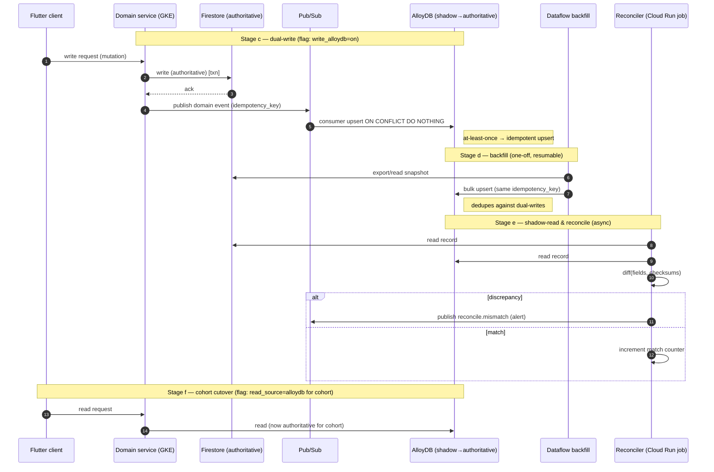
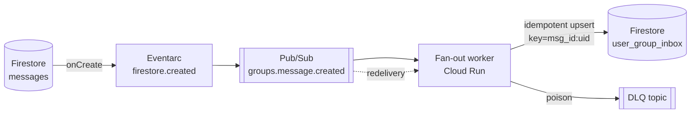

# 04 — Data Migration

> **Audience:** backend & data engineers executing the strangler-fig migration.
> **Scope:** per-domain data-ownership, the canonical migration pattern, concrete Firestore→AlloyDB schema mappings, trigger migration, migration-debt cleanup, ordering/risk, and rollback guarantees.
> **Cross-refs:** [00-overview.md](00-overview.md) · [01-current-state.md](01-current-state.md) · [02-target-architecture.md](02-target-architecture.md) · [03-service-decomposition.md](03-service-decomposition.md) · [05-eventing-and-messaging.md](05-eventing-and-messaging.md) · [06-cutover-and-rollback.md](06-cutover-and-rollback.md)

This document is the execution runbook for moving state out of the Firebase monolith (`greengo-chat`, ~90 Firestore collections / 151 composite indexes, ~200 Cloud Functions) into the hybrid target: **Firestore retained for realtime**, **AlloyDB (Postgres + pgvector) for money, social graph, catalog, and relational domains**, **BigQuery for analytics**, **Redis (Memorystore) for hot caches/derived state**.

Two principles govern every step below and are repeated deliberately:

- **Idempotency** — Pub/Sub and Eventarc deliver *at-least-once*. Every consumer, backfill worker, and dual-writer MUST be safe to run twice. Use natural or synthesized idempotency keys and `ON CONFLICT DO NOTHING` / upsert semantics everywhere.
- **Reversibility** — every step has an explicit rollback. We never take a destructive action (drop collection, delete function, disable dual-write) until the new path has run clean for the domain-specific soak window. Old and new paths coexist until proven equivalent.

---

## 1. Data-ownership map

Single source of truth for *who owns what* after decomposition. "Owner" is the one service permitted to write; all others read via API or subscribe to events.

| Domain service | Data it owns | Target store | Migration phase |
|---|---|---|---|
| **identity** | `users` (auth core), roles, `blocked_users`/`blockedUsers` (→ dedupe), sessions/devices | AlloyDB (identity schema) + Firebase Auth (retained IdP) | P1 (dedupe), P5 (relational move) |
| **profile / discovery** | profile docs, `candidate_pools` (precompute), discovery filters, presence flags | Firestore (presence/realtime) + AlloyDB (profile attrs + pgvector embeddings) | P5 |
| **messaging / realtime** | `messages`, `conversations`, typing/read receipts | **Firestore (stays)** | — (retained) |
| **groups** | group metadata, membership, `user_group_inbox` (fan-out inbox) | Firestore inbox (stays) + AlloyDB (group metadata/membership) | P6 (metadata), inbox retained |
| **events / catalog** | `events`, `external_events`, `external_events_index` (sharded), `external_country_stats` | AlloyDB (catalog schema) + Redis (hot nearby cache) | P2→P5 |
| **payments** | payment intents, `coinOrders`, provider webhooks, receipts | AlloyDB (payments schema) | P4 |
| **payments / coins-ledger** | `coinBalances`+`coin_balances` (dupe), `coinTransactions`+`coin_transactions` (dupe) | AlloyDB (ledger schema, append-only + materialized balance) | P1 (dedupe), P4 (move) |
| **subscriptions** | `subscriptions`/`memberships`, entitlements, `coupons` | AlloyDB (billing schema) | P4 |
| **notifications** | notification templates, delivery log; **inbox** (`notifications` per-user) | Firestore inbox (stays) + AlloyDB (delivery log/prefs) | P3 (events), P6 |
| **safety / moderation** | reports, moderation actions, `blocked_users` graph edges | AlloyDB (safety schema) | P5 |
| **media** | media metadata, transcode jobs, CDN refs (blobs stay in GCS) | AlloyDB (media schema) + GCS (blobs) | **P2 (first domain)** |
| **gamification** | `xp_transactions`, `user_levels`, `claimedRewards` | AlloyDB (gamification schema, ledger-style) | P5 |
| **language-learning** | `lessons`, `vocabulary_words`, `flashcards`, progress | AlloyDB (learning schema) | P5 |
| **analytics** | event stream, aggregates, funnels | **BigQuery** (+ Pub/Sub → BQ subscription) | **P2 (first domain)** |
| **admin** | roles/admin config, feature-flag audit, ops dashboards | AlloyDB (admin schema) | P5 |

**Store-selection rationale (summary):**

- **Firestore stays** only where sub-second realtime fan-out and offline sync are product-critical and Postgres would add latency/complexity: chat, presence, feeds, group inbox, notification inbox.
- **AlloyDB** for anything needing transactional integrity, multi-row consistency, joins, aggregations, or vector search (discovery). Money and social graph are non-negotiably relational.
- **BigQuery** for append-only analytical event data — never read on the hot path.
- **Redis/Memorystore** for derived, reconstructable hot state (nearby-events cache, materialized-balance read cache, rate limits). Never a source of truth.

---

## 2. What stays on Firestore vs what moves to AlloyDB

### 2.1 Stays on Firestore (retained realtime plane)

| Collection(s) | Why it stays |
|---|---|
| `messages`, `conversations` | Realtime chat; offline sync; per-conversation listeners. Relational move would regress latency and mobile UX. |
| presence (on `profiles`) | High-frequency ephemeral writes; TTL-friendly; not transactional. |
| `feeds` | Denormalized read-optimized timeline; fan-out-on-write already tuned. |
| `user_group_inbox` | Existing fan-out target (`group_chat/fanout.ts`); per-user realtime inbox at scale. |
| notifications **inbox** (`notifications` per-user docs) | Realtime badge/inbox listener; delivery log/prefs move to AlloyDB, the *inbox* stays. |

These remain authoritative on Firestore indefinitely. Services that need this data relationally consume **change events** (Eventarc → Pub/Sub, §5) and maintain their own projections — they do **not** dual-write chat into Postgres.

### 2.2 Moves to AlloyDB (relational/transactional plane)

| Domain | Source collections | Notes |
|---|---|---|
| Coins ledger | `coinBalances`, `coin_balances`, `coinTransactions`, `coin_transactions`, `coinOrders` | Fold 4 dupe collections → 1 append-only ledger + materialized balance (§4a). |
| Payments | payment intents, provider webhooks, receipts | Strong consistency, idempotent webhook keys. |
| Subscriptions/memberships | `subscriptions`/`memberships`, `coupons` | Entitlement checks join to identity. |
| Social graph | `matches`, `swipes`, `likes`, `photo_likes` | Indexed edge tables feeding discovery (§4b). |
| Events/catalog | `events`, `external_events`, `external_country_stats` | Sharded index → native Postgres indexes + geohash/PostGIS. |
| Gamification | `xp_transactions`, `user_levels`, `claimedRewards` | Ledger-style XP; `user_levels` materialized. |
| Language learning | `lessons`, `vocabulary_words`, `flashcards` | Relational content + per-user progress. |
| Roles/admin | roles, admin config | Joins to identity; RBAC. |

---

## 3. The canonical migration pattern (reusable)

Every domain migration follows the **same eight-stage pipeline**. Do not invent per-domain variants; parameterize this one. Each stage names its rollback.

| # | Stage | Goal | Rollback |
|---|---|---|---|
| a | **Dedupe / clean source** | Collapse duplicate schemas, fix bad rows, freeze schema (§6) | No-op — read-only analysis + reversible backfill of canonical |
| b | **Design target schema** | DDL + indexes + idempotency keys in AlloyDB | Drop new (empty) schema; no user impact |
| c | **Dual-write** | App/functions write BOTH Firestore (authoritative) and AlloyDB (shadow) behind a flag | Flip write flag off; Firestore untouched |
| d | **Backfill via Dataflow** | Bulk-load historical Firestore → AlloyDB, idempotent upserts | Truncate target tables; re-run |
| e | **Shadow-read & reconcile** | Read both, serve Firestore, diff async, alert on discrepancy | No-op — reads only |
| f | **Cohort cutover (Remote Config)** | Flip read source AlloyDB→authoritative per cohort % | Flip flag back to Firestore |
| g | **Monitor** | Watch discrepancy rate, latency, error budget through soak window | Cutover flag rollback |
| h | **Retire old path** | Stop dual-write, drop Firestore collection AFTER soak + backups | Restore from PITR/backup export |

### 3.1 Idempotency contract (applies to c, d, and every consumer)

- Each logical record carries a **stable idempotency key**: prefer the Firestore document ID (`fs_doc_id`) as the natural key; for event-derived writes synthesize `hash(source, entity_id, event_id)`.
- All target writes are `INSERT ... ON CONFLICT (idempotency_key) DO NOTHING` (append-only) or `... DO UPDATE` (materialized/upsertable) — never blind `INSERT`.
- Backfill and dual-write share the **same** keys so a record written by both collapses to one row. Backfill re-runs are free.
- Ledger/append-only tables (coins, xp) never `UPDATE` a historical row; corrections are new compensating entries.

### 3.2 Reversibility contract

- Firestore remains **authoritative** through stages c–e and during g's soak. AlloyDB is a shadow until flag flip at f.
- Cutover flags are **cohort-scoped** (Remote Config, §3.4) so rollback is a config flip affecting only migrated cohorts, not a redeploy.
- No collection is deleted (stage h) until: (1) cutover 100% for the domain soak window, (2) two independent backups exported, (3) PITR window covers the whole soak. See §8.

### 3.3 Dual-write + backfill + reconcile flow



### 3.4 Cohort cutover via Remote Config

The app already ships Remote Config feature flags — reuse them as the **cutover control plane**. Per-domain keys:

| Flag key | Values | Controls |
|---|---|---|
| `mig_<domain>_write_alloydb` | `off` / `on` | Enable dual-write (stage c) |
| `mig_<domain>_read_source` | `firestore` / `alloydb` | Which store is authoritative for reads (stage f) |
| `mig_<domain>_cohort_pct` | `0`–`100` | Rollout percentage (bucketed by stable `hash(uid) % 100`) |
| `mig_<domain>_shadow_read` | `off` / `on` | Async shadow-read + reconcile (stage e) |

Cohort bucketing uses a stable hash of `uid` so a user never flip-flops between stores mid-session. Rollback = set `read_source=firestore` (instant, no deploy).

---

## 4. Firestore → AlloyDB schema mapping (hardest domains)

DDL below is a **sketch** (types/constraints indicative). All money is integer minor-units (coins are whole units; never floats). All timestamps `timestamptz` UTC.

### 4a. Coins ledger

**Problem.** The monolith has **four** overlapping collections from divergent iterations:
`coinBalances` + `coin_balances` (materialized balance) and `coinTransactions` + `coin_transactions` (ledger), plus `coinOrders` (purchase intents). We fold them into **one append-only ledger** + **one materialized balance**, reconstructable from the ledger.

**Design: double-entry-ish append-only ledger.** Every balance change is an immutable ledger row with a signed `amount` and a `reason`. The balance is a *materialized projection* (a cache), never the source of truth — it can always be rebuilt by summing the ledger. This gives auditability and makes reconciliation a pure `SUM` check.

```sql
-- Canonical append-only ledger (folds coinTransactions + coin_transactions)
CREATE TABLE coin_ledger (
    entry_id        BIGINT GENERATED ALWAYS AS IDENTITY PRIMARY KEY,
    user_id         TEXT        NOT NULL,
    amount          BIGINT      NOT NULL,          -- signed: +credit / -debit
    balance_after   BIGINT      NOT NULL,          -- running balance snapshot at write time
    reason          TEXT        NOT NULL,          -- 'purchase','tts_spend','reward','refund','admin_adjust'
    ref_type        TEXT,                          -- 'coinOrder','payment','xp_reward',...
    ref_id          TEXT,                          -- FK-ish to originating entity
    -- Idempotency: natural key from source doc OR synthesized event hash
    idempotency_key TEXT        NOT NULL,
    source_system   TEXT        NOT NULL DEFAULT 'firestore', -- provenance during migration
    created_at      TIMESTAMPTZ NOT NULL DEFAULT now(),
    CONSTRAINT coin_ledger_idem_uq UNIQUE (idempotency_key),
    CONSTRAINT coin_ledger_amount_nonzero CHECK (amount <> 0)
);
CREATE INDEX coin_ledger_user_time ON coin_ledger (user_id, created_at DESC);
CREATE INDEX coin_ledger_ref ON coin_ledger (ref_type, ref_id);

-- Materialized balance (folds coinBalances + coin_balances). A CACHE, not truth.
CREATE TABLE coin_balance (
    user_id         TEXT        PRIMARY KEY,
    balance         BIGINT      NOT NULL DEFAULT 0,
    ledger_high_id  BIGINT      NOT NULL DEFAULT 0, -- last entry_id folded in (idempotent projection)
    updated_at      TIMESTAMPTZ NOT NULL DEFAULT now(),
    CONSTRAINT coin_balance_nonneg CHECK (balance >= 0)
);

-- Purchase intents (coinOrders)
CREATE TABLE coin_order (
    order_id        TEXT        PRIMARY KEY,        -- Firestore doc id
    user_id         TEXT        NOT NULL,
    coins           BIGINT      NOT NULL,
    status          TEXT        NOT NULL,           -- 'pending','paid','failed','refunded'
    provider        TEXT,                           -- 'play','stripe'
    provider_txn_id TEXT,
    created_at      TIMESTAMPTZ NOT NULL DEFAULT now(),
    settled_at      TIMESTAMPTZ,
    CONSTRAINT coin_order_provider_txn_uq UNIQUE (provider, provider_txn_id)
);
```

**Atomic spend/credit** (replaces `coins/coinManager.ts` `runTransaction`). One serializable transaction appends the ledger row and updates the materialized balance together:

```sql
BEGIN ISOLATION LEVEL SERIALIZABLE;
    -- guard: idempotent — abort silently if already applied
    INSERT INTO coin_ledger (user_id, amount, balance_after, reason, ref_type, ref_id, idempotency_key)
    SELECT :uid, :amount,
           COALESCE(b.balance,0) + :amount,
           :reason, :ref_type, :ref_id, :idem_key
    FROM (SELECT balance FROM coin_balance WHERE user_id = :uid FOR UPDATE) b
    ON CONFLICT (idempotency_key) DO NOTHING;

    UPDATE coin_balance
       SET balance = balance + :amount,
           ledger_high_id = (SELECT max(entry_id) FROM coin_ledger WHERE user_id = :uid),
           updated_at = now()
     WHERE user_id = :uid
       AND EXISTS (SELECT 1 FROM coin_ledger WHERE idempotency_key = :idem_key);
COMMIT;
```

**Folding the duplicate schemas.** Backfill maps both legacy pairs into the single canonical key space:

| Legacy source | Canonical target | Idempotency key strategy |
|---|---|---|
| `coinTransactions/{id}` | `coin_ledger` | `idempotency_key = 'ct:' || id` |
| `coin_transactions/{id}` | `coin_ledger` | `idempotency_key = 'ct2:' || id` |
| `coinBalances/{uid}` | `coin_balance` (reconciled) | rebuilt from ledger, not trusted directly |
| `coin_balances/{uid}` | `coin_balance` (reconciled) | rebuilt from ledger, not trusted directly |

Because legacy balances may disagree, we **never** trust a legacy balance doc. We backfill only the *transactions* into `coin_ledger`, then **rebuild** `coin_balance` from the ledger and treat any delta vs. legacy balance as a reconciliation finding (§4a reconciliation query). If a user had transactions in *both* legacy transaction collections, dedupe by business key (user+amount+reason+timestamp within a tolerance) during backfill and log collisions for manual review.

**Reconciliation SQL** (run every cycle during dual-run soak — money requires **zero discrepancies**, §7):

```sql
-- 1. Ledger integrity: does the materialized balance equal the ledger sum?
SELECT b.user_id, b.balance AS materialized, COALESCE(l.sum_amt,0) AS ledger_sum,
       b.balance - COALESCE(l.sum_amt,0) AS drift
FROM coin_balance b
LEFT JOIN (SELECT user_id, SUM(amount) sum_amt FROM coin_ledger GROUP BY user_id) l
       ON l.user_id = b.user_id
WHERE b.balance <> COALESCE(l.sum_amt,0);   -- MUST return 0 rows

-- 2. Source parity: AlloyDB balance vs Firestore legacy balance (during dual-run)
--    Firestore side loaded into staging table fs_coin_balance (uid, balance) by reconciler.
SELECT f.uid, f.balance AS firestore_bal, b.balance AS alloydb_bal,
       f.balance - b.balance AS drift
FROM fs_coin_balance f
JOIN coin_balance b ON b.user_id = f.uid
WHERE f.balance <> b.balance;               -- gate: MUST be empty for 14 consecutive days
```

Any non-empty result on money **blocks cutover** and pages the on-call.

### 4b. Social graph (discovery)

Firestore stores `swipes`, `likes`, `photo_likes`, `matches` as document collections read via composite indexes. In AlloyDB these become indexed **edge tables**; discovery reads them with joins and anti-joins instead of client-side filtering + `candidate_pools` precompute.

```sql
-- Directed swipe edges (like/pass). Append-only; latest wins per pair.
CREATE TABLE swipe (
    swiper_id   TEXT NOT NULL,
    target_id   TEXT NOT NULL,
    direction   SMALLINT NOT NULL,         -- 1=like, 0=pass, -1=superlike (example)
    created_at  TIMESTAMPTZ NOT NULL DEFAULT now(),
    idempotency_key TEXT NOT NULL,         -- fs doc id
    PRIMARY KEY (swiper_id, target_id),    -- one active edge per ordered pair
    CONSTRAINT swipe_idem_uq UNIQUE (idempotency_key),
    CONSTRAINT swipe_no_self CHECK (swiper_id <> target_id)
);
CREATE INDEX swipe_target_dir ON swipe (target_id, direction);   -- "who liked me"

-- Likes (profile-level) and photo_likes (asset-level) — split by grain.
CREATE TABLE profile_like (
    liker_id    TEXT NOT NULL,
    liked_id    TEXT NOT NULL,
    created_at  TIMESTAMPTZ NOT NULL DEFAULT now(),
    idempotency_key TEXT NOT NULL,
    PRIMARY KEY (liker_id, liked_id),
    CONSTRAINT profile_like_idem_uq UNIQUE (idempotency_key)
);
CREATE INDEX profile_like_liked ON profile_like (liked_id);

CREATE TABLE photo_like (
    liker_id    TEXT NOT NULL,
    owner_id    TEXT NOT NULL,
    photo_id    TEXT NOT NULL,
    created_at  TIMESTAMPTZ NOT NULL DEFAULT now(),
    idempotency_key TEXT NOT NULL,
    PRIMARY KEY (liker_id, photo_id),
    CONSTRAINT photo_like_idem_uq UNIQUE (idempotency_key)
);
CREATE INDEX photo_like_owner ON photo_like (owner_id);

-- Mutual matches. Store canonical unordered pair (user_lo < user_hi) so one row per match.
CREATE TABLE match (
    user_lo     TEXT NOT NULL,
    user_hi     TEXT NOT NULL,
    matched_at  TIMESTAMPTZ NOT NULL DEFAULT now(),
    conversation_id TEXT,                  -- link to Firestore conversation (stays)
    idempotency_key TEXT NOT NULL,
    PRIMARY KEY (user_lo, user_hi),
    CONSTRAINT match_order CHECK (user_lo < user_hi),
    CONSTRAINT match_idem_uq UNIQUE (idempotency_key)
);
CREATE INDEX match_user_hi ON match (user_hi);   -- reverse lookup
```

**How discovery reads them.** The candidate query for user `:uid` = profiles matching filters, *not already swiped*, ordered by pgvector similarity on the profile embedding (living in the `profile` table). The old `candidate_pools` precompute becomes an optional **Redis cache** of this query's output, not a source of truth:

```sql
-- Discovery candidates: unseen, filter-matched, vector-ranked.
SELECT p.user_id,
       p.embedding <=> :query_vec AS distance   -- pgvector cosine distance
FROM profile p
WHERE p.user_id <> :uid
  AND p.is_discoverable
  AND p.country = ANY(:allowed_countries)
  AND NOT EXISTS (SELECT 1 FROM swipe s
                  WHERE s.swiper_id = :uid AND s.target_id = p.user_id)
  AND NOT EXISTS (SELECT 1 FROM match m
                  WHERE (m.user_lo = LEAST(:uid,p.user_id) AND m.user_hi = GREATEST(:uid,p.user_id)))
ORDER BY p.embedding <=> :query_vec
LIMIT 50;

-- "Who liked me" (reverse feed) — one indexed scan, no fan-out:
SELECT swiper_id FROM swipe
WHERE target_id = :uid AND direction >= 1
ORDER BY created_at DESC LIMIT 50;
```

**Match creation** becomes atomic and derivable: when `:a` likes `:b`, check for the reciprocal edge and insert the match in one transaction (idempotent on the canonical pair key):

```sql
BEGIN;
    INSERT INTO swipe (swiper_id,target_id,direction,idempotency_key)
    VALUES (:a,:b,1,:idem) ON CONFLICT (swiper_id,target_id) DO UPDATE SET direction=1;

    INSERT INTO match (user_lo,user_hi,idempotency_key)
    SELECT LEAST(:a,:b), GREATEST(:a,:b), 'm:'||LEAST(:a,:b)||':'||GREATEST(:a,:b)
    WHERE EXISTS (SELECT 1 FROM swipe s WHERE s.swiper_id=:b AND s.target_id=:a AND s.direction>=1)
    ON CONFLICT (user_lo,user_hi) DO NOTHING;
COMMIT;
```

**Social-graph reconciliation** (edge count + match parity vs Firestore staging):

```sql
-- Edge parity: every Firestore swipe present in AlloyDB and vice versa.
SELECT 'missing_in_alloydb' AS side, f.fs_doc_id
FROM fs_swipe f LEFT JOIN swipe s ON s.idempotency_key = f.fs_doc_id
WHERE s.idempotency_key IS NULL
UNION ALL
SELECT 'orphan_in_alloydb', s.idempotency_key
FROM swipe s LEFT JOIN fs_swipe f ON f.fs_doc_id = s.idempotency_key
WHERE f.fs_doc_id IS NULL;   -- expect 0 rows at cutover
```

---

## 5. Migrating Firestore triggers to Eventarc / Pub/Sub

Firestore `onWrite`/`onCreate` triggers become **Eventarc Firestore triggers** (for collections that stay on Firestore) or **domain events published to Pub/Sub** (for logic that moves to GKE services). See [05-eventing-and-messaging.md](05-eventing-and-messaging.md) for topic naming and DLQ policy.

| Current trigger (function folder) | Fires on | Target event / mechanism | Consumer service | Idempotency key |
|---|---|---|---|---|
| `group_chat/fanout.ts` (fan-out) | `messages` create in a group conversation | Eventarc `firestore.document.v1.created` → Pub/Sub `groups.message.created` | groups (fan-out worker → `user_group_inbox`) | `msg_id` (fan-out row = `msg_id:recipient_uid`) |
| event broadcast | `events`/`external_events` create/update | Pub/Sub `events.catalog.changed` | events/catalog + notifications | `event_id:version` |
| notification triggers (`notification`\|`notifications` dupe) | domain writes (like, match, coin, event) | Pub/Sub `notifications.requested` | notifications (writes Firestore inbox + push) | `hash(source,entity,recipient)` |
| presence | `profiles` presence field write | Eventarc Firestore trigger (stays Firestore) / Memorystore TTL | profile/discovery (presence cache) | `uid` (last-write-wins, ts-guarded) |
| coin webhook (`coins`) | provider webhook (Play/Stripe) | Pub/Sub `payments.coin.purchased` | payments/coins-ledger (ledger append) | `provider:provider_txn_id` |
| xp/reward (`gamification`) | domain action (lesson done, match) | Pub/Sub `gamification.xp.granted` | gamification (xp ledger) | `hash(action,uid,ref)` |
| `video`\|`video_calling` (dupe) | call signaling | Pub/Sub `messaging.call.signal` | messaging/realtime | `call_id:seq` |

**Rules for all migrated triggers:**

1. **Idempotency key on every event** — consumers upsert on it. Pub/Sub redelivery must not double-fan-out, double-credit, or double-notify.
2. **Ordering** — where order matters (ledger, call signaling) include a monotonic `seq`/`created_at`; consumers apply last-write-wins or reject out-of-order via the key.
3. **DLQ + retry** — every subscription has a dead-letter topic; poison messages park after N attempts for manual replay (they are still idempotent on replay).
4. **Fan-out stays cheap** — the group fan-out worker keeps writing `user_group_inbox` on Firestore; only the *trigger transport* changes (Cloud Function → Eventarc/Cloud Run consumer). Do not relationalize the inbox.



---

## 6. Migration-debt cleanup runbook (Phase 1)

**Goal:** before any store move, collapse the duplicate schemas so we migrate *one* clean shape, not two. Deferring this means encoding tech debt into Postgres forever.

**Duplicate inventory to resolve in P1:**

| Kind | Duplicates | Canonical choice |
|---|---|---|
| Collection | `coinTransactions` / `coin_transactions` | `coin_ledger` (new AlloyDB, §4a) — legacy both retired |
| Collection | `coinBalances` / `coin_balances` | `coin_balance` (rebuilt from ledger) |
| Collection | `blocked_users` / `blockedUsers` | `blocked_users` (snake_case) |
| Collection | `notification` / `notifications` | `notifications` (plural) |
| Function folder | `notification` / `notifications` | `notifications` |
| Function folder | `subscription` / `subscriptions` | `subscriptions` |
| Function folder | `video` / `video_calling` | `video_calling` |

**Safe dedupe procedure (per duplicate pair)** — this is the generic stage-a runbook, all steps reversible:

1. **Freeze & inventory.** Snapshot both collections (export to GCS). Count docs, detect key overlaps and value conflicts. Read-only.
2. **Backfill canonical.** Copy non-canonical docs into the canonical collection with a stable idempotency key (`<src>:<docId>`), `ON CONFLICT DO NOTHING`. On value conflict, prefer the canonical's newer `updated_at` and log the conflict for review. Rollback: delete only the rows tagged with the migration provenance field.
3. **Dual-read.** Point services at canonical but fall back to reading the legacy collection on a miss (behind `mig_<x>_dedupe_read=canonical_first`). Detects backfill gaps in production without risk.
4. **Dual-write → canonical only.** Switch all writers to write canonical exclusively. Legacy collection goes read-only (security rules deny writes). Rollback: re-enable legacy writes.
5. **Soak.** Run reconciliation (doc-count + checksum parity) for the domain soak window. Zero drift required.
6. **Cut over reads.** Remove legacy fallback (`mig_<x>_dedupe_read=canonical`). Legacy now unused.
7. **Delete legacy — only after backups.** Export legacy to GCS (retained per §8), then delete. Function folders: delete the duplicate folder, redeploy, confirm the canonical function still handles all events, then remove.

**Order within P1:** do the *collection* dedupes first (data-shape truth), then the *function-folder* dedupes (behavior), since some duplicate functions write the duplicate collections. Money-touching dedupes (`coin*`) run last in P1 with the strictest reconciliation (they feed directly into P4).

---

## 7. Per-domain migration order & risk

Ordered so we prove the machinery on low-risk domains first (media/analytics) and reach money only after the pattern is battle-tested. **Money carries a mandatory 2-week zero-discrepancy dual-run gate.**

| Order | Phase | Domain | Store move | Risk | Dual-run gate | Rollback trigger |
|---|---|---|---|---|---|---|
| 1 | P1 | migration-debt dedupe | Firestore→Firestore | Med | Zero-drift reconcile per pair | Any parity drift |
| 2 | P2 | **media** | Firestore→AlloyDB (+GCS blobs) | **Low** | 3-day parity | Metadata mismatch / broken CDN ref |
| 2 | P2 | **analytics** | Firestore/stream→**BigQuery** | **Low** | 3-day row-count parity | Ingestion lag > SLA |
| 3 | P3 | eventing backbone (triggers→Pub/Sub) | transport only | Med | Fan-out/notify parity | Duplicate/lost notifications |
| 4 | P4 | **payments** | Firestore→AlloyDB | **Highest** | **14-day zero-discrepancy** | Any non-zero reconcile |
| 4 | P4 | **coins-ledger** | Firestore(×4 dupe)→AlloyDB | **Highest** | **14-day zero-discrepancy** | Any balance/ledger drift |
| 4 | P4 | **subscriptions/coupons** | Firestore→AlloyDB | High | 7-day parity | Entitlement mismatch |
| 5 | P5 | discovery/social-graph | Firestore→AlloyDB+pgvector | High | 7-day parity + recall check | Edge/match parity drift |
| 5 | P5 | events/catalog | Firestore→AlloyDB+Redis | Med | 5-day parity | Nearby results regression |
| 5 | P5 | gamification | Firestore→AlloyDB | Med | 5-day XP-sum parity | XP drift |
| 5 | P5 | language-learning | Firestore→AlloyDB | Low | 3-day parity | Progress loss |
| 5 | P5 | identity/roles/admin/safety | Firestore→AlloyDB | Med | 7-day parity | Auth/permission regression |
| 6 | P6 | groups metadata + realtime scale-out | mixed | Med | 5-day parity | Inbox delivery regression |

**Money gate detail (P4).** Dual-write live from start of P4. Reconciliation queries (§4a) run hourly. The gate requires **14 consecutive days with zero rows** returned from both the ledger-integrity and source-parity checks before `mig_payments_read_source`/`mig_coins_read_source` may move off `firestore`. A single discrepancy resets the 14-day clock.

---

## 8. Rollback & data-safety guarantees

**Non-destructive-until-proven.** No source collection or legacy schema is deleted until **all** hold:

1. Cutover at 100% cohort for the domain's full soak window (money: 14 days post-100%).
2. Reconciliation clean (zero drift) for the entire soak.
3. **Two independent backups exported** to GCS (Firestore managed export + a logical dump), retained ≥ 90 days.
4. AlloyDB **PITR** window covers the whole soak (continuous backup / WAL), verified by a test restore.

**Per-stage rollback (recap of §3):**

| Stage | Rollback action | Blast radius |
|---|---|---|
| a dedupe | Delete only provenance-tagged backfilled rows | None (legacy intact) |
| b schema | Drop empty target schema | None |
| c dual-write | `mig_<d>_write_alloydb=off` | None (Firestore authoritative) |
| d backfill | Truncate target, re-run | None (idempotent) |
| e shadow-read | Disable reconciler | None (reads only) |
| f cutover | `mig_<d>_read_source=firestore` | Migrated cohort → instant revert, no deploy |
| g monitor | Cutover rollback | Cohort |
| h retire | **Restore from PITR / backup export** | Full domain (last resort) |

**Data-safety guarantees:**

- **Firestore authoritative until proven** — through stages c–g, Firestore is the source of truth; AlloyDB is a shadow. A bad migration cannot corrupt user-visible state because reads still come from Firestore until the flag flip.
- **Idempotent everything** — replays (Pub/Sub redelivery, Dataflow re-run, dual-write races) converge to one correct row via idempotency keys. No double-credit, double-match, or double-notify.
- **Cohort-scoped, config-driven cutover** — rollback is a Remote Config flip, not a redeploy; only migrated cohorts are affected.
- **Money is append-only + reconstructable** — the coin ledger is immutable; `coin_balance` is a rebuildable cache. Any balance dispute is resolved by replaying the ledger. Corrections are compensating entries, never edits.
- **Backups + PITR before deletion** — two independent backups and a verified PITR restore precede any destructive delete; the destructive delete itself is the only irreversible step and is gated behind everything above.

See [06-cutover-and-rollback.md](06-cutover-and-rollback.md) for the operational cutover checklist, on-call runbook, and PITR restore procedure.
