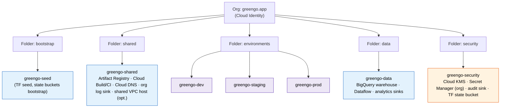
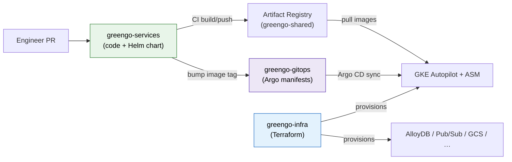
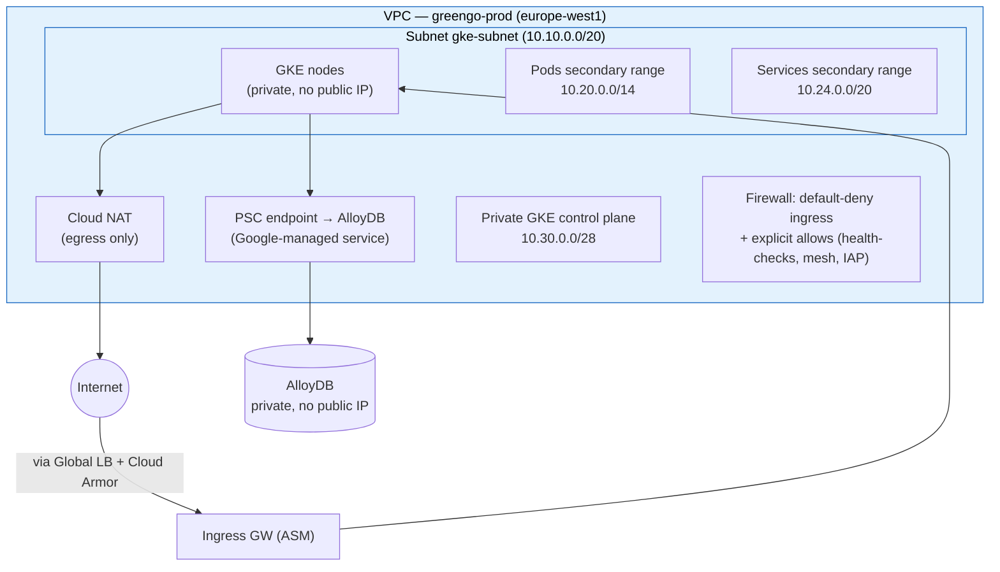
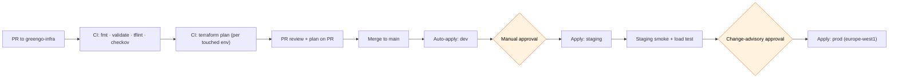
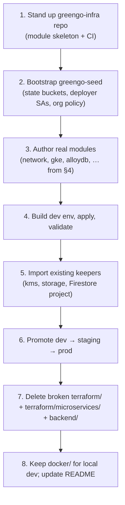

# 05 — Infrastructure as Code (Terraform)

> **Scope.** The Platform squad's build doc for GreenGo's Infrastructure as Code. Covers the GCP landing zone (org → folders → projects), repo strategy, Terraform module/environment layout, remote state, the networking module, promotion flow, naming/labeling for FinOps, secrets/state security, and the concrete migration off the **broken** `terraform/` tree that ships in the Flutter repo today.
>
> **Reads with.** [02-target-architecture.md](02-target-architecture.md) (what we are building), [03-gcp-service-catalog.md](03-gcp-service-catalog.md) (per-service sizing this doc provisions), [06-gke-platform.md](06-gke-platform.md) (the GKE Autopilot + ASM platform the `gke` module stands up), [07-data-platform.md](07-data-platform.md) (AlloyDB/Firestore/Memorystore consumed by the data modules), [08-networking-security.md](08-networking-security.md) (Cloud Armor, API Gateway, VPC-SC deep dive), [09-cicd-gitops.md](09-cicd-gitops.md) (Argo CD side of the split), [11-cost-finops.md](11-cost-finops.md) (labels → showback).
>
> **Locked decisions in force.** Hybrid strangler-fig (Firestore retained); AlloyDB PostgreSQL; GKE Autopilot + Anthos Service Mesh; Pub/Sub + Eventarc + Cloud Tasks; single region `europe-west1` first (multi-region Americas in Phase 7); **Terraform for infrastructure + Argo CD GitOps for Kubernetes**.
>
> **NFR anchors.** 1M → 5M MAU; 99.95% availability; RPO ≤ 5 min, RTO ≤ 30 min. Every module in this doc is sized and structured to hold those numbers.

---

## 1. Principles

IaC is the only sanctioned way to mutate `staging` and `prod`. The rules below are non-negotiable for the Platform squad and enforced in CI.

| # | Principle | What it means in practice | Enforcement |
|---|-----------|---------------------------|-------------|
| P1 | **Everything as code** | VPCs, GKE, AlloyDB, IAM bindings, Pub/Sub topics, Secret Manager *containers* (not values), budgets, monitoring — all declared in Terraform. No resource exists in stg/prod without a `.tf` file. | Drift detection job (`terraform plan` nightly) alerts on any out-of-band change. |
| P2 | **No click-ops in stg/prod** | Human console access to `greengo-staging` / `greengo-prod` is read-only by default. Write access is break-glass only, time-boxed, audited. | Org policy + IAM Conditions; break-glass grants via PAM with auto-expiry. |
| P3 | **Immutable infrastructure** | No in-place SSH mutation of nodes. GKE Autopilot nodes are Google-managed and replaced, not patched by us. App rollout = new image + Argo CD sync, never `kubectl edit`. | Autopilot (no node SSH); Argo CD `selfHeal: true` reverts manual K8s edits. |
| P4 | **Least privilege** | Each Terraform environment runs as its own service account scoped to its own project(s). No single SA can touch every project. Workload Identity for app→GCP; no exported SA keys. | Per-env deployer SA + IAM Conditions; `constraints/iam.disableServiceAccountKeyCreation`. |
| P5 | **Remote state + locking** | State lives in a CMEK-encrypted GCS bucket, per-env isolated prefixes, with GCS-native object locking preventing concurrent `apply`. Never local state, never state in git. | GCS backend with `use_lockfile = true`; bucket in `greengo-security`. |
| P6 | **Reviewed, planned, gated** | Every change is a PR. CI runs `fmt`, `validate`, `tflint`, `checkov`, and `plan`. `apply` only after human approval on `main`, only from CI, never from a laptop. | Branch protection + CI-only deployer SA (developers cannot `apply` locally to stg/prod). |
| P7 | **DRY, versioned modules** | Reusable modules are versioned (git tags); environments pin module versions. A change lands in `dev` before `staging`/`prod` bump their pin. | Module source pinned by `?ref=vX.Y.Z`. |

> **Dev exception.** `greengo-dev` allows engineers to `apply` locally for fast iteration (still remote state, still PR to persist). `staging`/`prod` are CI-only.

---

## 2. Landing zone — org → folders → projects

We adopt a **multi-project landing zone**. One project per environment plus shared/data/security seams gives us hard IAM and network blast-radius boundaries, clean per-env billing, and independent quota pools. A single monolithic project cannot meet P4 or the FinOps showback requirement.

### 2.1 Hierarchy



### 2.2 Projects — what lives where

| Project | Folder | Purpose | Key resources | Who deploys |
|---------|--------|---------|---------------|-------------|
| `greengo-seed` | bootstrap | Terraform bootstrap: creates the state buckets, deployer SAs, and enables APIs org-wide. Run once, rarely touched. | State GCS buckets, per-env deployer SAs, org-policy baseline. | Org admins (manual, guarded). |
| `greengo-shared` | shared | Cross-env platform services shared by all environments. | **Artifact Registry** (Docker + Helm), **Cloud Build / CI** runners, **Cloud DNS** zones, org-level **log sink** router, (optional) Shared VPC host. | `sa-deployer-shared`. |
| `greengo-dev` | environments | Fast-iteration environment; relaxed quotas, non-prod data. | GKE Autopilot (small), AlloyDB (dev tier), Memorystore (basic), Pub/Sub, GCS. | `sa-deployer-dev` (+ local apply allowed). |
| `greengo-staging` | environments | Prod-shaped pre-production; parity target for release gating & load tests. | GKE Autopilot (prod-shaped, scaled down), AlloyDB (HA, smaller), full mesh. | `sa-deployer-staging` (CI only). |
| `greengo-prod` | environments | Production, `europe-west1`. HA everything. | GKE Autopilot regional, AlloyDB HA + read pools, Memorystore HA, Cloud Armor, API Gateway. | `sa-deployer-prod` (CI only, gated). |
| `greengo-data` | data | Analytics plane, decoupled from serving. | **BigQuery** `greengo_analytics`, Dataflow, BQ sinks, scheduled queries. | `sa-deployer-data`. |
| `greengo-security` | security | Security & crypto control plane. | **Cloud KMS** keyrings (CMEK), org **Secret Manager**, **audit log sink** (immutable bucket), **Terraform state bucket**, VPC-SC perimeter config. | `sa-deployer-security` (tightest access). |

> **Firestore note.** Firestore Native is retained per the locked strangler-fig decision. It stays attached to the existing `greengo-chat` Firebase project during migration; the `firestore` Terraform module manages *rules, indexes, and backup schedules* against that project (imported), not a new database. See [07-data-platform.md](07-data-platform.md).

---

## 3. Repo strategy — three repos

Today GreenGo is a **single Flutter repo** (`GreenGo-App-Flutter`) that also carries a broken `terraform/` tree, a `terraform/microservices/` tree, a dead Django `backend/` skeleton, and a working `docker/` local stack. That does not scale to a hybrid platform with GitOps. We split into three purpose-built repos.

| Repo | Owns | Contents | Deployed by | Replaces / relates to |
|------|------|----------|-------------|-----------------------|
| **`greengo-infra`** | Cloud infrastructure | Terraform root modules, reusable `modules/`, `environments/{dev,staging,prod}/`, backend config, tflint/checkov policy. | CI (`terraform apply` per env). | Replaces the broken `terraform/` + `terraform/microservices/` trees. |
| **`greengo-gitops`** | Kubernetes desired state | Argo CD `Application`/`ApplicationSet`, per-env value overlays, Kustomize/Helm value files, mesh + platform add-ons. | Argo CD (pull-based sync). | New. Consumes images/Helm charts from `greengo-shared` Artifact Registry. See [09-cicd-gitops.md](09-cicd-gitops.md). |
| **`greengo-services`** | Application code | Per-domain microservices (money-ledger, social-graph, media, notifications, …), each with its **Helm chart** + Dockerfile + CI to build/push. | CI builds → Artifact Registry; Argo CD deploys. | New. The Flutter app repo stays for the *client*; server logic moves here. |

### 3.1 How they relate



**Contract between repos:** `greengo-infra` outputs (cluster name, WI pool, DB connection names, Pub/Sub topic IDs, KMS key ids) are published as Terraform outputs and consumed by `greengo-gitops` via a small generated `platform-outputs.yaml` (rendered from state, committed by CI). This keeps the GitOps repo free of Terraform, and the infra repo free of K8s manifests — a clean seam that matches the P3 immutability boundary.

> **Flutter app repo (`GreenGo-App-Flutter`)** remains the client-of-record and continues to hold `docs/migration/`. It **loses** infra ownership: `terraform/`, `terraform/microservices/`, and `backend/` are removed here (see §9). `docker/` stays for local dev.

---

## 4. Terraform structure

### 4.1 Directory layout (`greengo-infra`)

```text
greengo-infra/
├── README.md
├── .tflint.hcl
├── .checkov.yaml
├── modules/                        # reusable, versioned building blocks
│   ├── network/                    # VPC, subnets, secondary ranges, NAT, PSC, firewall
│   ├── gke/                        # Autopilot cluster + ASM (Anthos Service Mesh)
│   ├── alloydb/                    # AlloyDB cluster, primary, read pools, PSC endpoint
│   ├── firestore/                  # rules, indexes, backup schedule (imported project)
│   ├── memorystore/                # Redis HA
│   ├── pubsub/                     # topics, subscriptions, DLQs, schemas
│   ├── storage/                    # GCS buckets (CMEK, lifecycle, uniform ACL)
│   ├── bigquery/                   # datasets, tables, authorized views (greengo-data)
│   ├── iam/                        # SAs, WI bindings, custom roles, IAM Conditions
│   ├── secrets/                    # Secret Manager containers + accessor bindings
│   ├── monitoring/                 # SLOs, alert policies, dashboards, budgets
│   ├── cloud-armor/                # WAF/DDoS security policies
│   └── api-gateway/                # API Gateway / Apigee front door config
├── environments/
│   ├── dev/
│   │   ├── backend.tf              # GCS backend, prefix = env/dev
│   │   ├── providers.tf
│   │   ├── main.tf                 # module calls wired for dev
│   │   ├── variables.tf
│   │   ├── outputs.tf
│   │   └── dev.tfvars
│   ├── staging/
│   │   ├── backend.tf              # prefix = env/staging
│   │   ├── ... (same shape)
│   │   └── staging.tfvars
│   └── prod/
│       ├── backend.tf              # prefix = env/prod
│       ├── ... (same shape)
│       └── prod.tfvars
├── shared/                         # greengo-shared: Artifact Registry, DNS, CI
│   ├── backend.tf                  # prefix = shared
│   └── main.tf
└── security/                       # greengo-security: KMS, Secret Manager, state bucket, VPC-SC
    ├── backend.tf                  # prefix = security
    └── main.tf
```

**Per-env state isolation:** each `environments/<env>` (and `shared/`, `security/`) is its own root module with its own backend `prefix`, so a blast in `dev` cannot corrupt `prod` state, and `plan/apply` are scoped per env.

### 4.2 Remote state — GCS backend + locking

State bucket lives in `greengo-security`, CMEK-encrypted, versioned, with GCS-native lockfile locking (no external DynamoDB-equivalent needed on GCP).

```hcl
# environments/prod/backend.tf
terraform {
  required_version = ">= 1.9.0"

  backend "gcs" {
    bucket       = "greengo-tfstate-prod"       # in greengo-security, CMEK-encrypted
    prefix       = "env/prod"                    # per-env isolation
    use_lockfile = true                          # GCS object-generation state locking
  }

  required_providers {
    google = {
      source  = "hashicorp/google"
      version = "~> 6.0"
    }
    google-beta = {
      source  = "hashicorp/google-beta"
      version = "~> 6.0"
    }
  }
}
```

> **Never** local backend, **never** state committed to git. State buckets are created by `greengo-seed` bootstrap (chicken-and-egg: seed uses local state once, then migrates itself into the bucket it created).

### 4.3 Sample module call (prod `main.tf`, abridged)

```hcl
# environments/prod/main.tf
module "network" {
  source  = "git::https://github.com/greengo/greengo-infra.git//modules/network?ref=v1.4.0"

  project_id   = var.project_id
  region       = var.region                  # europe-west1
  environment  = var.environment             # "prod"
  subnet_cidr  = var.subnet_cidr
  pods_cidr    = var.pods_secondary_cidr
  svc_cidr     = var.services_secondary_cidr
  labels       = local.common_labels
}

module "gke" {
  source  = "git::https://github.com/greengo/greengo-infra.git//modules/gke?ref=v1.4.0"

  project_id          = var.project_id
  region              = var.region
  environment         = var.environment
  network             = module.network.network_self_link
  subnetwork          = module.network.subnet_self_link
  pods_range_name     = module.network.pods_range_name
  services_range_name = module.network.services_range_name
  master_cidr         = var.gke_master_cidr
  release_channel     = "REGULAR"
  enable_mesh         = true                  # Anthos Service Mesh
  labels              = local.common_labels
}

module "alloydb" {
  source  = "git::https://github.com/greengo/greengo-infra.git//modules/alloydb?ref=v1.4.0"

  project_id        = var.project_id
  region            = var.region
  environment       = var.environment
  network_self_link = module.network.network_self_link
  psc_enabled       = true
  primary_cpu_count = var.alloydb_primary_cpu   # e.g. 16
  read_pool_nodes   = var.alloydb_read_nodes    # e.g. 2
  ha_enabled        = true                       # regional HA (99.95% NFR)
  cmek_key_id       = var.alloydb_cmek_key       # from greengo-security KMS
  labels            = local.common_labels
}
```

### 4.4 Sample module interface — `gke`

```hcl
# modules/gke/variables.tf
variable "project_id"          { type = string }
variable "region"              { type = string }
variable "environment"         { type = string }              # dev|staging|prod
variable "network"             { type = string }              # self_link
variable "subnetwork"          { type = string }              # self_link
variable "pods_range_name"     { type = string }
variable "services_range_name" { type = string }
variable "master_cidr"         { type = string }              # /28 for private control plane
variable "release_channel"     { type = string  default = "REGULAR" }
variable "enable_mesh"         { type = bool    default = true }   # Anthos Service Mesh
variable "master_authorized_cidrs" {
  type    = list(object({ cidr = string, name = string }))
  default = []
}
variable "labels"              { type = map(string) default = {} }

# modules/gke/outputs.tf
output "cluster_name"            { value = google_container_cluster.this.name }
output "cluster_id"              { value = google_container_cluster.this.id }
output "endpoint"               { value = google_container_cluster.this.private_cluster_config[0].private_endpoint  sensitive = true }
output "workload_identity_pool" { value = "${var.project_id}.svc.id.goog" }
output "ca_certificate"         { value = google_container_cluster.this.master_auth[0].cluster_ca_certificate  sensitive = true }
output "mesh_id"                { value = local.mesh_id }
```

Internally the module provisions a **regional Autopilot** cluster (`enable_autopilot = true`), private nodes + private control plane, Workload Identity enabled by default, and — when `enable_mesh = true` — registers the cluster to the fleet and applies the ASM mesh label. Node counts are **not** an input: Autopilot scales per-Pod. See [06-gke-platform.md](06-gke-platform.md) for workload sizing.

### 4.5 Sample module interface — `alloydb`

```hcl
# modules/alloydb/variables.tf
variable "project_id"        { type = string }
variable "region"            { type = string }
variable "environment"       { type = string }
variable "network_self_link" { type = string }
variable "psc_enabled"       { type = bool   default = true }   # Private Service Connect
variable "primary_cpu_count" { type = number }                  # vCPUs on primary
variable "read_pool_nodes"   { type = number default = 0 }      # read replicas
variable "ha_enabled"        { type = bool   default = true }   # regional HA
variable "cmek_key_id"       { type = string }                  # CMEK from greengo-security
variable "backup_retention_days" { type = number default = 14 }
variable "pitr_enabled"      { type = bool   default = true }   # continuous backup → RPO ≤ 5min
variable "labels"            { type = map(string) default = {} }

# modules/alloydb/outputs.tf
output "cluster_id"        { value = google_alloydb_cluster.this.cluster_id }
output "primary_instance"  { value = google_alloydb_instance.primary.instance_id }
output "connection_uri"    { value = google_alloydb_instance.primary.psc_instance_config[0].psc_dns_name  sensitive = true }
output "read_endpoint"     { value = try(google_alloydb_instance.read_pool[0].psc_instance_config[0].psc_dns_name, null) sensitive = true }
```

The module wires **continuous backup / PITR** (`pitr_enabled = true`) to satisfy **RPO ≤ 5 min**, regional HA for the 99.95% NFR, and CMEK from `greengo-security`. Connectivity is **Private Service Connect** only (no public IP) — see §5.

---

## 5. Networking module

Single VPC per environment (custom-mode), regional to `europe-west1`, with a dedicated subnet carrying **secondary ranges** for GKE Pods and Services. GKE is **private** (no node public IPs, private control plane). AlloyDB is reached over **Private Service Connect**. Egress is via **Cloud NAT**. All ingress is default-deny with explicit firewall allows.



| Networking concern | Decision | Rationale |
|--------------------|----------|-----------|
| VPC mode | Custom-mode, one VPC per env project | Explicit ranges; blast-radius isolation between dev/stg/prod. |
| GKE Pod range | Secondary range (`/14`, ~262k IPs) | Headroom for 5M-MAU Pod density without renumbering. |
| GKE Service range | Secondary range (`/20`) | ClusterIP space. |
| Control plane | Private endpoint + master authorized networks | No public API server; access via IAP/bastion + CI. |
| Node access | Private nodes + Cloud NAT for egress | No inbound from internet to nodes; controlled egress for image pulls/APIs. |
| AlloyDB link | **Private Service Connect** endpoint | Private, no VPC peering range exhaustion, per the locked AlloyDB decision. |
| Firewall | Default-deny ingress; allow GKE health checks, ASM mesh, IAP CIDRs | Least-privilege network. |
| DNS | Cloud DNS private zones (in `greengo-shared`) + PSC DNS | Service discovery for private endpoints. |

Deeper WAF / Cloud Armor / API Gateway / VPC-SC treatment lives in [08-networking-security.md](08-networking-security.md); this module provisions the L3/L4 substrate those layers sit on.

---

## 6. Environments & promotion

`dev`, `staging`, `prod` are **structurally identical** (same modules, same wiring). They differ only by `*.tfvars` (sizing, HA flags, quotas) and module-version pins. `staging` is the parity gate for `prod`.

### 6.1 Change flow



Developers never run `apply` against stg/prod (P2/P6). CI, running as the per-env deployer SA, is the only writer. `dev` may be applied locally for iteration but must be reconciled via PR.

### 6.2 tfvars differences

| Setting | `dev.tfvars` | `staging.tfvars` | `prod.tfvars` |
|---------|-------------|------------------|---------------|
| `region` | europe-west1 | europe-west1 | europe-west1 |
| GKE cluster | Autopilot (single) | Autopilot (prod-shaped) | Autopilot regional, HA |
| `gke_master_cidr` | 10.30.0.0/28 | 10.31.0.0/28 | 10.32.0.0/28 |
| `alloydb_primary_cpu` | 4 | 8 | 16 |
| `alloydb_read_nodes` | 0 | 1 | 2 (scales) |
| `alloydb.ha_enabled` | false | true | true |
| `pitr_enabled` (AlloyDB) | false | true | true |
| Memorystore | Basic, 1 GB | Standard HA, 4 GB | Standard HA, 16 GB+ |
| Cloud Armor | permissive/log | enforce (staging rules) | enforce (full ruleset) |
| Budgets/alerts | soft | on | on + pager |
| Deletion protection | off | on | on |
| Module version pin | latest tag / branch OK | pinned `vX.Y.Z` | pinned `vX.Y.Z` (== staging after soak) |

Sizing figures are planning shapes; authoritative capacity/cost lives in [03-gcp-service-catalog.md](03-gcp-service-catalog.md) and [11-cost-finops.md](11-cost-finops.md).

---

## 7. Naming & labeling convention

### 7.1 Naming

`{org}-{env}-{service}-{qualifier}` — lowercase, hyphenated, region abbreviated where needed.

| Resource | Pattern | Example |
|----------|---------|---------|
| Project | `greengo-{env\|role}` | `greengo-prod`, `greengo-security` |
| VPC | `greengo-{env}-vpc` | `greengo-prod-vpc` |
| Subnet | `greengo-{env}-{region}-gke` | `greengo-prod-euw1-gke` |
| GKE cluster | `greengo-{env}-gke` | `greengo-prod-gke` |
| AlloyDB cluster | `greengo-{env}-alloydb` | `greengo-prod-alloydb` |
| Pub/Sub topic | `{domain}.{event}.v{n}` | `ledger.tx-posted.v1` |
| GCS bucket | `greengo-{env}-{purpose}` (globally unique) | `greengo-prod-media` |
| Service account | `sa-{service}-{env}` | `sa-ledger-prod` |
| State bucket | `greengo-tfstate-{env}` | `greengo-tfstate-prod` |

### 7.2 Labels (mandatory on every labelable resource → FinOps showback)

```hcl
# environments/prod/locals.tf
locals {
  common_labels = {
    project     = "greengo"
    env         = var.environment        # dev|staging|prod
    team        = "platform"             # owning squad
    cost_center = "eng-platform"         # FinOps showback key
    managed_by  = "terraform"
    migration   = "hybrid-gke"           # strangler-fig cohort tag
  }
}
```

| Label | Purpose | Consumed by |
|-------|---------|-------------|
| `project` | Constant `greengo`; disambiguates in shared org tooling. | Org log sink, billing export. |
| `env` | Environment slice. | Cost breakdown, alert routing. |
| `team` | Owning squad (`platform`, `payments`, `social`, `media`…). | Showback by team. |
| `cost_center` | Billing showback key. | [11-cost-finops.md](11-cost-finops.md) BigQuery billing export → per-CC report. |
| `managed_by` | Always `terraform`; anything without it is drift/click-ops. | Drift detection. |
| `migration` | Strangler-fig cohort tag. | Migration burn-down tracking. |

CI `checkov`/`tflint` policy fails the plan if a labelable resource is missing `env`, `team`, or `cost_center`.

---

## 8. Secrets & state security

| Control | Implementation |
|---------|----------------|
| **Secrets never in code/state** | Secret *values* live in **Secret Manager** (`greengo-security`, replicated to `europe-west1`). Terraform manages the *secret container + IAM accessor bindings*, not the payload. Values are written out-of-band (CI secret, break-glass) or synced from an external vault. |
| **No secrets in tfvars** | tfvars carry references (secret names, KMS key ids), never plaintext. `checkov` blocks plaintext-secret patterns. |
| **State treated as sensitive** | Even with no explicit secrets, Terraform state can capture sensitive outputs. State bucket is locked down: CMEK-encrypted, uniform bucket-level access, no public access, versioned, access limited to deployer SAs. |
| **State bucket CMEK** | `greengo-tfstate-*` buckets use a **CMEK** key from the `greengo-security` KMS keyring; key access audited. |
| **VPC Service Controls** | The state bucket, Secret Manager, and KMS sit inside a **VPC-SC perimeter** around `greengo-security` so exfiltration to outside the org is blocked even with valid creds. See [08-networking-security.md](08-networking-security.md). |
| **Workload Identity, no keys** | App→GCP auth via Workload Identity Federation; `constraints/iam.disableServiceAccountKeyCreation` org policy blocks exported SA keys. |
| **Audit** | All state-bucket and Secret Manager access flows to the immutable audit sink in `greengo-security`. |
| **Least-priv deployers** | Each `sa-deployer-<env>` can read the state prefix and write only its own env's resources; no cross-env authority (P4). |

---

## 9. Migration from the broken `terraform/`

### 9.1 What is broken today (in `GreenGo-App-Flutter`)

| Location | Problem | Action |
|----------|---------|--------|
| `terraform/main.tf` | References modules `./modules/cdn`, `network`, `pubsub`, `bigquery`, `monitoring` that **do not exist**; only `cloud_functions`, `kms`, `storage` exist. Hardcodes `nodejs18`. **No remote state.** | **Delete** after salvaging intent; rebuild in `greengo-infra`. |
| `terraform/microservices/main.tf` | References **12** modules; only `media-processing` exists. | **Delete**; re-express as real modules + Helm services. |
| `backend/` (Django skeleton) | Non-functional; not part of the target (services move to `greengo-services`). | **Delete.** |
| `docker/` | Real, working local stack (emulators + Postgres + Redis). | **Keep** for local dev. |

### 9.2 Migration steps



1. **Create `greengo-infra`** with the `modules/` + `environments/` skeleton from §4, plus CI (`fmt`, `validate`, `tflint`, `checkov`, `plan`).
2. **Bootstrap `greengo-seed`**: create the CMEK state buckets in `greengo-security`, per-env deployer SAs, and baseline org policies. Migrate seed's own state into its bucket.
3. **Author the real modules** listed in §4 (`network`, `gke`, `alloydb`, `firestore`, `memorystore`, `pubsub`, `storage`, `bigquery`, `iam`, `secrets`, `monitoring`, `cloud-armor`, `api-gateway`). Kill the `nodejs18` hardcode — Cloud Functions/runtimes become module inputs, and most server logic moves to GKE services anyway.
4. **Build `environments/dev`**, `apply`, validate end-to-end (cluster reachable, AlloyDB PSC connects, Pub/Sub round-trips).
5. **Import keepers**, don't recreate: the existing **KMS** keyrings, **GCS** buckets, and the retained **Firestore/`greengo-chat`** project are brought under management with `terraform import` (or `import {}` blocks) so no data is destroyed. The old `terraform/modules/{cloud_functions,kms,storage}` logic is salvaged into the new modules where useful.
6. **Promote** dev → staging → prod via the gated flow (§6). Prod is `europe-west1`.
7. **Delete the broken trees**: remove `terraform/`, `terraform/microservices/`, and the dead `backend/` Django skeleton from `GreenGo-App-Flutter`. Their intent now lives in `greengo-infra` / `greengo-services`.
8. **Keep `docker/`** as the local-dev stack (emulators + Postgres + Redis); update the repo README to point infra questions at `greengo-infra` and this doc.

> **Import over recreate** is the rule for anything holding state or crypto material (KMS keys, buckets with data, Firestore). Recreate freely only for stateless/never-provisioned resources (the phantom `cdn`, `network`, `pubsub`, `bigquery`, `monitoring` modules that were referenced but never existed).

---

## Appendix A — Module → owning project → doc map

| Module | Provisioned into | Detailed in |
|--------|------------------|-------------|
| `network` | per-env | §5, [08-networking-security.md](08-networking-security.md) |
| `gke` | per-env | [06-gke-platform.md](06-gke-platform.md) |
| `alloydb` | per-env | [07-data-platform.md](07-data-platform.md) |
| `firestore` | `greengo-chat` (imported) | [07-data-platform.md](07-data-platform.md) |
| `memorystore` | per-env | [07-data-platform.md](07-data-platform.md) |
| `pubsub` | per-env | [03-gcp-service-catalog.md](03-gcp-service-catalog.md) |
| `storage` | per-env | [03-gcp-service-catalog.md](03-gcp-service-catalog.md) |
| `bigquery` | `greengo-data` | [03-gcp-service-catalog.md](03-gcp-service-catalog.md) |
| `iam` | all | [08-networking-security.md](08-networking-security.md) |
| `secrets` | `greengo-security` | §8 |
| `monitoring` | per-env + `greengo-shared` | [10-observability.md](10-observability.md) |
| `cloud-armor` | prod/staging | [08-networking-security.md](08-networking-security.md) |
| `api-gateway` | prod/staging | [08-networking-security.md](08-networking-security.md) |

---

*Platform squad build doc. Changes to landing-zone shape, state topology, or the repo split require Platform-lead + Security sign-off.*
