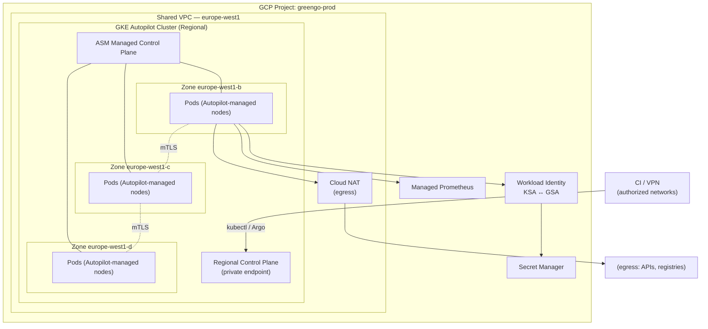
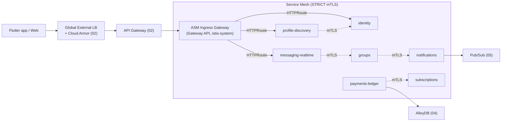
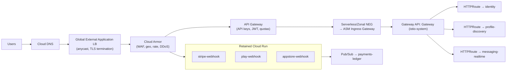
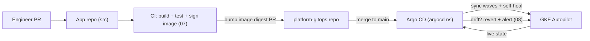
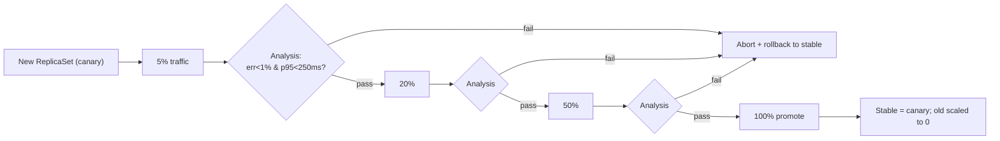

# 06 — GKE Platform

> **Scope.** This is the Platform/SRE build document for the container plane of the GreenGo hybrid migration. It defines how the **14 containerized domain services** run on **GKE Autopilot** behind **Anthos Service Mesh (ASM)**, how they are scaled, secured, delivered (GitOps + progressive delivery), and the **golden path** a product team follows to ship a new service. Firestore, AlloyDB, Pub/Sub, Cloud Tasks, and the webhook-only Cloud Run surface are owned elsewhere; here they are dependencies, not deliverables.
>
> **Locked decisions honored:** hybrid strangler-fig (Firestore retained), AlloyDB Postgres, GKE Autopilot regional `europe-west1` (3 zones) + ASM managed Istio with STRICT mTLS, Pub/Sub + Eventarc + Cloud Tasks eventing, single region first, Terraform for infra + Argo CD GitOps + Argo Rollouts canary, Cloud Run kept only for payment webhooks.
>
> **Cross-references:** edge, LB, Cloud Armor, and API Gateway topology live in [02-target-architecture.md](02-target-architecture.md); the CI/CD pipeline that builds and signs images lives in [07-cicd.md](07-cicd.md); SLOs, dashboards, and the metrics that drive canary analysis live in [08-observability-slo.md](08-observability-slo.md); data stores in [04-data-platform.md](04-data-platform.md); eventing contracts in [05-eventing.md](05-eventing.md).

---

## 0. The 14 domain services at a glance

Every service in this document maps to exactly one of the locked 14 domains. Their runtime shape, statefulness, and traffic profile drive nearly every platform decision that follows (autoscaling class, PDB budget, mesh policy).

| # | Domain service (namespace stem) | Primary datastore | Traffic class | Sync API | Event consumer | Notes |
|---|----------------------------------|-------------------|---------------|:--------:|:--------------:|-------|
| 1 | `identity` | AlloyDB + Firebase Auth | spiky (login storms) | ✔ | ✔ | Token mint/verify; strictest latency budget |
| 2 | `profile-discovery` | AlloyDB + Firestore (read) | steady, read-heavy | ✔ | ✔ | Geo/discovery queries; heavy HPA on QPS |
| 3 | `messaging-realtime` | Firestore + AlloyDB | very spiky, long-lived conns | ✔ (WS) | ✔ | Stateful-ish; graceful drain critical |
| 4 | `groups` | AlloyDB + Firestore | steady | ✔ | ✔ | Fan-out on membership changes |
| 5 | `events-catalog` | AlloyDB | read-heavy, cacheable | ✔ | ✔ | External ingesters land here |
| 6 | `payments-ledger` | AlloyDB (ledger, strong consistency) | low QPS, high value | ✔ | ✔ | Cloud Run webhooks feed via Pub/Sub |
| 7 | `subscriptions` | AlloyDB | low QPS | ✔ | ✔ | Entitlement source of truth |
| 8 | `notifications` | Firestore + Pub/Sub | bursty fan-out | partial | ✔ | Queue-depth-driven scaling |
| 9 | `safety-moderation` | AlloyDB + Vertex AI | bursty | partial | ✔ | Async classification workers |
| 10 | `media` | GCS + AlloyDB | bandwidth-heavy | ✔ | ✔ | Transcode workers; CPU spiky |
| 11 | `gamification` | AlloyDB + Redis | steady | ✔ | ✔ | Coin faucet, streaks, leaderboards |
| 12 | `language-learning` | AlloyDB + Vertex/Chirp | steady | ✔ | ✔ | TTS orchestration (coin-gated) |
| 13 | `analytics` | BigQuery + Pub/Sub | ingest-heavy | partial | ✔ | Streaming ETL, no user-facing p95 |
| 14 | `admin` | AlloyDB | very low QPS | ✔ | ✖ | Internal-only, mesh-gated |

---

## 1. Cluster design

### 1.1 Principles

- **One cluster per environment** (`dev`, `staging`, `prod`) — hard blast-radius isolation, independent upgrade cadence, independent IAM. No multi-env in a single cluster.
- **GKE Autopilot** — Google manages nodes, bin-packing, node security posture, and node autoscaling. Platform team owns workloads, not machines. This removes an entire class of node-pool toil and aligns with the SRE headcount we actually have.
- **Regional, `europe-west1`, spread across 3 zones** (`b`, `c`, `d`) — survives a single-zone failure with zero manual intervention; control plane is regional and HA by default.
- **Private cluster** — nodes have no public IPs; egress via Cloud NAT; control-plane endpoint is private with authorized networks for the bastion/CI reachability.
- **Workload Identity Federation** — every Kubernetes ServiceAccount (KSA) binds to a Google ServiceAccount (GSA). Zero long-lived JSON keys anywhere in the cluster.
- **Release channel: `regular`** for `prod`/`staging`, `rapid` for `dev` — dev surfaces breaking Kubernetes/ASM changes ~1–2 releases ahead of prod.

### 1.2 Cluster settings

| Setting | dev | staging | prod | Rationale |
|---|---|---|---|---|
| Mode | Autopilot | Autopilot | Autopilot | No node ops |
| Region | `europe-west1` | `europe-west1` | `europe-west1` | Single region first (locked) |
| Zones | b,c,d | b,c,d | b,c,d | Zonal HA |
| Release channel | `rapid` | `regular` | `regular` | Early breakage detection in dev |
| Private nodes | ✔ | ✔ | ✔ | No public node IPs |
| Private control plane | ✔ (public endpoint w/ authz nets) | ✔ private | ✔ private | Reduce attack surface in prod |
| Authorized networks | CI + VPN | CI + VPN | CI + VPN only | Locked-down API access |
| Workload Identity | ✔ (`PROJECT.svc.id.goog`) | ✔ | ✔ | Keyless GCP auth |
| ASM | managed (`asm-managed-rapid`) | managed (`asm-managed`) | managed (`asm-managed`) | Managed Istio control plane |
| Dataplane V2 (eBPF) | ✔ | ✔ | ✔ | NetworkPolicy + flow logs |
| Managed Prometheus | ✔ | ✔ | ✔ | HPA custom metrics + SLOs ([08](08-observability-slo.md)) |
| Binary Authorization | dry-run | enforce | enforce | Only signed images run ([07](07-cicd.md)) |
| Confidential Nodes | ✖ | ✖ | optional | Evaluate for `payments-ledger` |
| Maintenance window | anytime | weekend nights | Sun 02:00–06:00 CET | Predictable upgrades |
| CIDR (pods/services) | non-overlapping /17,/22 | non-overlapping | non-overlapping | Peering-safe |
| Cost / cluster autoscaling | Autopilot-managed | Autopilot-managed | Autopilot-managed | Pay per pod request |
| Deletion protection | ✖ | ✔ | ✔ | Guard prod |

> Terraform module: `infra/modules/gke-autopilot` with a per-env `tfvars`. The cluster resource, ASM feature enablement, Workload Identity pool, and CMEK keys are all declared there — never `gcloud`-mutated. See [03-infra-terraform.md](03-infra-terraform.md).

### 1.3 Cluster topology



---

## 2. Namespace & tenancy model

### 2.1 Model

**Soft multi-tenancy within an env cluster.** Each domain service owns exactly one namespace; platform capabilities live in dedicated platform namespaces. Namespaces are the unit of RBAC, ResourceQuota, NetworkPolicy scope, and mesh sidecar injection. There is no per-env namespace suffix inside a cluster because **env == cluster** (see §1.1); the `× env` axis is realized as three separate clusters.

Every domain namespace carries:
- `istio-injection=enabled` (sidecar auto-inject),
- a `ResourceQuota` and `LimitRange` (guardrails so a runaway service cannot starve the mesh),
- a default **deny-all** `NetworkPolicy` (§10),
- an `external-secrets` `SecretStore` reference (§6),
- ownership labels: `greengo.dev/domain`, `greengo.dev/team`, `greengo.dev/oncall`.

### 2.2 Namespace inventory

| Namespace | Kind | Injected | Owner | Purpose |
|---|---|:---:|---|---|
| `identity` | domain | ✔ | Identity team | Auth, token mint/verify |
| `profile-discovery` | domain | ✔ | Discovery team | Profiles, geo discovery |
| `messaging-realtime` | domain | ✔ | Messaging team | Chat, presence, WS |
| `groups` | domain | ✔ | Social team | Group lifecycle & fan-out |
| `events-catalog` | domain | ✔ | Events team | Events/attractions catalog |
| `payments-ledger` | domain | ✔ | Payments team | Coins ledger, purchases |
| `subscriptions` | domain | ✔ | Payments team | Entitlements |
| `notifications` | domain | ✔ | Growth team | Push/email fan-out |
| `safety-moderation` | domain | ✔ | Trust & Safety | Moderation, abuse |
| `media` | domain | ✔ | Media team | Upload/transcode |
| `gamification` | domain | ✔ | Growth team | Coins faucet, streaks |
| `language-learning` | domain | ✔ | Learning team | TTS, lessons |
| `analytics` | domain | ✔ | Data team | Streaming ETL |
| `admin` | domain | ✔ | Platform | Internal admin API |
| `istio-system` | platform | n/a | Platform | ASM ingress gateways, mesh config |
| `argocd` | platform | ✖ | Platform | GitOps controller |
| `monitoring` | platform | ✔ | Platform | Managed Prometheus rules, adapters, Grafana |
| `cert-manager` | platform | ✖ | Platform | Cert issuance for internal TLS/webhooks |
| `external-secrets` | platform | ✖ | Platform | ESO controller |
| `rollouts` | platform | ✖ | Platform | Argo Rollouts controller |
| `flagd`/`config` | platform | ✔ | Platform | Feature flags (optional) |

> RBAC: each domain team gets `edit` on **its** namespace only, bound to a Google Group via Workload Identity / GKE RBAC group sync. Platform team gets `cluster-admin` gated behind break-glass with audit logging. No human has standing `cluster-admin` in prod.

---

## 3. Anthos Service Mesh (managed Istio)

### 3.1 What we turn on

| Capability | Setting | Notes |
|---|---|---|
| Control plane | **Managed** (`asm-managed`) | Google-operated istiod; no self-managed control plane |
| Data plane | Sidecar (Envoy) auto-inject per namespace | Ambient mesh evaluated later; sidecar chosen for maturity + fine-grained authz |
| mTLS | **STRICT**, mesh-wide `PeerAuthentication` | All east-west traffic encrypted + authenticated by SPIFFE identity |
| Ingress | **Gateway API** (`gke-l7-*` + ASM gateway) | North-south entry; see §4 |
| Authorization | `AuthorizationPolicy` deny-by-default per namespace | Explicit allow-lists between services |
| Telemetry | Managed Prometheus + ASM dashboards + Cloud Trace | Feeds SLOs in [08](08-observability-slo.md) |
| Retries/timeouts | `VirtualService` defaults per service | Sane global defaults, overridable |
| Outlier detection | `DestinationRule` circuit breaking | Eject unhealthy endpoints |

### 3.2 Mesh-wide STRICT mTLS

```yaml
# platform/asm/peer-authentication-strict.yaml
apiVersion: security.istio.io/v1
kind: PeerAuthentication
metadata:
  name: default
  namespace: istio-system   # mesh-wide root config
spec:
  mtls:
    mode: STRICT
```

STRICT means a workload without a valid mesh sidecar identity **cannot** talk to any meshed service. This is the backbone of our zero-trust east-west posture: network reachability alone grants nothing.

### 3.3 Authorization policy pattern (deny-by-default)

Every domain namespace ships an empty-`rules` deny plus explicit allows. Example — only `messaging-realtime` and `notifications` may call `groups`:

```yaml
# groups/authz.yaml
apiVersion: security.istio.io/v1
kind: AuthorizationPolicy
metadata:
  name: groups-default-deny
  namespace: groups
spec: {}          # empty spec = deny all
---
apiVersion: security.istio.io/v1
kind: AuthorizationPolicy
metadata:
  name: groups-allow-callers
  namespace: groups
spec:
  action: ALLOW
  rules:
    - from:
        - source:
            principals:
              - "cluster.local/ns/messaging-realtime/sa/messaging-realtime"
              - "cluster.local/ns/notifications/sa/notifications"
      to:
        - operation:
            methods: ["GET", "POST"]
            paths: ["/v1/groups/*"]
```

### 3.4 North-south + east-west traffic



- **North-south:** Client → Global LB (Cloud Armor WAF/DDoS) → API Gateway (authn, quotas, key mgmt) → ASM ingress Gateway (mTLS origination into mesh) → domain service via `HTTPRoute`.
- **East-west:** service-to-service is always mTLS with SPIFFE identity; every hop is authorized by an `AuthorizationPolicy`. No service trusts another by IP.

---

## 4. Ingress & edge integration

The mesh does **not** own the internet edge. It sits behind the shared edge stack defined in [02-target-architecture.md](02-target-architecture.md):



Key integration facts:

| Concern | Decision |
|---|---|
| TLS termination | At Global LB (managed certs); re-originated as mTLS into mesh at the ASM Gateway |
| Gateway implementation | **Gateway API** (`Gateway` + `HTTPRoute`) using the ASM/`istio` GatewayClass — chosen over legacy Ingress for portability, header/traffic-split expressiveness, and Rollouts integration (§8) |
| Webhooks | Stripe/Play/App-Store hit **Cloud Run** directly (not the mesh); they validate signatures then publish to Pub/Sub which `payments-ledger` consumes. This keeps low-volume, spiky, externally-authenticated endpoints off the mesh and scaling to zero. |
| WAF/DDoS | Cloud Armor only at the edge; the mesh Gateway assumes traffic is pre-filtered |
| Internal-only services (`admin`, `analytics`) | No `HTTPRoute` from the public Gateway; reachable only via an internal Gateway + VPN |

Sample edge `Gateway` + `HTTPRoute`:

```yaml
# platform/gateway/public-gateway.yaml
apiVersion: gateway.networking.k8s.io/v1
kind: Gateway
metadata:
  name: greengo-public
  namespace: istio-system
spec:
  gatewayClassName: istio
  listeners:
    - name: https
      protocol: HTTPS
      port: 443
      tls:
        mode: Terminate
        certificateRefs:
          - name: greengo-edge-cert
      allowedRoutes:
        namespaces:
          from: Selector
          selector:
            matchLabels:
              greengo.dev/public-route: "true"
---
apiVersion: gateway.networking.k8s.io/v1
kind: HTTPRoute
metadata:
  name: identity-route
  namespace: identity
spec:
  parentRefs:
    - name: greengo-public
      namespace: istio-system
  hostnames: ["api.greengo.app"]
  rules:
    - matches:
        - path: { type: PathPrefix, value: /v1/auth }
      backendRefs:
        - name: identity
          port: 8080
```

---

## 5. Autoscaling & reliability

### 5.1 Scaling stack

- **HPA** is the primary scaler. It combines **CPU** and **custom/external metrics** exposed through the **Managed Prometheus adapter** (`custom.metrics.k8s.io` / `external.metrics.k8s.io`). Queue-driven services scale on **Pub/Sub subscription backlog depth**, not CPU.
- **Autopilot pod bursting** — a pod may burst above its CPU *requests* up to its *limits* when the node has spare capacity, absorbing short spikes without waiting on a scale-up. We set requests to steady-state and limits with headroom for bursty services.
- **Vertical guidance, not VPA in `Auto`** — Autopilot sizes nodes from pod requests; we keep requests honest via periodic right-sizing (VPA in `Off`/recommendation mode feeding dashboards).
- **PodDisruptionBudgets** protect availability during node upgrades / rebalancing.
- **Topology spread** forces pods across the 3 zones.
- **Graceful shutdown** — message/queue consumers must stop pulling, drain in-flight, and ack before exit within `terminationGracePeriodSeconds`.

### 5.2 Per-service scaling hints

| Service | Scale signal(s) | Min/Max (prod) | PDB `minAvailable` | Notes |
|---|---|---|---|---|
| `identity` | CPU + RPS | 6 / 120 | 60% | Login storms; keep warm min |
| `profile-discovery` | RPS + p95 | 8 / 200 | 60% | Read-heavy, cache-friendly |
| `messaging-realtime` | active WS conns (custom) + CPU | 10 / 300 | 70% | Long-lived conns; slow drain |
| `groups` | CPU + RPS | 4 / 80 | 50% | Fan-out spikes on writes |
| `events-catalog` | RPS | 4 / 60 | 50% | Cache in front; modest |
| `payments-ledger` | RPS (low) + queue depth | 4 / 30 | 75% | High value; conservative, no aggressive scale-down |
| `subscriptions` | RPS (low) | 3 / 20 | 50% | Entitlement checks |
| `notifications` | **Pub/Sub backlog** (external) | 4 / 150 | 40% | Backlog-driven; KEDA-style via Prom adapter |
| `safety-moderation` | **Pub/Sub backlog** + CPU | 3 / 100 | 40% | Async workers, tolerate lag |
| `media` | CPU (transcode) + backlog | 3 / 120 | 40% | CPU-bound bursts |
| `gamification` | RPS + CPU | 4 / 60 | 50% | Coin faucet spikes at events |
| `language-learning` | RPS + external TTS latency | 3 / 40 | 50% | TTS is coin-gated + cached |
| `analytics` | **Pub/Sub backlog** | 2 / 80 | 20% | No user p95; tolerate lag, prioritize cost |
| `admin` | RPS (tiny) | 2 / 6 | 50% | Internal only |

### 5.3 HPA on Pub/Sub backlog (external metric)

```yaml
# notifications/hpa.yaml
apiVersion: autoscaling/v2
kind: HorizontalPodAutoscaler
metadata:
  name: notifications
  namespace: notifications
spec:
  scaleTargetRef:
    apiVersion: argoproj.io/v1alpha1   # scale the Rollout, not a Deployment
    kind: Rollout
    name: notifications
  minReplicas: 4
  maxReplicas: 150
  behavior:
    scaleDown:
      stabilizationWindowSeconds: 300   # avoid flapping
      policies:
        - type: Percent
          value: 25
          periodSeconds: 60
    scaleUp:
      stabilizationWindowSeconds: 0
      policies:
        - type: Percent
          value: 100
          periodSeconds: 30
  metrics:
    - type: Resource
      resource:
        name: cpu
        target:
          type: Utilization
          averageUtilization: 65
    - type: External
      external:
        metric:
          name: pubsub.googleapis.com|subscription|num_undelivered_messages
          selector:
            matchLabels:
              resource.labels.subscription_id: notifications-fanout-sub
        target:
          type: AverageValue
          averageValue: "200"   # target ~200 backlog msgs per replica
```

### 5.4 Reliability primitives (every service)

```yaml
# fragment shared via base kustomize/helm
apiVersion: policy/v1
kind: PodDisruptionBudget
metadata: { name: groups, namespace: groups }
spec:
  minAvailable: 50%
  selector: { matchLabels: { app: groups } }
---
# pod template excerpts
spec:
  terminationGracePeriodSeconds: 60        # consumers need drain time
  topologySpreadConstraints:
    - maxSkew: 1
      topologyKey: topology.kubernetes.io/zone
      whenUnsatisfiable: ScheduleAnyway
      labelSelector: { matchLabels: { app: groups } }
  containers:
    - name: app
      resources:
        requests: { cpu: "250m", memory: "512Mi" }
        limits:   { cpu: "1",    memory: "512Mi" }   # mem request==limit on Autopilot
      lifecycle:
        preStop:
          exec: { command: ["/bin/sh","-c","sleep 10"] }  # let LB deregister first
      readinessProbe:
        httpGet: { path: /healthz/ready, port: 8080 }
      livenessProbe:
        httpGet: { path: /healthz/live, port: 8080 }
```

> **Requests/limits guidance on Autopilot:** memory `request == limit` (Autopilot enforces); CPU limit may exceed request to allow bursting; always set requests from observed p90 usage, never guess. Under-requesting causes throttling + noisy p95; over-requesting burns money because Autopilot bills on requests.
>
> **Graceful shutdown for consumers:** on `SIGTERM` → stop new Pub/Sub pulls → finish in-flight → ack/nack → exit before `terminationGracePeriodSeconds`. `preStop sleep 10` covers the LB/mesh endpoint-deregistration race so no new request is routed to a terminating pod.

---

## 6. Config & secrets

**Rule: zero secrets baked into images, zero secrets in Git (even encrypted).** Source of truth is **Secret Manager**; the cluster pulls at runtime.

| Layer | Mechanism | Use |
|---|---|---|
| Secrets | **External Secrets Operator (ESO)** syncing Secret Manager → K8s `Secret` | DB creds, API keys, signing keys |
| Secrets (alt/high-sensitivity) | **Secret Manager CSI driver** (mounted, not materialized as K8s Secret) | `payments-ledger` signing keys |
| Non-secret config | `ConfigMap` (rendered by Helm/Kustomize per env) | feature flags defaults, tunables, log levels |
| Identity to fetch | **Workload Identity** (KSA→GSA with `secretmanager.secretAccessor`) | keyless access |

```yaml
# external-secrets: a domain namespace pulls DB creds from Secret Manager
apiVersion: external-secrets.io/v1
kind: ExternalSecret
metadata:
  name: alloydb-creds
  namespace: payments-ledger
spec:
  refreshInterval: 1h
  secretStoreRef: { name: gcp-secret-manager, kind: ClusterSecretStore }
  target: { name: alloydb-creds, creationPolicy: Owner }
  data:
    - secretKey: DATABASE_URL
      remoteRef: { key: prod-payments-alloydb-url }
```

- ESO `ClusterSecretStore` authenticates via Workload Identity — no static key.
- Rotation: rotating in Secret Manager triggers ESO refresh (≤ `refreshInterval`); high-sensitivity services subscribe to Secret Manager rotation events via Eventarc for near-instant roll ([05](05-eventing.md)).
- CSI driver preferred where we must avoid the secret ever existing as a K8s `Secret` object (defense-in-depth for payments signing material).

---

## 7. GitOps with Argo CD

### 7.1 Model

- **App-of-apps.** One root `Application` per env points at `clusters/<env>/` and renders child `Application`s — one per domain service plus platform add-ons.
- **ApplicationSets** generate the 14 domain `Application`s from a single generator (directory/Git generator), so adding a service = adding a directory, not writing 14 YAMLs.
- **Sync waves** order bootstrap: CRDs/operators → mesh/policies → services → routes.
- **Self-heal + auto-prune** in `staging`/`prod` — the cluster is continuously reconciled to Git; manual `kubectl` edits are reverted (drift detection alerts fire first, see [08](08-observability-slo.md)).
- **Separation of concerns with CI:** [07-cicd.md](07-cicd.md) builds+signs images and bumps the image digest in the env repo via PR; Argo CD only ever *reads* Git. No pipeline runs `kubectl apply`.

### 7.2 Sync waves

| Wave | Contents |
|---|---|
| `-2` | Namespaces, ResourceQuota, LimitRange |
| `-1` | CRDs, operators (ESO, cert-manager, Rollouts), ASM config, PeerAuthentication STRICT |
| `0` | ConfigMaps, ExternalSecrets, NetworkPolicies, AuthorizationPolicies |
| `1` | Domain service Rollouts + HPAs + PDBs |
| `2` | Gateways, HTTPRoutes, VirtualServices |
| `3` | Dashboards, SLO/alerting rules, PrometheusRules |

### 7.3 ApplicationSet for the 14 services

```yaml
# argocd/appset-domain-services.yaml
apiVersion: argoproj.io/v1alpha1
kind: ApplicationSet
metadata:
  name: domain-services
  namespace: argocd
spec:
  generators:
    - git:
        repoURL: https://github.com/greengo/platform-gitops
        revision: main
        directories:
          - path: envs/prod/services/*
  template:
    metadata:
      name: '{{path.basename}}-prod'
    spec:
      project: greengo-prod
      source:
        repoURL: https://github.com/greengo/platform-gitops
        path: '{{path}}'
        targetRevision: main
      destination:
        server: https://kubernetes.default.svc
        namespace: '{{path.basename}}'
      syncPolicy:
        automated: { prune: true, selfHeal: true }
        syncOptions: [CreateNamespace=false, ServerSideApply=true]
```

### 7.4 GitOps flow



---

## 8. Progressive delivery

Deploys are **Argo Rollouts canaries** that shift traffic through **ASM** and gate each step on **analysis tied to SLOs**. A bad release is auto-rolled-back before it reaches meaningful traffic.

### 8.1 Canary strategy

| Step | Weight | Gate |
|---|---|---|
| 1 | 5% | `AnalysisTemplate` (error-rate + p95) over 5 min |
| 2 | 20% | same, 5 min |
| 3 | 50% | same, 10 min |
| 4 | 100% | promote, scale down stable |

Analysis pulls from **Managed Prometheus** using the same PromQL that backs the SLOs in [08-observability-slo.md](08-observability-slo.md) — canary success criteria and production SLOs are literally the same queries, so "the canary is healthy" means "it meets our SLO."

### 8.2 Canary steps (visual)



### 8.3 Rollout + AnalysisTemplate (real)

```yaml
# groups/rollout.yaml
apiVersion: argoproj.io/v1alpha1
kind: Rollout
metadata:
  name: groups
  namespace: groups
spec:
  replicas: 4
  selector: { matchLabels: { app: groups } }
  strategy:
    canary:
      trafficRouting:
        managedRoutes:
          - name: canary-header
        plugins:
          argoproj-labs/gatewayAPI:
            httpRoute: groups-route
            namespace: groups
      steps:
        - setWeight: 5
        - pause: { duration: 5m }
        - analysis:
            templates: [{ templateName: slo-canary }]
            args: [{ name: service, value: groups }]
        - setWeight: 20
        - pause: { duration: 5m }
        - setWeight: 50
        - pause: { duration: 10m }
        - setWeight: 100
  template:
    metadata: { labels: { app: groups } }
    spec:
      serviceAccountName: groups
      containers:
        - name: app
          image: europe-west1-docker.pkg.dev/greengo/apps/groups@sha256:REPLACED_BY_CI
          ports: [{ containerPort: 8080 }]
          resources:
            requests: { cpu: "250m", memory: "512Mi" }
            limits:   { cpu: "1",    memory: "512Mi" }
---
# groups/analysistemplate-slo.yaml
apiVersion: argoproj.io/v1alpha1
kind: AnalysisTemplate
metadata:
  name: slo-canary
  namespace: groups
spec:
  args: [{ name: service }]
  metrics:
    - name: error-rate
      interval: 1m
      count: 5
      failureLimit: 1            # one breach aborts
      successCondition: result < 0.01     # <1% 5xx
      provider:
        prometheus:
          address: http://frontend.monitoring.svc:9090   # Managed Prometheus frontend
          query: |
            sum(rate(istio_requests_total{
              destination_service_name="{{args.service}}",
              response_code=~"5.."}[2m]))
            /
            sum(rate(istio_requests_total{
              destination_service_name="{{args.service}}"}[2m]))
    - name: p95-latency
      interval: 1m
      count: 5
      failureLimit: 1
      successCondition: result < 250      # ms, matches API p95<250ms NFR
      provider:
        prometheus:
          address: http://frontend.monitoring.svc:9090
          query: |
            histogram_quantile(0.95,
              sum(rate(istio_request_duration_milliseconds_bucket{
                destination_service_name="{{args.service}}"}[2m])) by (le))
```

---

## 9. Golden path — shipping a new service

The golden path is the **templated, paved road**. A team `cookiecutter`s the service template and fills in ~4 things; everything else (mesh, mTLS, HPA scaffold, PDB, canary, GitOps wiring, dashboards) comes for free and stays consistent across all 14 services.

### 9.1 What the template ships vs. what a team fills in

| Artifact | Provided by template | Team fills in |
|---|---|---|
| `Dockerfile` | distroless non-root base, healthcheck | build steps, entrypoint |
| Helm chart / Kustomize base | full base (Rollout, Service, HPA, PDB, HTTPRoute, AuthorizationPolicy, ExternalSecret) | `values.yaml`: name, port, resources, callers, routes |
| `Rollout` | canary strategy + steps | replicas, image (CI injects digest) |
| `HPA` | CPU metric wired | custom/external metric + min/max |
| `PDB` | `minAvailable` default | budget tuning |
| `AnalysisTemplate` | SLO queries (error-rate, p95) | thresholds if service differs |
| `NetworkPolicy` | deny-all default | allowed ingress peers |
| GitOps entry | directory picked up by ApplicationSet | just add the dir |
| Dashboards/SLO | generated from template | ownership labels, alert routing |

### 9.2 Kustomize layout (base + per-env overlays)

```
services/groups/
├── base/
│   ├── kustomization.yaml
│   ├── rollout.yaml
│   ├── service.yaml
│   ├── hpa.yaml
│   ├── pdb.yaml
│   ├── httproute.yaml
│   ├── authz.yaml
│   ├── networkpolicy.yaml
│   └── externalsecret.yaml
└── overlays/
    ├── dev/      { kustomization.yaml, patches: replicas=2, image=dev }
    ├── staging/  { kustomization.yaml, patches: replicas=3 }
    └── prod/     { kustomization.yaml, patches: replicas=4, hpa max=80, pdb=50% }
```

Equivalent Helm `values.yaml` a team edits:

```yaml
# services/groups/values.prod.yaml
service:
  name: groups
  port: 8080
  domain: social
image:
  repo: europe-west1-docker.pkg.dev/greengo/apps/groups
  # digest injected by CI (07) — never a floating tag in prod
resources:
  requests: { cpu: 250m, memory: 512Mi }
  limits:   { cpu: "1",  memory: 512Mi }
autoscaling: { min: 4, max: 80, cpuTarget: 65 }
pdb: { minAvailable: 50% }
mesh:
  allowedCallers:
    - messaging-realtime
    - notifications
route:
  public: false        # internal east-west only
canary:
  steps: [5, 20, 50, 100]
```

> The team writes YAML values, not Kubernetes. The platform owns the *shape*; teams own the *knobs*. This is what keeps 14 services (and the next 14) operationally identical.

---

## 10. Network policies & workload hardening

Defense-in-depth beyond mTLS: even inside the mesh, we assume compromise and minimize blast radius.

### 10.1 Deny-by-default networking (Dataplane V2)

```yaml
# groups/networkpolicy-default-deny.yaml
apiVersion: networking.k8s.io/v1
kind: NetworkPolicy
metadata: { name: default-deny, namespace: groups }
spec:
  podSelector: {}
  policyTypes: [Ingress, Egress]
---
# allow only mesh ingress + DNS + AlloyDB egress
apiVersion: networking.k8s.io/v1
kind: NetworkPolicy
metadata: { name: groups-allow, namespace: groups }
spec:
  podSelector: { matchLabels: { app: groups } }
  policyTypes: [Ingress, Egress]
  ingress:
    - from:
        - namespaceSelector: { matchLabels: { kubernetes.io/metadata.name: istio-system } }
        - namespaceSelector: { matchLabels: { kubernetes.io/metadata.name: messaging-realtime } }
        - namespaceSelector: { matchLabels: { kubernetes.io/metadata.name: notifications } }
  egress:
    - to: [{ namespaceSelector: {} }]      # DNS + mesh
      ports: [{ port: 53, protocol: UDP }, { port: 53, protocol: TCP }]
    - to: []                                # AlloyDB via PSC / private range
      ports: [{ port: 5432, protocol: TCP }]
```

> NetworkPolicy (L3/L4, Dataplane V2/eBPF) and `AuthorizationPolicy` (L7, ASM) are complementary: the former limits reachability, the latter limits *what* an authenticated peer may invoke.

### 10.2 Pod & supply-chain hardening

| Control | Setting | Enforcement |
|---|---|---|
| Run as non-root | `runAsNonRoot: true`, `runAsUser: 10001` | Pod Security `restricted` |
| Read-only root FS | `readOnlyRootFilesystem: true` (+ `emptyDir` for scratch) | securityContext |
| Drop capabilities | `capabilities.drop: [ALL]` | securityContext |
| No privilege escalation | `allowPrivilegeEscalation: false` | securityContext |
| Seccomp | `RuntimeDefault` | securityContext |
| Pod Security Admission | `restricted` enforced per namespace | namespace label |
| **Binary Authorization** | only images signed by the CI attestor run | cluster policy (enforce in staging/prod) |
| Image provenance | distroless, SBOM + digest pinning | [07-cicd.md](07-cicd.md) |
| No `latest` tags | digest-pinned only | Rollout spec |

```yaml
# securityContext fragment (in every Rollout pod template)
securityContext:
  runAsNonRoot: true
  runAsUser: 10001
  seccompProfile: { type: RuntimeDefault }
containers:
  - name: app
    securityContext:
      readOnlyRootFilesystem: true
      allowPrivilegeEscalation: false
      capabilities: { drop: ["ALL"] }
    volumeMounts:
      - { name: tmp, mountPath: /tmp }
volumes:
  - name: tmp
    emptyDir: {}
```

Binary Authorization policy (enforced prod): the cluster admits a pod only if every image carries a valid attestation from the `greengo-ci-attestor` produced by the signed build in [07-cicd.md](07-cicd.md). Unsigned or externally-built images are rejected at admission — closing the "someone `kubectl run`s a random image" gap even with break-glass access.

---

## Appendix A — Platform decision summary

| Decision | Choice | Why (1-liner) |
|---|---|---|
| Cluster mode | Autopilot | Remove node ops; pay per pod request |
| Region strategy | Single region, 3-zone regional | Locked; zonal HA now, multi-region later |
| Env isolation | One cluster per env | Hard blast-radius separation |
| Mesh | ASM managed, STRICT mTLS | Zero-trust east-west, Google-run control plane |
| Ingress | Gateway API behind Global LB + Cloud Armor + API GW | Portable, Rollouts-friendly, pre-filtered edge |
| Scaling | HPA (CPU + Pub/Sub backlog via Managed Prom adapter) | Right signal per workload class |
| Secrets | Secret Manager via ESO/CSI + Workload Identity | No keys in Git or images |
| Delivery | Argo CD app-of-apps + ApplicationSets | Declarative, self-healing, scales to N services |
| Release | Argo Rollouts canary gated on SLO analysis | Auto-rollback before user impact |
| Hardening | Deny-by-default net + non-root/RO-FS + Binary Authorization | Defense-in-depth, signed-images-only |

## Appendix B — Cross-references

- Edge / LB / Cloud Armor / API Gateway: [02-target-architecture.md](02-target-architecture.md)
- Terraform infra modules: [03-infra-terraform.md](03-infra-terraform.md)
- Data platform (AlloyDB, Firestore): [04-data-platform.md](04-data-platform.md)
- Eventing (Pub/Sub, Eventarc, Cloud Tasks): [05-eventing.md](05-eventing.md)
- CI/CD, image signing, Binary Authorization attestor: [07-cicd.md](07-cicd.md)
- SLOs, dashboards, canary analysis queries: [08-observability-slo.md](08-observability-slo.md)
