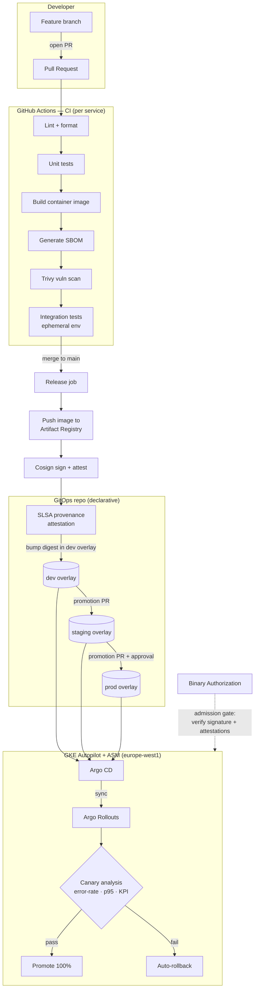
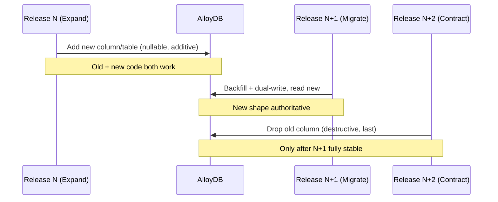
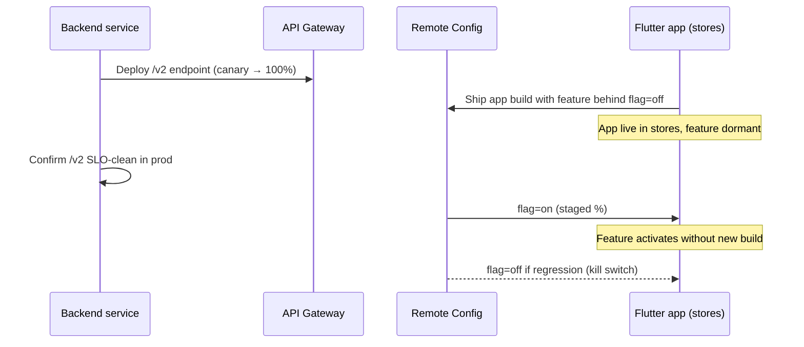
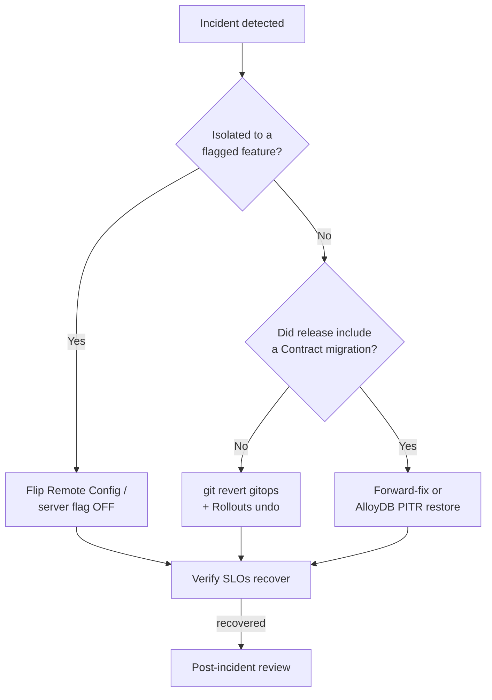

# 07 — CI/CD

> **Scope.** Delivery pipeline for the GreenGo hybrid GKE migration: how source becomes a signed, admission-controlled image running in GKE Autopilot behind Anthos Service Mesh (ASM), how AlloyDB schema evolves safely alongside it, and how the Flutter client stays coordinated. Owned by the **Platform squad**.
>
> **Related docs:** [06-gke-platform.md](06-gke-platform.md) · [08-observability-slo.md](08-observability-slo.md) · [09-security-compliance.md](09-security-compliance.md)

---

## 0. Context & baseline

| Aspect | Today (Firebase-era) | Target (hybrid GKE) |
| --- | --- | --- |
| Client build | `codemagic.yaml` (Flutter → AAB/IPA/web) | **Unchanged** — Codemagic remains the app-store pipeline |
| Backend CI | Firebase Functions deploy via `firebase deploy` | GitHub Actions → Artifact Registry → Argo CD |
| Deploy mechanism | `deploy-all.{sh,ps1}`, `deploy-microservices.sh` (imperative scripts) | **Declarative GitOps** (Argo CD sync from a gitops repo) |
| Prod release | Manual script run from a workstation | **No manual prod deploy** — merge to a protected branch only |
| Rollout strategy | Big-bang function replace | **Argo Rollouts canary**, SLO-gated |
| Rollback | Re-deploy previous artifact by hand | **`git revert`** on gitops repo |
| Images | n/a (managed runtime) | Immutable, digest-pinned, Cosign-signed, Binary Authorization-enforced |
| DB schema | Firestore (schemaless) | AlloyDB Postgres — **versioned migrations** (expand/contract) |

The migration follows the **strangler-fig** pattern: the 14 domain services move behind the API Gateway one at a time; the delivery pipeline below governs each service independently so migration and steady-state use identical mechanics.

---

## 1. Principles

The pipeline is opinionated. These principles are non-negotiable and every deviation is a documented exception.

| # | Principle | What it means in practice |
| --- | --- | --- |
| P1 | **Trunk-based development** | Short-lived branches off `main`; branches live < 24h; no long-running release branches. Release is a tag/promotion, not a branch. |
| P2 | **Small PRs, gated by tests** | A PR that cannot be reviewed in ~15 min is too big. Merge is blocked until lint + unit + integration + scan pass. |
| P3 | **Immutable images** | An image is identified by its **digest** (`@sha256:…`), never by a mutable tag like `latest`. The same digest that passed CI is the one that runs in prod. |
| P4 | **GitOps promotion** | The gitops repo is the single source of truth for what runs where. No `kubectl apply`, no `helm upgrade` from a laptop. Cluster state converges to git. |
| P5 | **No manual prod deploys** | Production changes only by merging a promotion PR into a protected path. Humans approve; automation applies. |
| P6 | **Fast, boring rollback** | Rollback = `git revert` of the promotion commit. Mean-time-to-rollback target **< 5 min**, no rebuild required (image already exists). |
| P7 | **Progressive delivery by default** | Every backend service ships via canary with automated SLO analysis. Full-weight only after gates pass. |
| P8 | **Backward-compatible always** | API and DB changes are expand-first. A release must be safe to roll back without data loss (see §5, §10). |
| P9 | **Supply-chain provenance** | Every deployable artifact has an SBOM, a vuln-scan verdict, and a signature. Unsigned/unscanned images cannot be admitted (§9). |

---

## 2. Pipeline overview (end-to-end)



**Two repositories, one flow:**

| Repo | Contains | Written by |
| --- | --- | --- |
| **App repo** (`greengo/<service>` or monorepo path) | Service source, Dockerfile, CI workflows, DB migrations | Engineers |
| **GitOps repo** (`greengo/gitops`) | Kustomize overlays / Helm values per env, image digests, Rollout specs | CI (dev bump) + humans (promotion PRs) |

Separating them enforces P4/P5: application CI never touches the cluster; it only proposes a digest change in git.

---

## 3. Toolchain choice

### 3.1 CI runner: GitHub Actions vs Cloud Build

Given source is **GitHub-hosted**, the decision is between GitHub Actions (GHA) and Cloud Build.

| Criterion | GitHub Actions | Cloud Build | Verdict |
| --- | --- | --- | --- |
| Source proximity | Native — triggers, checks, PR status, environments in one place | Requires GitHub App + mirroring; PR UX is second-class | **GHA** |
| GCP auth | **Workload Identity Federation** (keyless, no long-lived SA keys) | Native SA | Tie (both keyless-capable) |
| Ecosystem | Huge marketplace (Cosign, Trivy, SLSA generators, Kustomize) | Smaller; more hand-rolled steps | **GHA** |
| SLSA provenance | Official `slsa-framework/slsa-github-generator` (SLSA L3) | Built-in provenance but GHA path is more portable | **GHA** |
| Cost at our scale | Hosted runners + self-hosted ARC on GKE for heavy jobs | Per-build-minute | Tie |
| Vendor coupling | Portable YAML | GCP-locked | **GHA** |

**Recommendation: GitHub Actions** as the primary CI, using **Workload Identity Federation (WIF)** for keyless GCP auth. Heavy or privileged jobs (integration tests needing VPC access to AlloyDB) run on **Actions Runner Controller (ARC)** self-hosted runners inside the GKE platform cluster, so they reach private endpoints without exposing them publicly.

> Cloud Build is retained only as a fallback for GCP-internal automation that must run without GitHub (e.g., break-glass image rebuilds). It is not on the golden path.

### 3.2 Supporting services

| Concern | Tool | Notes |
| --- | --- | --- |
| Image registry | **Artifact Registry** (`europe-west1-docker.pkg.dev/greengo-chat/services`) | Regional, CMEK-encrypted; single-region per LOCKED decision. |
| Image signing | **Cosign** (keyless via Fulcio/OIDC or KMS key) | Signatures + attestations stored as OCI artifacts alongside the image. |
| Admission enforcement | **Binary Authorization** | Cluster rejects images lacking required attestations (§9). |
| Vuln scanning | **Trivy** (in-pipeline, blocking) + **Artifact Analysis** (continuous, registry-side) | Trivy gates the build; Artifact Analysis surfaces CVEs discovered *after* push. |
| SBOM | **Syft** (SPDX/CycloneDX) | Attached as a Cosign attestation. |
| GitOps engine | **Argo CD** | Declarative sync of gitops overlays. |
| Progressive delivery | **Argo Rollouts** | Canary with `AnalysisTemplate` querying Prometheus/Cloud Monitoring. |
| DB migrations | **Flyway** (recommended, see §5) | Versioned SQL, expand/contract discipline. |

---

## 4. Per-service backend pipeline

Each of the 14 domain services owns an identical pipeline shape (DRY via a reusable workflow). Stages:

| # | Stage | Tool | Gate / output | Fails build on |
| --- | --- | --- | --- | --- |
| 1 | Checkout | `actions/checkout` | Pinned SHA of source | — |
| 2 | Auth to GCP | `google-github-actions/auth` (WIF) | Short-lived token | Auth error |
| 3 | Deps + cache | language toolchain | Restored module cache | Resolve failure |
| 4 | Lint / format | golangci-lint / eslint / etc. | Style report | Lint error |
| 5 | Unit tests | test runner | Coverage ≥ threshold (e.g. 70%) | Test fail / low coverage |
| 6 | Build image | `docker build` (BuildKit) | OCI image, tagged by digest | Build error |
| 7 | Generate SBOM | Syft | `sbom.spdx.json` | — |
| 8 | Vuln scan | Trivy | No `CRITICAL`/`HIGH` (configurable allowlist) | Blocking CVE |
| 9 | Sign + attest | Cosign | Signature + SBOM + provenance attestations | Sign error |
| 10 | Integration tests | ephemeral env (see below) | Contract + smoke pass | Test fail |
| 11 | Push | `docker push` to Artifact Registry | Immutable digest | Push error |
| 12 | Bump gitops (dev) | `kustomize edit set image` + PR/commit | dev overlay updated | — |

**Ephemeral environment for stage 10.** Integration tests run against a throwaway namespace in the platform cluster (or a `kind`/Testcontainers stack for lighter services). AlloyDB dependency is satisfied by a disposable Postgres (Testcontainers) seeded with the service's Flyway migrations, so schema and code are tested together. Pub/Sub is emulated with the Pub/Sub emulator. This validates the service in isolation before its digest is allowed near a shared env.

### 4.1 Sample GitHub Actions workflow (reusable, one domain service)

```yaml
# .github/workflows/service-ci.yaml
name: service-ci
on:
  pull_request:
    paths: ["services/messaging/**"]
  push:
    branches: [main]
    paths: ["services/messaging/**"]

permissions:
  contents: read
  id-token: write        # required for WIF + keyless Cosign

env:
  SERVICE: messaging
  REGION: europe-west1
  PROJECT: greengo-chat
  REGISTRY: europe-west1-docker.pkg.dev/greengo-chat/services
  GITOPS_REPO: greengo/gitops

jobs:
  ci:
    runs-on: ubuntu-24.04
    steps:
      - uses: actions/checkout@v4

      - id: auth
        uses: google-github-actions/auth@v2
        with:
          workload_identity_provider: projects/123456789/locations/global/workloadIdentityPools/gh-pool/providers/gh-provider
          service_account: ci-builder@greengo-chat.iam.gserviceaccount.com

      - uses: docker/setup-buildx-action@v3

      - name: Lint + unit tests
        working-directory: services/messaging
        run: |
          make lint
          make test COVERAGE_MIN=70

      - name: Build image (digest-pinned)
        id: build
        working-directory: services/messaging
        run: |
          gcloud auth configure-docker ${REGION}-docker.pkg.dev --quiet
          IMAGE="${REGISTRY}/${SERVICE}"
          docker build -t "$IMAGE:${GITHUB_SHA}" .
          docker push "$IMAGE:${GITHUB_SHA}"
          DIGEST=$(docker inspect --format='{{index .RepoDigests 0}}' "$IMAGE:${GITHUB_SHA}")
          echo "digest=${DIGEST}" >> "$GITHUB_OUTPUT"

      - name: SBOM (Syft)
        uses: anchore/sbom-action@v0
        with:
          image: ${{ steps.build.outputs.digest }}
          format: spdx-json
          output-file: sbom.spdx.json

      - name: Vulnerability scan (Trivy — blocking)
        uses: aquasecurity/trivy-action@0.28.0
        with:
          image-ref: ${{ steps.build.outputs.digest }}
          severity: CRITICAL,HIGH
          exit-code: "1"
          ignore-unfixed: true

      - name: Integration tests (ephemeral)
        working-directory: services/messaging
        run: make integration-test   # Testcontainers: Postgres+Flyway, Pub/Sub emulator

      # ---- release-only steps (main branch) ----
      - name: Cosign sign + attest
        if: github.ref == 'refs/heads/main'
        env:
          COSIGN_EXPERIMENTAL: "1"
        run: |
          cosign sign --yes ${{ steps.build.outputs.digest }}
          cosign attest --yes --predicate sbom.spdx.json \
            --type spdxjson ${{ steps.build.outputs.digest }}

      - name: Bump gitops dev overlay
        if: github.ref == 'refs/heads/main'
        run: |
          git clone https://x-access-token:${{ secrets.GITOPS_TOKEN }}@github.com/${GITOPS_REPO}.git gitops
          cd gitops/apps/${SERVICE}/overlays/dev
          kustomize edit set image ${REGISTRY}/${SERVICE}=${{ steps.build.outputs.digest }}
          git config user.name  "greengo-ci"
          git config user.email "ci@greengo.app"
          git commit -am "chore(${SERVICE}): dev → ${{ steps.build.outputs.digest }}"
          git push
```

SLSA L3 provenance is generated by chaining `slsa-framework/slsa-github-generator` as a downstream reusable workflow (kept separate so the `id-token` boundary stays tight). See §9.

---

## 5. Database migrations (AlloyDB)

AlloyDB is a **relational store with real schema**, unlike the outgoing Firestore. Schema changes are code, versioned in the app repo next to the service that owns the table, and executed by the pipeline — never by hand.

### 5.1 Tool choice

| Tool | Pros | Cons | Verdict |
| --- | --- | --- | --- |
| **Flyway** | SQL-first, versioned files, simple mental model, `repair`, native Postgres/AlloyDB support, runs as a Job | Community edition lacks undo (we don't rely on undo — see contract reversibility) | **Recommended** |
| Liquibase | DB-agnostic changelog, rollback tags | XML/YAML abstraction adds ceremony; team is SQL-fluent | Alternative |
| sqitch | Dependency graph, no version-number collisions | Smaller ecosystem, steeper onboarding | Alternative |

**Recommendation: Flyway**, versioned SQL migrations (`V<timestamp>__<desc>.sql`), one migration history per service schema.

### 5.2 How migrations run safely

Migrations execute as a **Kubernetes Job / Argo CD PreSync hook** that runs *before* the new ReplicaSet rolls out, against AlloyDB over the private VPC (via the ARC runner or an in-cluster job with Workload Identity). The migration Job is idempotent (Flyway skips already-applied versions) and gated: if it fails, Argo CD aborts the sync and the old pods keep serving.

The discipline that makes this safe is **expand/contract** (a.k.a. parallel-change). A schema change is split across releases so that at every moment the running code and the schema are mutually compatible — which is exactly what makes rollback (P6/P8) safe.



### 5.3 Expand/contract steps

| Phase | Release | Migration type | Backward compatible? | Reversible? | Example |
| --- | --- | --- | --- | --- | --- |
| **Expand** | N | Additive DDL only — add nullable column, new table, new index `CONCURRENTLY` | Yes — old code ignores new column | Yes — drop the addition | `ALTER TABLE msg ADD COLUMN edited_at timestamptz NULL;` |
| **Migrate (dual-write)** | N+1 | Code writes both old + new; backfill job populates new | Yes — either shape readable | Yes — stop writing new, old still intact | Backfill `edited_at` from legacy `updated_at`; app dual-writes |
| **Read-switch** | N+1 | Code reads new column; old still maintained | Yes | Yes — flip read flag back | Feature flag `read_edited_at=true` |
| **Contract** | N+2 | Destructive DDL — drop old column/table/constraint | Yes (nothing reads old) | **Limited** — see §10 | `ALTER TABLE msg DROP COLUMN updated_at;` |

**Rules enforced in review:**
- No `Expand` and `Contract` in the same release. Destructive DDL never ships alongside the code change that depends on it.
- Index creation on hot tables uses `CREATE INDEX CONCURRENTLY` (no `ACCESS EXCLUSIVE` lock).
- Every migration has a corresponding rollback note (how to reverse, or why contract is deferred to a later window).
- Contract migrations require a "stability gate": N+1 must have been at 100% in prod for ≥ 1 release cycle before its contract is authored.

---

## 6. GitOps promotion

Environments are **overlays**, not branches of application code. The gitops repo holds one overlay per environment; promotion is a PR that copies a *digest* from one overlay to the next.

```
gitops/
  apps/
    messaging/
      base/                 # Deployment, Rollout, Service, VirtualService
      overlays/
        dev/                # auto-bumped by CI
        staging/            # promotion PR (platform approval)
        prod/               # promotion PR (platform + service owner approval)
```

| Environment | Trigger | Approver | Protection | Sync policy |
| --- | --- | --- | --- | --- |
| **dev** | Auto — CI bumps digest on merge to `main` | None (automated) | None | Argo CD auto-sync + self-heal |
| **staging** | Promotion PR from dev digest | Platform on-call | GitHub environment `staging`, 1 review | Auto-sync after merge |
| **prod** | Promotion PR from *validated staging digest* | Platform on-call **and** service owner | GitHub environment `prod`, 2 reviews, CODEOWNERS on `overlays/prod/**`, no bypass | Auto-sync + Rollouts canary |

Only a digest that has run in staging can be promoted to prod (enforced by a promotion action that reads staging's live digest as the PR source). This guarantees prod never runs an image that skipped staging.

```mermaid
flowchart LR
    CI[CI on main] -->|auto bump| DEV[dev overlay]
    DEV -->|soak + auto tests| PROMO1{Promote?}
    PROMO1 -->|open PR: copy dev digest| STG[staging overlay]
    STG -->|1 approval| MERGESTG[merge → Argo sync]
    MERGESTG -->|e2e + soak in staging| PROMO2{Promote?}
    PROMO2 -->|open PR: copy staging digest| PRD[prod overlay]
    PRD -->|2 approvals + CODEOWNERS| MERGEPRD[merge → Argo sync]
    MERGEPRD --> CANARY[Argo Rollouts canary]
    CANARY -->|gates pass| DONE[100% prod]
    CANARY -->|gates fail| REVERT[auto-rollback + git revert]
```



---

## 7. Progressive delivery gates

Every prod rollout is a canary managed by **Argo Rollouts**. Traffic is shifted in steps; between steps an `AnalysisRun` queries metrics and either allows the next step or aborts (which auto-rolls-back to the stable ReplicaSet). SLO definitions and dashboards live in [08-observability-slo.md](08-observability-slo.md); this section defines the *gates*.

### 7.1 Canary steps (default template)

| Step | Canary weight | Hold / analysis | Abort behavior |
| --- | --- | --- | --- |
| 1 | 5% | 5 min analysis | Abort → 0%, keep stable |
| 2 | 20% | 10 min analysis | Abort → 0% |
| 3 | 50% | 10 min analysis | Abort → 0% |
| 4 | 100% | Final 5 min analysis | Abort → 0% |

### 7.2 Gate metrics

| Metric | Source | Pass threshold | Auto-rollback threshold | Rationale |
| --- | --- | --- | --- | --- |
| **Error rate** (5xx / total) | ASM / Prometheus | < 0.5% | ≥ 1% over 2 min | Protects the 99.95% availability NFR |
| **p95 latency** | ASM telemetry | ≤ 1.2× stable baseline | > 1.5× baseline for 3 min | Guards user-facing latency SLO |
| **p99 latency** | ASM telemetry | ≤ 1.5× baseline | > 2× baseline for 3 min | Tail-latency guard |
| **Business KPI** (e.g. message-send success, match-create success) | App metrics | ≥ 99% of baseline | < 97% of baseline | Catches "green infra, broken feature" regressions |
| **Pod restart / CrashLoop** | kube-state-metrics | 0 crashes | ≥ 1 CrashLoopBackOff | Catches bad config/migration |

An `AnalysisRun` that breaches any **rollback threshold** aborts the Rollout immediately; Argo Rollouts returns 100% traffic to the stable ReplicaSet within seconds. A breach that only fails a **pass threshold** (without hitting rollback) pauses the rollout for manual judgment.

### 7.3 Sample Argo Rollouts spec + AnalysisTemplate

```yaml
# gitops/apps/messaging/base/rollout.yaml
apiVersion: argoproj.io/v1alpha1
kind: Rollout
metadata:
  name: messaging
spec:
  replicas: 6
  strategy:
    canary:
      canaryService: messaging-canary
      stableService: messaging-stable
      trafficRouting:
        managedRoutes: []
        istio:
          virtualService: { name: messaging }
      steps:
        - setWeight: 5
        - analysis: { templates: [{ templateName: slo-gate }] }
        - setWeight: 20
        - analysis: { templates: [{ templateName: slo-gate }] }
        - setWeight: 50
        - analysis: { templates: [{ templateName: slo-gate }] }
        - setWeight: 100
  selector: { matchLabels: { app: messaging } }
---
apiVersion: argoproj.io/v1alpha1
kind: AnalysisTemplate
metadata: { name: slo-gate }
spec:
  metrics:
    - name: error-rate
      interval: 30s
      count: 10
      failureLimit: 2
      provider:
        prometheus:
          address: http://prometheus.monitoring:9090
          query: |
            sum(rate(istio_requests_total{destination_workload="messaging",
              response_code=~"5.."}[1m]))
            /
            sum(rate(istio_requests_total{destination_workload="messaging"}[1m]))
      successCondition: result[0] < 0.01
    - name: p95-latency
      interval: 30s
      count: 10
      failureLimit: 3
      provider:
        prometheus:
          address: http://prometheus.monitoring:9090
          query: |
            histogram_quantile(0.95, sum by (le) (
              rate(istio_request_duration_milliseconds_bucket{
                destination_workload="messaging"}[1m])))
      successCondition: result[0] < 600   # ms; ~1.2x baseline
```

---

## 8. Flutter client CI

The client pipeline stays on **Codemagic** (`codemagic.yaml`) — it is well-suited to app-store signing, provisioning profiles, and multi-target builds (Android AAB, iOS IPA, web). The GKE migration does **not** touch how the app is built or shipped to stores.

What changes is **coordination**: the client and backend now deploy on independent cadences, so they must never assume lock-step versions.

| Mechanism | Purpose | Owner |
| --- | --- | --- |
| **Firebase Remote Config feature flags** | Ship client code dark; enable a feature only once the backend service is live and canary-clean. Rollback = flip the flag (instant, no app-store round-trip). | Client + service owner |
| **Backward-compatible APIs** | Backend never removes a field/endpoint the shipped app depends on. Additive-only, mirroring the DB expand/contract rule (§5). | Service owner |
| **Versioned endpoints via API Gateway** | Breaking changes ship as `/v2/...` behind the API Gateway; `/v1` stays until store telemetry shows old clients drained. | Platform |
| **Min-version gate** | Remote Config `min_supported_build` forces upgrade of clients too old to speak the current contract. | Client |

**Coordination sequence for a feature spanning client + backend:**



Because the app ships through store review (hours-to-days latency), the backend contract must land and stabilize **first**, with the client feature gated off until the server side is proven. Rollback of a client feature is a Remote Config flag flip, not a resubmission.

The existing **pre-commit** hooks (format, analyze, l10n check) remain the first gate for both client and backend repos — consistent with the project standard of never hardcoding UI strings (all via `AppLocalizations`).

---

## 9. Supply-chain security

Full policy lives in [09-security-compliance.md](09-security-compliance.md); this section is the pipeline's enforcement surface.

| Control | Implementation | Enforced where |
| --- | --- | --- |
| **Provenance (SLSA-ish)** | `slsa-github-generator` produces build provenance attestation (builder identity, source digest, params) → SLSA Build L3 | CI release job |
| **Image signing** | Cosign keyless (Fulcio OIDC) or KMS key; signature stored as OCI artifact | CI release job |
| **SBOM attestation** | Syft SPDX attached via `cosign attest` | CI release job |
| **Binary Authorization** | Admission policy requires: (a) valid Cosign signature by the CI identity, (b) SBOM attestation, (c) provenance attestation. Missing any → pod rejected | GKE admission (cluster) |
| **Vuln scanning** | Trivy blocks build on CRITICAL/HIGH; Artifact Analysis continuously rescans pushed images and raises alerts on newly disclosed CVEs | CI + registry |
| **Dependency pinning** | Lockfiles committed; GitHub Actions pinned to commit SHAs; base images pinned by digest | Repo + CI |
| **Secret scanning** | GitHub secret scanning + push protection; `gitleaks` in pre-commit; no secrets in gitops (use Workload Identity / External Secrets) | Repo + CI |
| **Keyless GCP auth** | Workload Identity Federation — no long-lived SA JSON keys in CI | CI |

### 9.1 Binary Authorization admission policy (excerpt)

```yaml
# binauthz-policy.yaml
defaultAdmissionRule:
  evaluationMode: REQUIRE_ATTESTATION
  enforcementMode: ENFORCED_BLOCK_AND_AUDIT_LOG
  requireAttestationsBy:
    - projects/greengo-chat/attestors/cosign-signer
    - projects/greengo-chat/attestors/sbom-attestor
    - projects/greengo-chat/attestors/provenance-attestor
clusterAdmissionRules:
  europe-west1.greengo-autopilot:
    evaluationMode: REQUIRE_ATTESTATION
    enforcementMode: ENFORCED_BLOCK_AND_AUDIT_LOG
    requireAttestationsBy:
      - projects/greengo-chat/attestors/cosign-signer
      - projects/greengo-chat/attestors/sbom-attestor
      - projects/greengo-chat/attestors/provenance-attestor
```

`enforcementMode: ENFORCED_BLOCK_AND_AUDIT_LOG` means an unattested image is **blocked** from scheduling and the attempt is logged — closing the loop from build to runtime so P3/P9 cannot be bypassed by a manual `kubectl run`.

---

## 10. Rollback playbook

Three independent rollback axes, matching the three ways a release can change the system. In an incident, roll back the narrowest axis that resolves it.

### 10.1 Image / code rollback (fastest, default)

The image for release N-1 still exists in Artifact Registry, still signed and attested. Rollback is a git operation on the gitops repo:

```bash
# In gitops repo, on the prod overlay change
git revert <promotion-commit-sha>
git push          # Argo CD syncs; Rollouts returns to previous stable digest
```

- No rebuild, no re-scan, no re-sign — the digest already passed Binary Authorization.
- Argo Rollouts also supports an in-cluster instant undo for the active rollout: `kubectl argo rollouts undo messaging` (used for the seconds-matter case; the `git revert` still follows to keep git authoritative — self-heal would otherwise re-apply the bad digest).
- MTTR target < 5 min (P6).

### 10.2 Database rollback (constrained by phase)

DB rollback safety is *designed in* by expand/contract (§5), not improvised during an incident.

| If the release was… | DB rollback action | Data-loss risk |
| --- | --- | --- |
| **Expand** (additive) | Revert code; leave the new column/table in place (unused) or drop it later | None — additive changes are inert to old code |
| **Migrate / dual-write** | Revert code to single-write; new column keeps last values, harmless | None |
| **Contract** (destructive) | **Cannot be undone by revert** — data is gone. Restore from AlloyDB PITR / backup, or ship a forward-fix | **High — this is why contract is isolated, gated, and delayed** |

The playbook rule: **if an incident implicates a Contract release, the response is forward-fix or point-in-time restore, never a naive image revert** (the old code expects columns that no longer exist). This is the entire reason contract migrations are quarantined into their own late release (§5.3) and never bundled with feature code.

### 10.3 Feature-flag kill switch (no deploy at all)

For behavior gated behind Firebase Remote Config (§8), the fastest mitigation is flipping the flag:

- Client feature regression → set flag `off` in Remote Config; effect is near-instant, no store round-trip, no pod change.
- Backend feature behind a server-side flag → toggle via config (hot-reloaded or short rollout), avoiding a full image rollback when only one code path is bad.

### 10.4 Decision order



---

## Appendix A — Cross-references

| Topic | Doc |
| --- | --- |
| Cluster, ASM, namespaces, ARC runners, Argo CD install | [06-gke-platform.md](06-gke-platform.md) |
| SLO definitions, dashboards, alerting, error budgets that back §7 gates | [08-observability-slo.md](08-observability-slo.md) |
| Full supply-chain, IAM, data-protection, compliance controls behind §9 | [09-security-compliance.md](09-security-compliance.md) |

## Appendix B — Definition of Done for a backend release

- [ ] PR merged to `main` with green CI (lint, unit, integration, scan).
- [ ] Image pushed to Artifact Registry, signed, SBOM + provenance attested.
- [ ] dev overlay auto-bumped and healthy.
- [ ] Promotion PR to staging approved and soaked; e2e green.
- [ ] Promotion PR to prod approved (platform + service owner), CODEOWNERS satisfied.
- [ ] Any DB migration is expand/contract-clean; no destructive DDL bundled with feature code.
- [ ] Canary gates passed (error-rate, p95, KPI) or auto-rolled-back.
- [ ] Rollback path confirmed (image revert reversible; contract migrations flagged).
