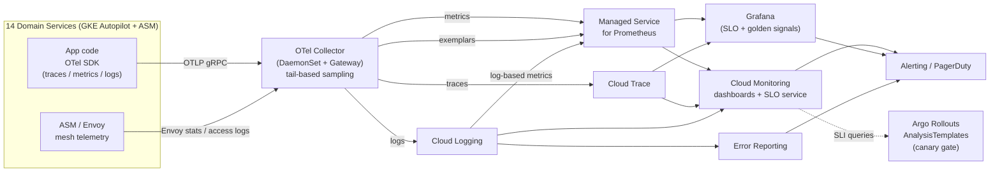
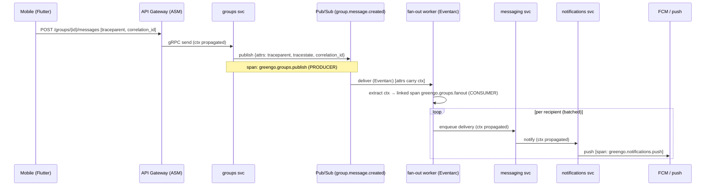

# 08 — Observability & SLOs

> **Scope.** This document is the SRE reference for the GreenGo hybrid migration (Firebase `greengo-chat` → GKE Autopilot + Anthos Service Mesh, AlloyDB, Pub/Sub/Eventarc/Cloud Tasks, single region `europe-west1`). It defines the telemetry stack, the OpenTelemetry instrumentation standard, per-domain SLOs, error-budget policy, dashboards, alerting/on-call, distributed tracing for async fan-out, migration-specific observability, and the cost/sampling strategy.
>
> **Audience.** Platform SRE, service owners, on-call engineers.
>
> **Cross-references.** CI/CD & canary gating [07-cicd.md](07-cicd.md) · Data migration & reconciliation [04-data-migration.md](04-data-migration.md) · Phased roadmap [10-phased-roadmap.md](10-phased-roadmap.md) · Cost/FinOps [11-cost-finops.md](11-cost-finops.md).

---

## 1. Philosophy

Observability is a **precondition for traffic**, not a post-incident retrofit. No GreenGo domain service may take production traffic on GKE until it exports the three signals (traces, metrics, logs) and publishes at least one SLO with a burn-rate alert wired into the on-call rotation. This is enforced as a gate in [07-cicd.md](07-cicd.md): a service manifest without an `slo.yaml` and a golden-signals dashboard fails the promotion pipeline.

Guiding principles:

| Principle | Meaning for GreenGo |
|---|---|
| **Golden signals first** | Every service is measured on the four golden signals — **latency, traffic, errors, saturation** — before any bespoke metric. Consistency across 14 services beats per-team cleverness. |
| **SLO-driven** | Reliability is a *target with a number*, expressed as SLIs (good/total ratios). We do not chase 100%; we chase the agreed SLO and spend the remainder as an error budget. |
| **Error budgets gate velocity** | When a service's error budget is healthy, teams ship fast (canaries auto-promote). When it is exhausted, feature rollout freezes and reliability work takes priority. The budget is the contract between product velocity and reliability. |
| **Symptom-based alerting** | Page on user-facing SLO burn, not on causes. CPU at 90% is not an incident; message-delivery p95 breaching 500 ms is. |
| **Trace everything, sample smartly** | 100% of requests are trace-*context* propagated; a tail-based sampler decides what to *retain* (all errors + slow traces + a head baseline). See §10. |
| **One correlation ID end-to-end** | A request that starts at the mobile app and fans out through Pub/Sub to five services shares one trace and one correlation ID. Debugging is a single query, not five. |

The canary gates in Argo Rollouts (see [07-cicd.md](07-cicd.md)) **consume the SLOs defined here** as their AnalysisTemplate metrics — a canary that degrades the SLI beyond threshold is auto-rolled-back. Observability is therefore not just for humans; it is the machine-readable safety interlock of the whole delivery pipeline.

---

## 2. Telemetry stack

All 14 services embed the **OpenTelemetry SDK** and export via the **OpenTelemetry Collector** (running as an ASM sidecar-adjacent DaemonSet + a gateway Deployment). The Collector is the single choke point that fans telemetry out to Google Cloud Operations and Managed Service for Prometheus, decoupling application code from backend specifics.



**Signal → tool → retention:**

| Signal type | Primary tool | Secondary / query surface | Default retention | Notes |
|---|---|---|---|---|
| Distributed traces | Cloud Trace | Grafana (Tempo-style via Cloud Trace datasource) | 30 days | Tail-sampled; 100% of errors + slow traces retained (§10) |
| Application metrics (RED/USE) | Managed Service for Prometheus | Grafana, Cloud Monitoring | 24 months (Monarch) | PromQL native; exemplars link metric→trace |
| Mesh telemetry (Envoy) | Managed Prometheus (ASM) | Grafana | 24 months | L7 golden signals for free per workload |
| Structured logs (JSON) | Cloud Logging | Log Analytics (BigQuery-backed) | 30 days hot / 400 days via log bucket + BQ sink | Correlation IDs indexed |
| Errors / crashes (backend) | Error Reporting | Cloud Logging | 90 days grouped | Auto-groups by stack signature |
| Errors / crashes (mobile) | Firebase Crashlytics | BigQuery export | 90 days | Retained during hybrid; unified in Grafana via BQ datasource |
| Continuous profiling | Cloud Profiler | — | 30 days | CPU/heap flame graphs per service |
| SLO burn state | Cloud Monitoring SLO service | Grafana SLO panels | 24 months | Source of truth for error budgets |
| Log-based & business metrics | Managed Prometheus (log-based) | Grafana | 24 months | e.g. coins minted, ledger mismatches |

> Mobile stays on Crashlytics + `firebase_performance` during the strangler-fig period (Flutter v2.2.4+100). Its data is exported to BigQuery and surfaced in the same Grafana workspace so client-side and server-side reliability are read from one pane. Convergence to full OTel-on-device is out of scope for this phase — tracked in [10-phased-roadmap.md](10-phased-roadmap.md).

---

## 3. Instrumentation standard

Every service, regardless of language (Go/Kotlin/TS across the 14 domains), MUST conform to the following. This is enforced by a shared internal library (`greengo-otel-bootstrap`) and a CI lint check.

### 3.1 The three pillars

| Pillar | Standard | Enforcement |
|---|---|---|
| **Traces** | OTel SDK, W3C `traceparent`/`tracestate` propagation, service + span naming convention `greengo.<domain>.<operation>` | Lint: reject spans without `service.name`, `service.version`, `deployment.environment` resource attrs |
| **Metrics** | OTLP → Managed Prometheus; RED for request-driven, USE for resource-driven; histogram buckets standardized | Lint: every HTTP/gRPC handler auto-instrumented via middleware |
| **Logs** | Structured JSON only; mandatory fields below; emitted to stdout, scraped by Cloud Logging | Lint: reject `print`/unstructured logging in prod build |

### 3.2 Mandatory structured-log schema

```json
{
  "timestamp": "2026-07-07T10:15:03.221Z",
  "severity": "INFO",
  "service": "payments",
  "version": "2.2.4+100",
  "env": "prod",
  "trace_id": "4bf92f3577b34da6a3ce929d0e0e4736",
  "span_id": "00f067aa0ba902b7",
  "correlation_id": "greengo-req-8f14e45f",
  "user_id_hash": "sha256:9c1185a5...",
  "domain_event": "coins.debit",
  "message": "debited 120 coins for tts_synthesis",
  "attributes": { "ledger_txn_id": "txn_01J...", "idempotency_key": "..." }
}
```

`trace_id`/`span_id` are injected automatically from the active span so Cloud Logging correlates the log line to its trace. `correlation_id` originates at the API gateway (or the mobile client for client-initiated flows) and is propagated through every hop, **including across Pub/Sub** (§3.3).

### 3.3 Trace-context propagation across Pub/Sub (async traceability)

Synchronous propagation (HTTP/gRPC) is handled by ASM + OTel auto-instrumentation. Asynchronous propagation is **not automatic** and is the single most common cause of "broken" traces. Rule: **publishers inject W3C trace context into Pub/Sub message attributes; subscribers extract it and start a linked span.**

```
# Publisher (pseudocode, any language via OTel API)
carrier = {}
propagator.inject(carrier, context=current_context)   # writes traceparent, tracestate
message.attributes["traceparent"]     = carrier["traceparent"]
message.attributes["tracestate"]      = carrier["tracestate"]
message.attributes["correlation_id"]  = correlation_id
publish(topic, message)

# Subscriber
ctx = propagator.extract(carrier=message.attributes)
with tracer.start_as_current_span("greengo.groups.fanout.deliver",
                                  context=ctx,
                                  kind=CONSUMER,
                                  links=[Link(ctx)]):
    handle(message)
```

This makes the group-message fan-out (§8) a single connected trace from the sender's tap to the last recipient's push notification.

### 3.4 RED / USE per service

| Pattern | Applies to | Metrics |
|---|---|---|
| **RED** (Rate, Errors, Duration) | Request-driven services (identity, profile/discovery, messaging, payments, subscriptions, admin, events/catalog) | `http_server_request_count`, `..._errors_total`, `..._duration_seconds` (histogram) |
| **USE** (Utilization, Saturation, Errors) | Resource/consumer services (notifications, media, analytics, safety/moderation workers) | CPU/mem utilization, queue depth (`subscription_oldest_unacked_seconds`), worker error rate |

Standard histogram buckets (seconds): `0.005, 0.01, 0.025, 0.05, 0.1, 0.25, 0.5, 1, 2.5, 5, 10` — chosen so the 250 ms API and 500 ms delivery SLO thresholds land on bucket boundaries for accurate percentile math.

### 3.5 Sample OTel + PromQL

**OTel Collector (tail sampling excerpt):**

```yaml
processors:
  tail_sampling:
    decision_wait: 10s
    policies:
      - name: errors
        type: status_code
        status_code: { status_codes: [ERROR] }
      - name: slow
        type: latency
        latency: { threshold_ms: 250 }
      - name: baseline
        type: probabilistic
        probabilistic: { sampling_percentage: 5 }
exporters:
  googlecloud: {}
  googlemanagedprometheus: {}
```

**PromQL — messaging delivery p95 SLI (used by both dashboard and canary gate):**

```promql
histogram_quantile(0.95,
  sum by (le) (
    rate(messaging_delivery_duration_seconds_bucket{env="prod"}[5m])
  )
) < 0.5
```

**PromQL — availability SLI as good/total ratio (payments):**

```promql
sum(rate(http_server_request_count{service="payments",code!~"5.."}[30m]))
/
sum(rate(http_server_request_count{service="payments"}[30m]))
```

---

## 4. SLOs per domain

SLIs are expressed as **good-events / valid-events** ratios (availability) or **percentile-under-threshold** (latency), measured over a **rolling 28-day** window unless noted. Error budget = `(1 − SLO) × valid events`.

| Service | SLI definition (good / total intent) | SLO target | Error budget (28d) | SLI query intent |
|---|---|---|---|---|
| **identity** | Auth requests returning success or valid-credential-rejection (non-5xx, non-timeout) / all auth requests | **99.95%** availability | 21.6 min | `count(auth_result∈{ok,invalid_creds}) / count(auth_attempts)` |
| **identity (latency)** | Token issue/refresh p95 < 300 ms | 99% of req < 300 ms | 1% slow | `histogram_quantile(0.95, token_duration) < 0.3` |
| **profile/discovery** | Feed/discovery queries p95 < 250 ms AND non-5xx | **99.9%** (latency) / 99.95% (avail) | 40 min / 21.6 min | `p95(discovery_query_duration) < 0.25` + good-ratio |
| **messaging/realtime (delivery)** | Messages delivered end-to-end with p95 < 500 ms / all accepted messages | **p95 < 500 ms at 99.9%** | 40 min over threshold | `histogram_quantile(0.95, messaging_delivery_duration) < 0.5` |
| **messaging/realtime (availability)** | Send API non-5xx & WS connect success / all attempts | **99.95%** | 21.6 min | good/total on send + ws_connect |
| **groups** | Group send + fan-out enqueue non-5xx / all group sends | 99.95% | 21.6 min | good/total on `groups_send` |
| **events/catalog** | Catalog read p95 < 250 ms & non-5xx / all reads | 99.9% | 40 min | `p95(catalog_read_duration) < 0.25` |
| **payments/coins-ledger (availability)** | Ledger write/read non-5xx / all ledger ops | **99.95%** | 21.6 min | good/total on `ledger_op` |
| **payments/coins-ledger (correctness)** | Ledger operations that are double-entry-balanced & idempotent / all ledger operations | **99.999%** correctness | ~26 s equiv | `1 − (ledger_imbalance_total / ledger_op_total)` — **any** non-zero mismatch pages (§7) |
| **subscriptions** | Entitlement resolution non-5xx & p95 < 250 ms / all | 99.95% | 21.6 min | good/total + `p95(entitlement_duration) < 0.25` |
| **notifications** | Push/inbox delivered to provider within 30 s / all sendable notifications | **99.5%** delivery | 3.36 h | `count(delivered ≤30s) / count(sendable)` |
| **safety/moderation** | Moderation verdict returned within SLA (sync ≤300 ms / async ≤5 s) / all items | 99.9% | 40 min | `count(verdict_within_sla) / count(items)` |
| **media** | Upload/transcode success & signed-URL p95 < 250 ms / all | 99.9% | 40 min | good/total + latency |
| **gamification** | XP/badge award applied idempotently / all award events | 99.9% | 40 min | `count(award_applied) / count(award_events)` |
| **language-learning** | Lesson/content fetch non-5xx & p95 < 250 ms / all | 99.5% | 3.36 h | good/total + latency |
| **analytics** | Event ingestion accepted / all emitted (best-effort tier) | 99% | 7.3 h | `count(ingested) / count(emitted)` |
| **admin** | Console API non-5xx / all (internal tier) | 99.5% | 3.36 h | good/total |

**Tiering note.** *Core* domains (identity, messaging, payments, discovery availability) carry the 99.95% corporate NFR and page 24/7. *Supporting* domains (notifications, media, safety) run 99.5–99.9%. *Best-effort* (analytics, language-learning content) run 99% and alert business-hours only. This tiering directly sets paging policy in §7 and burn-rate multipliers in §5.

> **Correctness ≠ availability for the ledger.** The coins-ledger has *two* SLOs: a 99.95% availability SLO (it can be briefly down and recover) and a near-perfect **correctness** SLO (money must never be wrong). A single reconciliation mismatch is a Sev-1 regardless of availability. This split is deliberate and mirrors the reconciliation controls in [04-data-migration.md](04-data-migration.md).

---

## 5. Error-budget policy

Alerting on SLO burn uses **multi-window, multi-burn-rate** alerts (Google SRE workbook method): a *fast-burn* alert catches acute outages; a *slow-burn* alert catches chronic erosion. Both require the short and long window to agree, which suppresses flapping.

For a 99.95% SLO over 28 days (budget = 0.05%):

| Alert | Burn rate | Windows (long / short) | Budget consumed if sustained | Severity | Action |
|---|---|---|---|---|---|
| **Fast burn** | 14.4× | 1 h / 5 m | 2% of 28-day budget in 1 h | **Sev-1, page** | Immediate on-call page; incident channel opened |
| **Medium burn** | 6× | 6 h / 30 m | 5% in 6 h | **Sev-2, page** | Page primary; investigate within 30 min |
| **Slow burn** | 3× | 24 h / 2 h | 10% in 24 h | **Sev-3, ticket** | Ticket to owning team; review next standup |
| **Slow burn (chronic)** | 1× | 72 h / 6 h | budget trending to exhaustion | **Sev-4, notify** | Backlog reliability item |

### Budget-exhaustion policy

| Budget state (rolling 28d) | Consequence |
|---|---|
| **> 25% remaining** | Normal operations. Canaries auto-promote (Argo Rollouts) if AnalysisTemplate passes. |
| **10–25% remaining** | Caution. Canary promotion requires SRE ack; risky changes deferred. |
| **< 10% remaining** | **Feature freeze** on the affected service. Only reliability fixes, rollbacks, and security patches deploy. Argo Rollouts promotion gate hard-fails. |
| **Exhausted (budget ≤ 0)** | Freeze + mandatory blameless postmortem + reliability sprint. Product owner and SRE lead sign off before freeze lifts. |

**Ownership.** Each SLO has a single **owning team** (service owner) and a **secondary SRE contact**. The service owner is accountable for the error budget; SRE owns the platform SLIs (mesh, data layer) and the alerting pipeline. Budget status is reviewed weekly in the reliability review and is visible on the fleet dashboard (§6).

### Sample SLO + alerting policy definition

```yaml
# slo.yaml — messaging delivery latency (consumed by Cloud Monitoring SLO service + Argo Rollouts)
apiVersion: monitoring.googleapis.com/v1
kind: ServiceLevelObjective
metadata:
  name: messaging-delivery-p95
  labels: { domain: messaging, tier: core }
spec:
  service: messaging
  goal: 0.999                       # 99.9% of eval windows meet the latency bound
  rollingPeriod: 28d
  sli:
    requestBased:
      distributionCut:
        distributionFilter: >
          metric.type="prometheus.googleapis.com/messaging_delivery_duration_seconds/histogram"
          resource.type="prometheus_target"
        range: { max: 0.5 }         # good = delivered within 500 ms
---
# alerting-policy.yaml — fast-burn (14.4x, 1h/5m multi-window)
apiVersion: monitoring.googleapis.com/v1
kind: AlertPolicy
metadata: { name: messaging-delivery-fastburn }
spec:
  displayName: "Messaging delivery — FAST burn (Sev-1)"
  combiner: AND
  conditions:
    - displayName: "1h burn > 14.4x"
      conditionThreshold:
        filter: 'select_slo_burn_rate("messaging-delivery-p95", "3600s")'
        comparison: COMPARISON_GT
        thresholdValue: 14.4
    - displayName: "5m burn > 14.4x"
      conditionThreshold:
        filter: 'select_slo_burn_rate("messaging-delivery-p95", "300s")'
        comparison: COMPARISON_GT
        thresholdValue: 14.4
  notificationChannels: [ "projects/greengo-chat/notificationChannels/pagerduty-core" ]
  severity: CRITICAL
```

---

## 6. Dashboards

A standard, templated dashboard set ships with every service (Grafana JSON + Cloud Monitoring dashboards, both provisioned via Terraform). Consistency is mandatory: an on-call engineer must be able to open *any* service's golden-signals board and read it identically.

| Dashboard | Audience | Key panels | Data source |
|---|---|---|---|
| **Per-service golden signals** (1 per domain, templated) | Service owner, on-call | Rate, Errors%, Duration p50/p95/p99, Saturation (CPU/mem/queue), SLO burn gauge, top failing endpoints, exemplar links to traces | Managed Prometheus, Cloud Trace |
| **Fleet overview** | SRE, leadership | All 14 services' SLO status (green/amber/red), error-budget remaining, active incidents, deploy markers, mesh success rate | Cloud Monitoring SLO service |
| **Data layer** | SRE, DBA | Firestore ops/sec & read/write latency, **AlloyDB QPS / connections / replication lag / CPU**, Redis hit ratio & evictions, **Pub/Sub backlog size & oldest-unacked age** per subscription | Managed Prometheus, Cloud Monitoring |
| **Business KPIs** | Product, finance, SRE | Coins minted/spent/sec, coin faucet rate, MRR & subscription conversions, DAU/MAU, ledger balance | Log-based metrics, BigQuery datasource |
| **Migration — dual-write parity** | Migration lead, SRE | Dual-write success ratio, **parity mismatch rate** (Firestore vs AlloyDB), write-lag histogram, shadow-read diff count | Log-based metrics (§9) |
| **Migration — reconciliation drift** | Migration lead | Reconciliation job pass/fail, **row/record drift count** per entity, drift trend, last-successful-recon timestamp | Recon job metrics (§9), [04-data-migration.md](04-data-migration.md) |
| **Migration — cutover cohort health** | Migration lead, on-call | Per-cohort error rate, latency, SLO burn *segmented by cohort label* (`cohort=canary/wave1/…`), rollback readiness | Managed Prometheus (cohort-labeled) |
| **Async pipeline** | Messaging/groups/notifications owners | Fan-out latency, Pub/Sub publish→ack age, Cloud Tasks queue depth & retries, dead-letter counts | Managed Prometheus, Cloud Monitoring |

Deploy markers (from Argo CD / Argo Rollouts) are overlaid on all golden-signals and migration dashboards so a regression can be visually correlated with the release that caused it — see [07-cicd.md](07-cicd.md).

---

## 7. Alerting & on-call

**Severity model:**

| Severity | Definition | Response | Paging |
|---|---|---|---|
| **Sev-1** | Core SLO fast-burn, ledger correctness mismatch, region-wide outage, security incident | Immediate; incident commander assigned | Page 24/7, 5-min ack SLA |
| **Sev-2** | Core SLO medium-burn, supporting-service outage, data-layer degradation (replication lag > threshold) | ≤ 30 min | Page primary on-call |
| **Sev-3** | Slow-burn erosion, single non-core endpoint failing, elevated retries | Next business day | Ticket, no page |
| **Sev-4** | Chronic low-grade budget trend, cosmetic | Backlog | Notify channel |

**No-noise principle.** Alerts fire on **symptoms (SLO burn) not causes**. Cause-based signals (high CPU, replication lag) are alertable *only* when they are leading indicators with a defined action, and they carry a runbook. Every alert MUST link a runbook and be actionable; an alert that fires and is routinely ignored is deleted or downgraded in the weekly review. Target: **> 90% of pages are actionable.**

**Routing.** Cloud Monitoring / Grafana → PagerDuty. Routing keys by tier: `pagerduty-core` (identity/messaging/payments/discovery, 24/7), `pagerduty-supporting` (business hours + best-effort escalation), `slack-notify` (Sev-3/4). Ledger and safety alerts additionally CC the domain owner directly.

**Key alerts:**

| Alert | Signal / condition | Severity | Routing | Runbook |
|---|---|---|---|---|
| Core SLO fast-burn | 14.4× multi-window (§5) | Sev-1 | pagerduty-core | `rb/slo-fastburn` |
| **Ledger reconciliation mismatch** | `ledger_imbalance_total > 0` OR recon drift ≠ 0 | **Sev-1** | pagerduty-core + payments owner | `rb/ledger-mismatch` |
| **AlloyDB replication lag** | `alloydb_replication_lag_seconds > 30` for 5 m (RPO ≤ 5 min guard) | Sev-2 | pagerduty-core | `rb/alloydb-lag` |
| **Pub/Sub backlog growth** | `subscription_oldest_unacked_message_age > 300s` OR backlog derivative > 0 for 10 m | Sev-2 | pagerduty + async owner | `rb/pubsub-backlog` |
| **Canary SLO breach** | Argo Rollouts AnalysisTemplate failed (SLI below threshold) | Sev-2 | pagerduty + service owner | `rb/canary-rollback` |
| Error-budget burn < 10% | Budget remaining < 10% (§5) | Sev-3 | slack + owner | `rb/budget-freeze` |
| Messaging delivery p95 | p95 > 500 ms sustained (fast/medium burn) | Sev-1/2 | pagerduty-core | `rb/messaging-latency` |
| Dead-letter accumulation | DLQ count increasing over 15 m | Sev-2 | async owner | `rb/dead-letter` |
| Crashlytics crash-free drop | Mobile crash-free sessions < 99.5% | Sev-2 | mobile owner | `rb/mobile-crash` |

On-call: two-tier (primary + secondary) per pager rotation, weekly handoff, incident retro for every Sev-1/2 with blameless postmortem feeding the reliability backlog.

---

## 8. Tracing async & fan-out

The hardest thing to trace in GreenGo is a **group-message fan-out**: one sender's message must reach N group members via Pub/Sub, per-recipient delivery, and push notification — potentially thousands of downstream spans. With trace-context propagation across Pub/Sub (§3.3), this is one connected trace.



**How it stays one trace:**

1. `traceparent`/`tracestate` are written to Pub/Sub **message attributes** by the publisher (§3.3), never lost across the async boundary.
2. The fan-out worker **extracts** context and opens a `CONSUMER` span **linked** to the publisher span (span links express the causal fan-out relationship where a strict parent-child would be misleading for batched delivery).
3. Each per-recipient delivery is a child span carrying the same `trace_id` and `correlation_id`; high-cardinality recipient IDs go on span attributes, **not** metric labels.
4. Fan-out **latency** (publish → last-recipient push) is a dedicated histogram `groups_fanout_duration_seconds`, feeding the async pipeline dashboard (§6) and, if needed, its own SLO.
5. Because retries go through Cloud Tasks / Pub/Sub redelivery, redelivered messages re-extract the *original* context so retries appear on the original trace rather than orphaned.

Query pattern for on-call: given a user complaint, look up `correlation_id` in Cloud Logging → jump to the trace → see exactly which recipient legs were slow or failed, and whether the cause was Pub/Sub backlog, a slow subscriber, or FCM.

---

## 9. Migration-specific observability

During the strangler-fig migration (Firestore → AlloyDB, dual-write), reliability of the *migration itself* is measured with three dedicated signals, all cross-referenced to the reconciliation design in [04-data-migration.md](04-data-migration.md).

| Signal | Metric | Alert threshold | Dashboard |
|---|---|---|---|
| **Dual-write parity** | `dualwrite_parity_ratio` = writes where Firestore == AlloyDB / total dual-writes | < 99.99% → Sev-2 | Migration — dual-write parity |
| **Dual-write lag** | `dualwrite_lag_seconds` histogram (secondary store write delay) | p99 > 5 s → ticket | Migration — dual-write parity |
| **Shadow-read diff** | `shadow_read_mismatch_total` (read from new store compared to old, served from old) | any sustained increase → investigate | Migration — dual-write parity |
| **Reconciliation drift** | `reconciliation_drift_records` per entity (batch job) | ≠ 0 for ledger/identity → Sev-1; ≠ 0 elsewhere → Sev-2 | Migration — reconciliation drift |
| **Recon freshness** | `reconciliation_last_success_timestamp` age | > 2× schedule → Sev-2 | Migration — reconciliation drift |
| **Cutover cohort health** | SLIs re-labeled by `cohort` | cohort SLO burn > baseline → auto-hold cutover | Migration — cutover cohort health |

**Cutover cohort health.** Every request carries a `cohort` label (`canary`, `wave1`, `wave2`, `ga`) assigned at migration cutover. All golden-signal metrics are sliced by `cohort`, so a wave that regresses is caught *before* the next wave proceeds. The cohort SLO burn feeds the same Argo Rollouts analysis mechanism (§1, [07-cicd.md](07-cicd.md)) so a bad cohort can auto-hold the rollout. Cohort definitions and wave sequencing are owned by [04-data-migration.md](04-data-migration.md) and [10-phased-roadmap.md](10-phased-roadmap.md).

**Parity metric (log-based) example intent:** the dual-write layer emits a structured log per write with `parity: match|mismatch`; a log-based counter derives `dualwrite_parity_ratio`. Mismatches log the diff (field-level) for triage without storing full payloads.

---

## 10. Cost of observability & sampling strategy

Observability at 1M→5M MAU is a material cost line; it is governed with the same FinOps discipline as compute — see [11-cost-finops.md](11-cost-finops.md). The strategy is **retain signal, drop redundancy**, not blanket down-sampling.

| Lever | Strategy | Effect |
|---|---|---|
| **Traces — tail-based sampling** | Collector retains 100% of error traces + 100% of traces slower than the SLO threshold + ~5% head baseline of healthy traces (§3.5). Decision made *after* the trace completes, so we never drop the interesting ones. | ~90–95% trace-volume reduction with no loss of actionable traces |
| **Metrics — cardinality control** | High-cardinality dimensions (user_id, message_id, recipient_id) are span/log attributes, **never** metric labels. Standardized buckets. Recording rules pre-aggregate expensive PromQL. | Bounded active series; prevents Managed Prometheus cost blow-ups |
| **Logs — tiering** | Three tiers: **hot** (Cloud Logging, 30 d, all `INFO+`), **warm** (log bucket / Log Analytics, 400 d, `WARN+` and audit), **cold** (BigQuery + GCS via sink, cheap long-term for compliance/business). `DEBUG` sampled at 1% in prod. | Cuts hot-tier ingestion; keeps compliance & analytics data cheaply |
| **Log exclusion filters** | Health-check, readiness-probe, and known-noisy access logs excluded at the sink before billing. | Removes high-volume zero-value logs |
| **Profiling** | Continuous Profiler runs always-on (low overhead) but is not stored beyond 30 d. | Negligible cost, high debugging value |
| **Ledger & audit exception** | Payments/coins-ledger and safety/moderation logs are **exempt from sampling** — retained in full for correctness and compliance. | Slightly higher cost accepted for money/safety integrity |

**Budgeting & showback.** Observability spend (Cloud Ops ingestion + Managed Prometheus samples + trace volume) is attributed per-domain via team labels and shown back on the FinOps dashboard in [11-cost-finops.md](11-cost-finops.md). A monthly review flags any service whose telemetry cost grows faster than its traffic, prompting a sampling/cardinality tune. The guiding rule: **observability should scale sub-linearly with traffic** — as MAU grows 5×, telemetry cost should grow meaningfully less, achieved through the levers above.

---

### Cross-reference index

| Topic | Document |
|---|---|
| Canary gates, deploy markers, promotion pipeline | [07-cicd.md](07-cicd.md) |
| Dual-write, reconciliation, cohort/wave cutover design | [04-data-migration.md](04-data-migration.md) |
| Phasing, wave sequencing, rollout timeline | [10-phased-roadmap.md](10-phased-roadmap.md) |
| Telemetry cost attribution, showback, FinOps | [11-cost-finops.md](11-cost-finops.md) |
