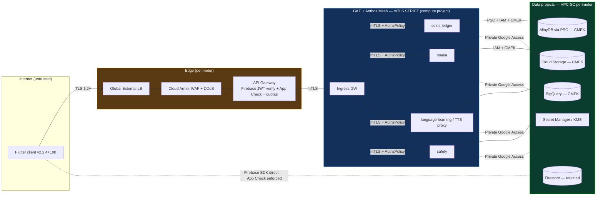
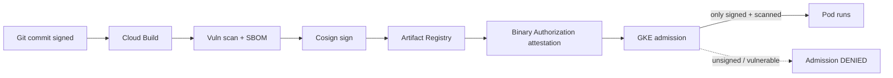
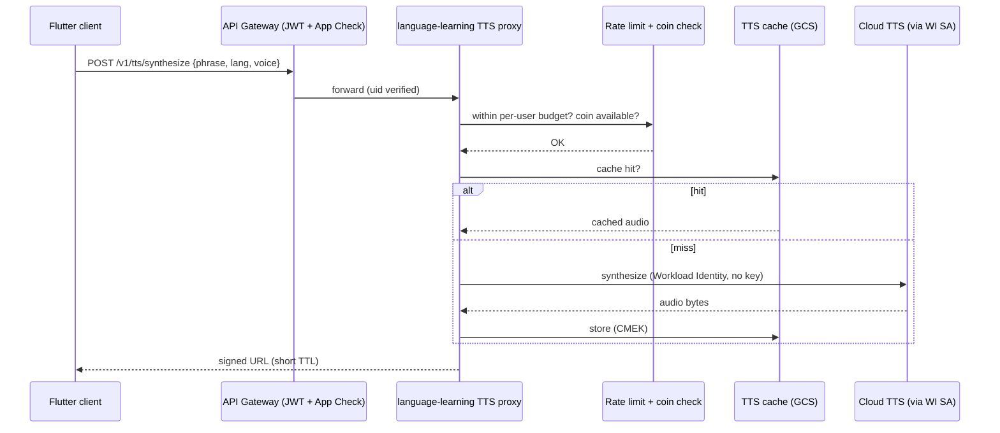
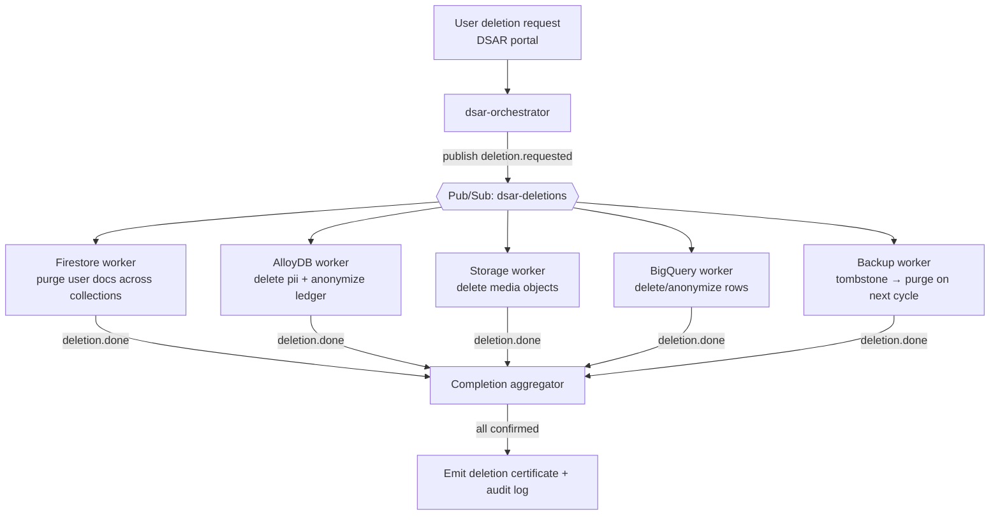

# 09 — Security & Compliance

> **Scope.** The security and compliance target state for the GreenGo hybrid platform (GKE Autopilot + managed data on GCP), migrating from the Firebase monolith (`greengo-chat`, Flutter app **v2.2.4+100**). GreenGo processes user **PII, photos, precise location, and payments**, so this document is normative for every squad, not advisory.
>
> **Reads with.** [02-target-architecture.md](02-target-architecture.md) (system shape), [04-data-migration.md](04-data-migration.md) (what data lands where), [06-gke-platform.md](06-gke-platform.md) (mesh, ingress, Workload Identity), [07-cicd.md](07-cicd.md) (supply chain, Binary Authorization), [10-observability.md](10-observability.md) (audit log routing & alerting).
>
> **Locked decisions in force.** Hybrid strangler-fig (Firestore retained); AlloyDB PostgreSQL for money-ledger + social-graph; GKE Autopilot + Anthos Service Mesh with **mTLS STRICT**; Pub/Sub + Eventarc; single region **`europe-west1`**; Terraform + Argo CD GitOps, Artifact Registry, **Binary Authorization**.
>
> **NFR envelope.** 99.95% availability; GDPR + CCPA right-to-deletion & export; immutable audit logs; PII store isolation.
>
> **Known security debt tracked here.** (1) Cloud TTS **API key exposed client-side** in `lib/core/services/pronunciation_service.dart` — see [§8](#8-the-client-tts-key-fix-p0). (2) App Check present but **not enforced** — see [§7](#7-application-security). (3) ~90 Firestore collections with duplicate/legacy rule surface — see [§9](#9-data-protection--privacy).

---

## 1. Security principles

These six principles are testable design constraints. Every ADR, Terraform module, and service PR is reviewed against them.

| # | Principle | What it means concretely at GreenGo | Enforced by |
|---|-----------|--------------------------------------|-------------|
| P1 | **Zero trust** | No implicit trust from network position. Every east-west call is authenticated (mTLS) and authorized (mesh `AuthorizationPolicy`). Every north-south call carries a validated identity (Firebase JWT). | Anthos Service Mesh STRICT, API Gateway, [§3](#3-network-security) |
| P2 | **Least privilege** | Each workload runs as its **own** Google Service Account with the minimum roles; humans get access via groups + IAM Conditions, time-bound. No `roles/editor`, no `roles/owner` on runtime SAs. | Workload Identity, IAM [§2](#2-identity--access) |
| P3 | **Defense in depth** | Cloud Armor → API Gateway → mesh authz → app authz → row-level checks → CMEK-at-rest. A single control failing must not expose data. | Layered [§3](#3-network-security)–[§9](#9-data-protection--privacy) |
| P4 | **No client-side secrets** | The Flutter client ships **zero** privileged credentials. Anything privileged is brokered by a server-side service. The TTS key exposure is the P0 remediation of this principle. | [§8](#8-the-client-tts-key-fix-p0) |
| P5 | **Encrypt everywhere** | TLS 1.2+ in transit externally, mTLS internally; CMEK (Cloud KMS) at rest for AlloyDB, Storage, BigQuery, and the Terraform state bucket. | [§5](#5-secrets--keys), [§9](#9-data-protection--privacy) |
| P6 | **Auditable & tamper-evident** | Every admin action and data-access event is logged to an isolated security project with a bucket lock. Security decisions are reproducible from Terraform + Git history. | [§11](#11-audit--compliance) |

---

## 2. Identity & access

### 2.1 Model

- **Workload identity (no key files).** Every GKE workload authenticates to GCP APIs via **Workload Identity Federation** — the Kubernetes SA is bound to a Google SA; no exported JSON keys ever exist. Service-account key creation is blocked org-wide by policy (`iam.disableServiceAccountKeyCreation`).
- **Human access.** Engineers never get direct project roles. They are members of Google Groups (`grp-greengo-*`), and IAM bindings target the group with **IAM Conditions** (time-bound, resource-scoped). Production data-access roles require **break-glass** (§2.4).
- **End-user identity.** Firebase Auth issues the JWT. It is validated **twice**: at the edge (API Gateway verifies signature, `aud`, `iss`, `exp`), and again **in-mesh** by each service (defense in depth — a compromised gateway cannot forge identity that the service trusts blindly). The user's `uid` propagates as a signed request attribute; services derive authorization from it, never from client-supplied `uid` fields.

### 2.2 Org-policy guardrails (Terraform)

```hcl
# terraform/org-policies/security.tf
resource "google_org_policy_policy" "no_sa_keys" {
  name   = "projects/${var.project_id}/policies/iam.disableServiceAccountKeyCreation"
  spec { rules { enforce = "TRUE" } }
}
resource "google_org_policy_policy" "uniform_bucket_access" {
  name   = "projects/${var.project_id}/policies/storage.uniformBucketLevelAccess"
  spec { rules { enforce = "TRUE" } }
}
resource "google_org_policy_policy" "restrict_regions" {
  name = "projects/${var.project_id}/policies/gcp.resourceLocations"
  spec { rules { values { allowed_values = ["in:europe-west1-locations", "in:eu-locations"] } } }
}
```

### 2.3 Service → Service Account → roles (sample)

Each domain service maps to exactly one Google SA. Roles are the **complete** grant for that SA — anything not listed is denied.

| Service (domain) | K8s SA | Google SA | IAM roles (project-scoped, least privilege) | Data reach |
|------------------|--------|-----------|---------------------------------------------|------------|
| **coins-ledger** | `coins-ledger` | `sa-coins-ledger@…iam` | `roles/alloydb.client`, `roles/cloudkms.cryptoKeyEncrypterDecrypter` (ledger CMEK), `roles/secretmanager.secretAccessor` (db creds), `roles/pubsub.publisher` (`coin-events`) | AlloyDB `ledger` schema only |
| **media** | `media` | `sa-media@…iam` | `roles/storage.objectAdmin` (`greengo-media-*` buckets only, via IAM Condition on resource name), `roles/secretmanager.secretAccessor`, `roles/cloudkms.cryptoKeyEncrypterDecrypter` (media CMEK) | Cloud Storage media buckets |
| **analytics** | `analytics` | `sa-analytics@…iam` | `roles/bigquery.dataEditor` (`greengo_analytics` dataset), `roles/bigquery.jobUser`, `roles/pubsub.subscriber` (`analytics-ingest`) | BigQuery only; **no** PII store |
| **language-learning** (TTS proxy) | `lang-learning` | `sa-lang-learning@…iam` | `roles/cloudtts.user` *(equivalently the TTS caller role)*, `roles/storage.objectAdmin` (`greengo-tts-cache`), `roles/datastore.user` (scoped), `roles/secretmanager.secretAccessor` | TTS cache bucket + pronunciation cache |
| **safety** | `safety` | `sa-safety@…iam` | `roles/alloydb.client` (moderation schema), `roles/pubsub.publisher` (`safety-actions`), `roles/aiplatform.user` (moderation model) | Moderation schema |

> **Resource-scoped conditions.** The `media` grant is not a blanket `storage.objectAdmin`; it is conditioned:
> ```hcl
> condition {
>   title      = "media-buckets-only"
>   expression = "resource.name.startsWith('projects/_/buckets/greengo-media-')"
> }
> ```

### 2.4 Break-glass

Production **data-access** roles (e.g., `roles/alloydb.databaseUser` on the PII instance, `roles/datastore.viewer` on Firestore prod) are **not** standing grants. They are obtained through a break-glass flow:

1. Engineer files a justified request (PagerDuty incident # required).
2. Approval by a second person from `grp-greengo-security`.
3. A Cloud Function grants a **2-hour** IAM Condition-bound role and posts the grant to the audit channel.
4. Expiry auto-revokes; the entire episode is a Data Access audit-log event reviewed weekly.

---

## 3. Network security

### 3.1 Controls

| Control | Configuration | Purpose |
|---------|---------------|---------|
| **Private GKE** | Autopilot cluster, private nodes, no public node IPs; control plane private endpoint + authorized networks | No node is internet-reachable |
| **Private AlloyDB** | Reached only via **Private Service Connect (PSC)** endpoint inside the VPC; no public IP | DB unreachable from internet |
| **Cloud NAT** | All egress via Cloud NAT with a fixed IP range; egress firewall default-deny, allowlist to Google APIs (Private Google Access) + approved partners (Stripe, Viator, Ticketmaster, Geoapify) | Controlled, attributable egress |
| **VPC Service Controls** | Service perimeter around the **data** projects (AlloyDB, Storage, BigQuery, Secret Manager, KMS). Ingress/egress rules allow only the runtime SAs from the compute project | Blocks data exfiltration even with stolen credentials |
| **Mesh mTLS STRICT** | Anthos Service Mesh `PeerAuthentication` STRICT mesh-wide; plaintext east-west rejected | Encrypted, authenticated service-to-service |
| **Authorization policies** | Per-workload `AuthorizationPolicy` allowlisting caller SPIFFE identities + methods | Least-privilege east-west |

### 3.2 Trust zones



> **Firestore retained path.** Because the strangler-fig keeps Firestore, the client still talks to Firestore directly via the Firebase SDK. That path is **not** protected by Cloud Armor or the mesh — its perimeter is **App Check ([§7](#7-application-security)) + Firestore Security Rules ([§9](#9-data-protection--privacy))**. This is why App Check enforcement is P0.

### 3.3 Sample AuthorizationPolicy (only `coins-ledger` may call the ledger write API)

```yaml
apiVersion: security.istio.io/v1
kind: AuthorizationPolicy
metadata:
  name: allow-coins-ledger-writes
  namespace: money
spec:
  selector:
    matchLabels: { app: coins-ledger }
  action: ALLOW
  rules:
    - from:
        - source:
            principals: ["spiffe://greengo.svc.id.goog/ns/payments/sa/checkout"]
      to:
        - operation:
            methods: ["POST"]
            paths: ["/v1/ledger/entries"]
```

---

## 4. Edge protection

The edge is the single north-south choke point for HTTPS API traffic (the Firestore SDK path is handled separately by App Check).

| Layer | Control | Configuration |
|-------|---------|---------------|
| **DDoS** | Google Cloud global network + Cloud Armor Adaptive Protection | L3/L4 absorbed by Google frontend; L7 volumetric ML-detected |
| **WAF** | Cloud Armor **preconfigured OWASP** rules | `sqli`, `xss`, `lfi`, `rfi`, `rce`, `scannerdetection`, `protocolattack` at sensitivity 1–2, tuned to reduce FPs |
| **Rate limiting** | Cloud Armor `rate_based_ban` | 600 req/min per client IP → `throttle`; ban 300s on egregious bursts. Per-user quotas enforced at API Gateway |
| **Geo / bot** | Cloud Armor geo rules + reCAPTCHA Enterprise / bot management | Deny embargoed regions; challenge suspected bots on auth/signup endpoints |
| **AuthN & quotas** | API Gateway | Validates Firebase JWT + App Check token; per-API-key & per-user quotas; request-size limits |

```hcl
# terraform/edge/cloud-armor.tf (excerpt)
resource "google_compute_security_policy" "greengo_edge" {
  name = "greengo-edge"
  adaptive_protection_config { layer_7_ddos_defense_config { enable = true } }

  rule {
    action   = "throttle"
    priority = 1000
    match { versioned_expr = "SRC_IPS_V1"
            config { src_ip_ranges = ["*"] } }
    rate_limit_options {
      conform_action = "allow"
      exceed_action  = "deny(429)"
      enforce_on_key = "HTTP_HEADER"        # keyed on end-user id header from gateway
      enforce_on_key_name = "x-greengo-uid"
      rate_limit_threshold { count = 600 interval_sec = 60 }
    }
  }
  rule {                                    # OWASP SQ--i
    action = "deny(403)" priority = 2000
    match { expr { expression = "evaluatePreconfiguredWaf('sqli-v33-stable', {'sensitivity': 1})" } }
  }
}
```

---

## 5. Secrets & keys

**Rules:** no secret in a container image, in a Terraform `.tfvars`, in the state file, in Firestore, or in the Flutter client. Secrets live in **Secret Manager**; encryption keys in **Cloud KMS**. Both already exist in the current Cloud Functions and are the standard going forward.

### 5.1 Secret Manager

- Every DB credential, partner API key (Stripe, Geoapify, Viator, Ticketmaster), and the **relocated TTS credential** ([§8](#8-the-client-tts-key-fix-p0)) is a Secret Manager secret, accessed at runtime via `roles/secretmanager.secretAccessor` scoped to the owning SA.
- **Rotation:** DB creds rotate every 90 days (automated via Cloud Function + AlloyDB user rotation); partner keys rotate on the partner's cadence, tracked in a rotation calendar. Rotation events are audit-logged.
- Injected into pods via the **Secret Manager CSI driver** (mounted, not env-baked) so rotation propagates without image rebuilds.

### 5.2 CMEK map — what is encrypted with which key

All key rings live in `europe-west1` in the **security** project; data projects are granted encrypt/decrypt only.

| Data at rest | KMS key | Rotation | Notes |
|--------------|---------|----------|-------|
| AlloyDB (PII + ledger + social-graph) | `keyring-data/alloydb-cmek` | 90 days | Instance created with `kms_key_name`; ledger is the highest-sensitivity store |
| Cloud Storage — media (`greengo-media-*`) | `keyring-data/media-cmek` | 90 days | Per-bucket default CMEK |
| Cloud Storage — TTS cache (`greengo-tts-cache`) | `keyring-data/tts-cmek` | 180 days | Non-PII derived audio |
| BigQuery `greengo_analytics` | `keyring-data/bq-cmek` | 90 days | Dataset default CMEK |
| Terraform **state bucket** | `keyring-infra/tfstate-cmek` | 180 days | Uniform bucket-level access; versioned; state may contain resource metadata, never plaintext secrets |
| Secret Manager payloads | Google-managed (default) + optional CMEK | — | Access, not encryption, is the control here |

```hcl
resource "google_alloydb_cluster" "primary" {
  cluster_id = "greengo-core"
  location   = "europe-west1"
  encryption_config { kms_key_name = google_kms_crypto_key.alloydb_cmek.id }
}
```

---

## 6. Supply-chain security

Full pipeline detail lives in [07-cicd.md](07-cicd.md); this is the security contract it must satisfy.



| Control | Requirement |
|---------|-------------|
| **Artifact Registry** | Sole image source; public registries blocked by admission |
| **Vulnerability scanning** | Automatic on push; build **fails** on CRITICAL/HIGH fixable CVEs |
| **SBOM** | SPDX SBOM generated per image, stored as an AR attachment for provenance/audit |
| **Image signing (Cosign)** | Every image signed post-scan; key in KMS |
| **Binary Authorization** | Cluster policy requires a valid attestation from the `prod-attestor`; **only signed + scanned** images admit. `evaluationMode = REQUIRE_ATTESTATION`, no `dryrun` in prod |
| **Base images** | Distroless/minimal, patched weekly; no shell in runtime images |

```yaml
# Binary Authorization policy (prod)
defaultAdmissionRule:
  evaluationMode: REQUIRE_ATTESTATION
  enforcementMode: ENFORCED_BLOCK_AND_AUDIT_LOG
  requireAttestationsBy:
    - projects/greengo-security/attestors/prod-attestor
```

---

## 7. Application security

| Concern | Control |
|---------|---------|
| **App Check** | **ENFORCE** on Firestore, Storage, and every Cloud Function / API. Attestation: Play Integrity (Android), App Attest (iOS), reCAPTCHA Enterprise (web). See enforcement plan below |
| **Input validation** | All API inputs validated against JSON Schema/proto at the gateway and re-validated in-service; reject on failure, never coerce |
| **Authorization per domain** | Each service derives authz from the signed `uid`; ownership checks on every resource (a user may only mutate their own ledger/media/profile). No trust in client-supplied ids |
| **Rate limits** | Per-user quotas at API Gateway + Cloud Armor ([§4](#4-edge-protection)); expensive endpoints (TTS, media upload, AI moderation) have dedicated tighter limits |
| **Abuse / fraud** | Tie into the existing **`safety/`** domain: velocity checks on signup, message-spam heuristics, coin-fraud rules on the ledger, image moderation via Vertex AI before publish |

### 7.1 App Check enforcement plan (App Check present, must be enforced)

The app already includes `firebase_app_check ^0.3.0`; today it is initialized but **not enforced**, so a stolen Firebase config can drive the backend directly. Enforcement rollout:

| Step | Action | Gate |
|------|--------|------|
| 1 | Ship client with App Check providers wired for all 3 platforms; run in **monitoring** mode | ≥ 99% of legitimate traffic shows valid tokens in metrics |
| 2 | Confirm token coverage per platform in the App Check console for ≥ 7 days | No material drop from real users |
| 3 | **Enforce** on Cloud Storage + Cloud Functions first (lowest risk of lockout) | Error rate flat |
| 4 | **Enforce** on Firestore (the retained direct-SDK path — highest value) | Rollback lever ready |
| 5 | Enforce on API Gateway (belt-and-suspenders with JWT) | — |

> Enforcement is coordinated with the minimum supported app version. Clients below the App-Check-capable build are force-upgraded to avoid mass token failures.

---

## 8. THE CLIENT TTS KEY FIX (P0)

### 8.1 Current exposure

`lib/core/services/pronunciation_service.dart` reads a Google Cloud credential from Firestore and calls Cloud TTS **directly from the client**:

- `_getApiKey()` (line ~32) loads `app_config/api_keys.cloud_tts_api_key`, falling back to `gemini_api_key`.
- `_synthesizeWithCloudTts()` (line ~204) issues an HTTPS `POST` to
  `https://texttospeech.googleapis.com/v1/text:synthesize?key=$apiKey`.

The key is therefore (a) present in a Firestore document any authenticated client can potentially read depending on rules, and (b) transmitted from every device. The doc comment claims "never hardcoded," but **loading a privileged key onto the client is the exposure** — hardcoding vs. Firestore-delivery is irrelevant once it reaches the device. This violates principle **P4 (no client-side secrets)**.

### 8.2 Risk

| Risk | Impact |
|------|--------|
| **Quota / billing abuse** | An extracted key lets an attacker call Cloud TTS at Google list prices on GreenGo's bill — Chirp 3 HD is premium-priced; unbounded synthesis is a direct financial-loss vector |
| **Key scope blast radius** | The fallback `gemini_api_key` may authorize other Google APIs → far larger abuse surface than TTS alone |
| **No per-user throttling** | Client-side calls bypass any server rate limit; one user can burn shared quota and degrade all users |
| **Poisoned config** | Anyone able to write `app_config` could redirect or swap the key |

### 8.3 The fix

1. **Remove the key from the client and from Firestore.** Delete `cloud_tts_api_key` (and the `gemini_api_key` fallback for TTS) from `app_config/api_keys`; strip `_getApiKey()` and the direct `text:synthesize` call from `pronunciation_service.dart`. Store the credential (or, preferably, use the `language-learning` service's **Workload Identity** SA with `roles/cloudtts.user` — no key at all) in **Secret Manager**.
2. **Add a server-side TTS proxy** in the **language-learning / media** service:
   - Endpoint `POST /v1/tts/synthesize` behind API Gateway (Firebase JWT + App Check enforced).
   - Authenticates to Cloud TTS via its **Workload Identity SA** — the credential never leaves GCP.
   - **Per-user rate limiting** (token bucket in Memorystore) + coin-cost enforcement server-side (the "1 coin per listen" rule moves to the trusted boundary, not the client).
   - **Caching preserved & centralized:** keep the existing phrase+language+voice cache key; check the `greengo-tts-cache` bucket / `pronunciation_cache` first, synthesize on miss, then store. The proxy returns a short-lived signed URL to the cached audio.
3. **Client change:** `pronunciation_service.dart` calls the proxy endpoint instead of Google directly; it holds no credential.



### 8.4 Rollout (Phase 1) & rotation

- This is a **Phase 1** deliverable — it ships alongside App Check enforcement, before broader traffic cutover.
- Sequence: deploy proxy → release client build calling the proxy → confirm ≥99% of TTS traffic flows through the proxy → **revoke/rotate the exposed key** and delete the Firestore field. Because the key was on many devices, treat it as **compromised**: rotate it (and the shared Gemini key if it was the fallback) immediately after client adoption, not before, to avoid breaking un-upgraded clients — coordinate with the minimum-supported-version gate from [§7.1](#71-app-check-enforcement-plan-app-check-present-must-be-enforced).

---

## 9. Data protection & privacy

### 9.1 Encryption

- **In transit:** external TLS 1.2+; internal **mTLS STRICT** ([§3](#3-network-security)).
- **At rest:** CMEK for AlloyDB, Storage, BigQuery, state bucket ([§5.2](#52-cmek-map--what-is-encrypted-with-which-key)); Firestore uses Google-managed encryption (CMEK not offered) — its protection is rules + App Check + VPC-SC-adjacent controls.

### 9.2 PII classification & store isolation

| Class | Examples | Authoritative store | Isolation |
|-------|----------|---------------------|-----------|
| **Sensitive PII** | Legal name, email, precise location, DOB | **AlloyDB** `pii` schema, CMEK | Own schema, own DB user, VPC-SC perimeter; only profile/identity service reaches it |
| **User content (PII-bearing)** | Profile photos, chat media | Cloud Storage `greengo-media-*`, CMEK | Signed-URL access only; `media` SA scoped |
| **Financial** | Coin ledger, purchase records | AlloyDB `ledger` schema, CMEK | Payment card data **out of scope** — held by **Stripe**, never GreenGo ([§11](#11-audit--compliance)) |
| **Realtime app data** | Chats, presence, discovery | Firestore (retained) | Security Rules + App Check; PII minimized here |
| **Derived / analytics** | Aggregates, events (pseudonymized) | BigQuery `greengo_analytics`, CMEK | No raw sensitive PII; `analytics` SA has no PII reach |

> **Rule-surface debt.** The ~90 Firestore collections include duplicate/legacy ones that inflate the rules attack surface. Phase 1 inventories every collection, marks each `active | legacy | delete`, and removes legacy collections + their rules. Default-deny remains the baseline; every collection needs an explicit, reviewed rule.

### 9.3 Residency & retention

- **Residency:** all primary data in **`europe-west1`**; org policy `gcp.resourceLocations` blocks creation outside the EU ([§2.2](#22-org-policy-guardrails-terraform)). Satisfies GDPR data-locality expectations.
- **Retention:** per-class TTL — chats/media retained per product policy; analytics pseudonymized and time-boxed; backups retained 30 days then purged. Retention windows feed the deletion flow ([§10](#10-gdprccpa)).

---

## 10. GDPR / CCPA

GreenGo must honor **right-to-deletion** and **right-to-access (export)** across **every** store: Firestore, AlloyDB, BigQuery, Cloud Storage, **and backups**.

### 10.1 Deletion orchestration

A DSAR-deletion request emits one Pub/Sub event; per-store workers fan out and each acknowledges completion. The request is closed only when all stores confirm.



| Store | Deletion action | Backups |
|-------|-----------------|---------|
| Firestore | Delete all user-keyed docs across active collections | — |
| AlloyDB `pii` | Hard-delete rows | — |
| AlloyDB `ledger` | **Anonymize**, not delete (financial-record retention obligation) — strip PII, keep de-identified entries | — |
| Cloud Storage | Delete objects + versions | Object versioning purged |
| BigQuery | Delete/anonymize user rows | — |
| **Backups** | Cannot rewrite immutable backups mid-cycle → **tombstone** the subject id; the record is purged when that backup ages out (≤ 30 days), and tombstones block restoration of the subject | Documented in the deletion certificate |

### 10.2 Export, consent, SLA

- **Export (access):** the same orchestrator runs in read mode, assembling a machine-readable (JSON) bundle per store into a short-TTL signed download.
- **Consent:** consent + marketing/analytics preferences stored versioned; analytics pipelines honor the opt-out flag at ingest.
- **DSAR SLA:** acknowledge ≤ **72h**; complete deletion/export ≤ **30 days** (GDPR Art. 12 / CCPA), with backup-purge completion noted separately (≤ 30-day backup cycle). Every DSAR is audit-logged with a completion certificate.

---

## 11. Audit & compliance

### 11.1 Logging

- **Cloud Audit Logs:** Admin Activity (always on) + **Data Access** logs enabled on AlloyDB, Storage, BigQuery, Secret Manager, KMS, Firestore.
- **Log sink → security project:** an aggregated org sink routes all audit logs to a bucket in an **isolated `greengo-security` project** that runtime SAs cannot read/delete.
- **Tamper-evident:** the sink bucket uses **Bucket Lock** (retention policy, WORM) + object versioning; audit logs cannot be altered or deleted within the retention window even by project owners.

```hcl
resource "google_logging_project_sink" "audit_to_security" {
  name        = "audit-all"
  destination = "storage.googleapis.com/${google_storage_bucket.audit.name}"
  filter      = "logName:\"cloudaudit.googleapis.com\""
  unique_writer_identity = true
}
resource "google_storage_bucket" "audit" {
  name     = "greengo-audit-logs"
  project  = "greengo-security"
  location = "europe-west1"
  retention_policy { retention_period = 34560000 }   # 400 days, locked
  versioning { enabled = true }
}
```

### 11.2 Compliance matrix

| Regime | Scope for GreenGo | Primary controls |
|--------|-------------------|------------------|
| **GDPR** | EU users' PII; lawful basis, residency, DSAR | `europe-west1` residency ([§9.3](#93-residency--retention)), deletion/export ([§10](#10-gdprccpa)), consent, DPA with GCP |
| **CCPA/CPRA** | California users; access/delete/opt-out | Same DSAR machinery + opt-out of sale/share (GreenGo does not sell data) |
| **PCI-DSS** | Payments | **Descoped via Stripe** — card data never touches GreenGo systems; GreenGo stores only Stripe tokens/refs. Maintain SAQ-A eligibility |
| **SOC 2 (aspirational)** | Trust services | Audit logging, access review, change management via GitOps map to CC controls |

---

## 12. Threat model summary (STRIDE)

| # | Threat (STRIDE) | Vector | Mitigation | Ref |
|---|-----------------|--------|------------|-----|
| T1 | **Spoofing** | Forged end-user identity / client-supplied `uid` | Firebase JWT verified at gateway **and** in-mesh; authz from signed uid only | [§2](#2-identity--access) |
| T2 | **Tampering** | Malicious/unsigned container image | Cosign signing + Binary Authorization `REQUIRE_ATTESTATION` | [§6](#6-supply-chain-security) |
| T3 | **Repudiation** | Admin denies a data action | Immutable, bucket-locked Data Access audit logs in isolated project | [§11](#11-audit--compliance) |
| T4 | **Information disclosure** | **Exposed client TTS key** / stolen Firebase config | Server-side TTS proxy + key rotation; App Check enforcement; Firestore rules | [§7](#7-application-security), [§8](#8-the-client-tts-key-fix-p0) |
| T5 | **Information disclosure** | Data exfiltration via stolen SA credential | VPC Service Controls perimeter blocks egress outside the perimeter | [§3](#3-network-security) |
| T6 | **Denial of service** | Volumetric / L7 flood, quota exhaustion | Cloud Armor Adaptive Protection + rate limits + per-user quotas | [§4](#4-edge-protection) |
| T7 | **Elevation of privilege** | Over-broad IAM / lateral movement | Least-privilege per-service SAs, Workload Identity (no keys), break-glass, mesh AuthorizationPolicy | [§2](#2-identity--access), [§3](#3-network-security) |
| T8 | **Tampering / EoP** | Secret in image or state | Secret Manager + CSI driver; no secrets in images/state; CMEK on state bucket | [§5](#5-secrets--keys) |
| T9 | **Info disclosure** | Coin/quota fraud & abuse | Server-side coin enforcement, ledger fraud rules in `safety/`, per-user throttles | [§7](#7-application-security), [§8](#8-the-client-tts-key-fix-p0) |
| T10 | **Repudiation / compliance** | DSAR not honored across all stores | Pub/Sub deletion orchestration incl. backups + completion certificate | [§10](#10-gdprccpa) |

---

### Phase 1 security exit criteria

1. Client TTS key removed from client + Firestore; server-side TTS proxy live; exposed key rotated. ([§8](#8-the-client-tts-key-fix-p0))
2. App Check **enforced** on Firestore, Storage, and Functions/APIs. ([§7.1](#71-app-check-enforcement-plan-app-check-present-must-be-enforced))
3. Firestore collection inventory complete; legacy collections + rules removed. ([§9.2](#92-pii-classification--store-isolation))
4. Workload Identity for all migrated services; SA-key creation blocked org-wide. ([§2](#2-identity--access))
5. CMEK on AlloyDB/Storage/BigQuery/state; audit-log sink to locked security-project bucket. ([§5](#5-secrets--keys), [§11](#11-audit--compliance))

*End of 09 — Security & Compliance.*
