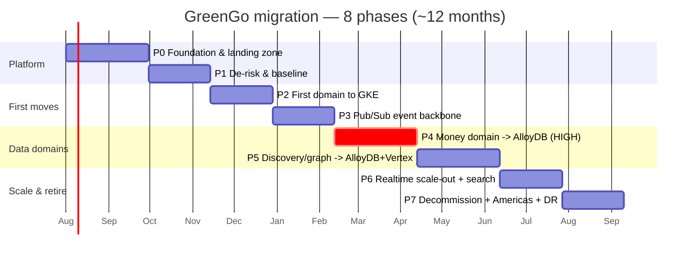
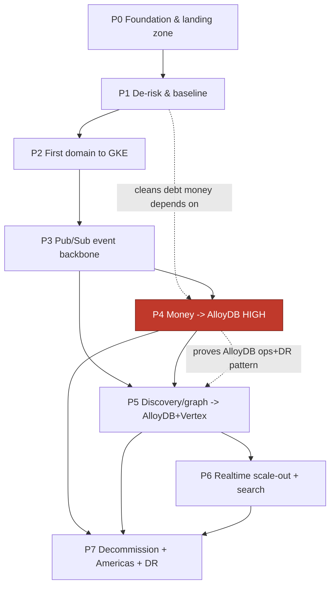

# 10 — Phased Roadmap

> Master execution document for the GreenGo Firebase-monolith → hybrid GKE + managed-data migration.
> Strategy: **strangler-fig, app stays live and earning, every step reversible.**
> Companion reads: [00-overview.md](00-overview.md), [02-target-architecture.md](02-target-architecture.md), [03-gcp-service-catalog.md](03-gcp-service-catalog.md), [04-data-migration.md](04-data-migration.md), [05-iac-terraform.md](05-iac-terraform.md), [06-gke-platform.md](06-gke-platform.md), [12-team-raci.md](12-team-raci.md).

This is the document the program runs from. Each phase below is a runbook: entry criteria, workstreams, measurable exit criteria, rollback/abort plan, and user-facing risk. Durations are illustrative planning figures, not commitments — phase gates ([§4](#4-phase-gates--gono-go)) govern advancement, not the calendar.

---

## 1. Roadmap overview

Eight phases across ~12 months. P0–P3 build the platform and de-risk with low blast radius; **P4 (money → AlloyDB) is the single HIGH-risk phase** and everything before it exists to make it safe; P5–P7 scale out and retire the legacy estate.

| Phase | Goal | Duration | User risk | Key deliverables | Primary squads |
|-------|------|----------|-----------|------------------|----------------|
| **P0** | Foundation & landing zone | ~60d | **none** | GCP org/folders/projects, VPC + VPC-SC, GKE Autopilot + Anthos Service Mesh, Terraform modules, Argo CD + Argo Rollouts, observability stack, `europe-west1` | Platform, SRE, Security |
| **P1** | De-risk & baseline | ~45d | **low** | Dedupe duplicate schemas & function folders, remove client TTS key, enforce App Check, SLO baseline, load test to 1M-sim | Platform, Backend, Security, SRE |
| **P2** | First domain to GKE (media or analytics/admin) | ~45d | **low** | Golden-path service on GKE behind facade, canary via Argo Rollouts, cohort cutover via Remote Config | Media **or** Analytics/Admin squad, Platform |
| **P3** | Pub/Sub event backbone | ~45d | **low–med** | Eventarc/Pub/Sub replaces Firestore-trigger sprawl incrementally, Cloud Tasks for retries, DLQs | Platform, Backend, all domain squads |
| **P4** | Money domain → AlloyDB | ~60d | **HIGH** | coins-ledger + payments + subscriptions on AlloyDB; dual-write + backfill + reconcile; **2-week zero-discrepancy gate** | Payments, Data, SRE, Finance/Risk |
| **P5** | Discovery/graph → AlloyDB + Vertex Vector Search | ~60d | **med** | Social graph + candidate generation on Postgres, pgvector/Vertex recs, shadow-ranked | Discovery, Data, ML |
| **P6** | Realtime scale-out + full-text search | ~45d | **med** | Optional WS tier (Pub/Sub + Memorystore Redis), managed full-text search | Messaging, Platform, Search |
| **P7** | Decommission legacy + multi-region Americas + DR | ~45d | **low** | Delete retired Cloud Functions, add Americas region, DR game days, RPO/RTO proven | Platform, SRE, all squads |

---

## 2. Sequencing rationale

**Why this order:**

- **P0 first, always.** Nothing production-bearing moves until the landing zone, IaC, GitOps, and observability exist. "Observability before traffic" is non-negotiable ([06-gke-platform.md](06-gke-platform.md)).
- **P1 before any domain move.** The migration debt (duplicate `coinTransactions`/`coin_transactions`, `coinBalances`/`coin_balances`, `blocked_users`/`blockedUsers`, `notification`/`notifications`, duplicate function folders) and the **client-exposed Cloud TTS key** are latent hazards. Deduping *before* P4 means the money migration copies from one canonical schema, not two divergent ones. Enforcing App Check and a load-tested SLO baseline gives us the "before" numbers to prove no regression later.
- **P2 is a deliberately boring first domain.** Media (stateless, cacheable, idempotent) or analytics/admin (no user-write hot path) lets us prove the golden path — CI/CD → Argo Rollouts canary → Remote Config cohort cutover → rollback — on a domain where a mistake cannot lose money or messages.
- **P3 before P4.** The Pub/Sub + Eventarc + Cloud Tasks backbone must exist before the money domain, because ledger correctness depends on reliable, ordered, retryable, DLQ-backed eventing (payment webhooks, fan-out, reconciliation jobs). Building the backbone on a low-stakes domain first de-risks it.
- **Money (P4) before discovery (P5).** Money is the highest-risk and highest-value domain; it must migrate while the org's attention, freeze discipline, and SRE muscle are at their peak — not after fatigue sets in on lower-stakes work. P4 also *proves the AlloyDB operational pattern* (HA, backups, PITR, dual-write, reconcile, DR) that P5 reuses for the social graph. Discovery can tolerate eventual consistency and shadow ranking; money cannot. Do the hard, unforgiving one while the safety apparatus is freshest.
- **P5 depends on P4's AlloyDB.** Graph + pgvector live in the same AlloyDB platform stood up and hardened in P4. Reusing it avoids standing up a second unproven datastore.
- **P6 after the data domains.** Realtime scale-out and search are optimizations layered on a stable platform; they must not compete for capacity or attention with the money/graph migrations.
- **P7 last.** You cannot decommission legacy Cloud Functions until every domain that called them is migrated and soak-tested. Multi-region Americas and DR game days are the capstone — they validate the whole platform under regional failure.

**What can parallelize:**

- Within P0, the VPC/landing-zone, GKE platform, and observability workstreams run concurrently across Platform/SRE/Security.
- P1 dedupe work parallelizes per collection pair (independent squads).
- P3's per-trigger migrations parallelize across domain squads once the backbone is live.
- P5 and the *early planning/schema* of P6 can overlap, but P6 execution waits for P5 exit.

---

## 3. Phase runbooks

Each subsection is self-contained. Reference the sibling docs for the deep mechanics; this doc owns the *sequence, gates, and decisions*.

---

### P0 — Foundation & landing zone

**Goal.** Stand up a production-grade GCP landing zone and delivery platform in `europe-west1` so that any domain service can be deployed, observed, secured, and rolled back — with **zero user-facing change**.

**Scope.**
- **In:** GCP org/folder/project hierarchy; VPC + subnets + Cloud NAT + Private Service Connect; VPC Service Controls perimeter; GKE Autopilot cluster + Anthos Service Mesh (mTLS); Terraform modules & remote state; Argo CD + Argo Rollouts; observability stack (Cloud Monitoring/Logging/Trace, Prometheus/Grafana, SLO tooling); Cloud Armor + global LB + CDN + API Gateway shell; secret management (Secret Manager + Workload Identity); base CI/CD pipelines.
- **Out:** Any application logic, any data migration, any traffic. No Firestore or Cloud Function is touched.

**Entry criteria.**
- Program approved; budget and GCP org access granted.
- Target architecture ([02-target-architecture.md](02-target-architecture.md)) and IaC design ([05-iac-terraform.md](05-iac-terraform.md)) signed off.
- Squads and RACI ([12-team-raci.md](12-team-raci.md)) staffed.

**Workstreams & key tasks.**
- **Landing zone (Platform/Security):** org policies, folder/project layout (`prod`, `staging`, `shared-infra`, `data`), IAM baseline (least privilege, no primitive roles), VPC-SC perimeter around data projects. See [05-iac-terraform.md](05-iac-terraform.md).
- **Networking:** VPC, regional subnets in `europe-west1`, Cloud NAT, Private Service Connect to Google APIs, DNS. Replace the stale `nodejs18` and phantom-module references from the repo's existing `terraform/` (tracked as P1 debt but *modules authored here*).
- **GKE platform (Platform):** Autopilot cluster, Anthos Service Mesh with strict mTLS, namespaces per domain, Gateway API + ingress. See [06-gke-platform.md](06-gke-platform.md).
- **GitOps & delivery:** Argo CD app-of-apps, Argo Rollouts with canary analysis templates wired to SLO metrics, image signing + Binary Authorization, per-service SA via Workload Identity.
- **Observability (SRE):** metrics/logs/traces pipelines, base dashboards, on-call/alerting (paging), error budgets tooling. Nothing takes traffic before this is green.
- **Edge:** global LB, Cloud Armor WAF/rate-limit policies, CDN, API Gateway facade skeleton that will later front domain services.
- **Secrets:** Secret Manager, rotation policy, Workload Identity bindings — the pattern that P1's TTS-key fix will use.

**Exit criteria (measurable).**
- `terraform plan` is clean and `terraform apply` reproducible from zero in a scratch project; state locked in remote backend.
- GKE cluster healthy; a **hello-world canary** deploys via Argo CD, canaries via Argo Rollouts, and auto-rolls-back on an injected SLO breach — demonstrated end-to-end.
- Service mesh enforces mTLS (verified: plaintext pod-to-pod denied).
- Dashboards + alerts live; a synthetic alert pages on-call successfully.
- VPC-SC perimeter blocks exfil test; no primitive IAM roles present (policy scan clean).
- DR primitives configured (state backups, cluster reprovision runbook).

**Rollback / abort plan.** Entirely greenfield in isolated projects; "rollback" = `terraform destroy` of the scratch/staging estate. No user impact possible. Abort criterion: landing-zone cannot pass VPC-SC/mesh security gate — halt and remediate before any P1 work.

**User-facing risk & mitigation.** **None** — no production system is touched. Mitigation is procedural: enforce that no P0 change routes any live traffic.

**Duration & dependencies.** ~60d. Depends on: program approval only. Blocks: all subsequent phases.

---

### P1 — De-risk & baseline

**Goal.** Pay down the migration debt that would poison later phases, close the client-side security hole, enforce App Check, and establish the SLO/performance **baseline** (proven to 1M-simulated load) that every later phase measures "no regression" against — all on the *existing* Firebase stack.

**Scope.**
- **In:** Firestore schema dedupe; Cloud Function folder dedupe; remove client-exposed Cloud TTS key; App Check enforcement across callable functions & Firestore; SLO baseline + load test to 1M-sim; fix stale `nodejs18` in the repo's Terraform.
- **Out:** Moving any domain to GKE (that's P2); AlloyDB (P4). This phase hardens the monolith in place.

**Entry criteria.**
- P0 exit criteria met (platform, IaC, observability live).
- Full inventory of duplicate collections/functions confirmed against production ([01-current-state.md](01-current-state.md), [04-data-migration.md](04-data-migration.md)).

**Workstreams & key tasks.**
- **Schema dedupe (Backend/Data)** — collapse each duplicate pair to one canonical collection via dual-read → backfill → dual-write → single-write, per pair:
  - `coinTransactions` ⟶ `coin_transactions` (**canonicalize to snake_case ledger name**; this is a prerequisite for P4 — money must migrate from one schema).
  - `coinBalances` ⟶ `coin_balances`.
  - `blocked_users` ⟶ `blockedUsers` (choose one canonical; update safety/moderation reads).
  - `notification` ⟶ `notifications`.
  - Each pair: shim readers to canonical, backfill historical docs, verify counts + checksums, remove writers to the deprecated name, then retire it behind a Remote Config kill-switch.
- **Function folder dedupe (Backend):** collapse duplicate function folders, remove dead deploys, tag each remaining function with its owning domain (of the 14) to prepare P2/P3 extraction.
- **Security — TTS key (Security/Backend):** remove the **client-exposed Cloud Text-to-Speech key** (`lib/core/services/pronunciation_service.dart`, key in Firestore `app_config`). Move synthesis behind a server endpoint (callable/soon-to-be language-learning service) using Secret Manager + Workload Identity; rotate/revoke the leaked key; ship a client update that no longer reads `app_config` for the key. Gate old clients via Remote Config.
- **App Check (Security):** enforce App Check on callable functions and Firestore; monitor rejection rate; provide grace window + forced-update path for old clients.
- **Baseline & load (SRE):** define SLOs (API p95<250ms, msg delivery p95<500ms, 99.95% core availability); build the 1M-simulated load test; capture the **baseline numbers** every later phase compares against.
- **IaC cleanup:** replace stale `nodejs18` runtime and reconcile the repo's `terraform/` with the P0 modules.

**Exit criteria (measurable).**
- Each duplicate pair: 100% of reads/writes on the canonical collection; deprecated collection has zero writers for ≥7 days; row-count + checksum parity verified.
- No client build reads the TTS key from `app_config`; leaked key revoked; server TTS path serving 100% of synthesis; secret scan clean.
- App Check enforced; illegitimate-traffic rejection working; legitimate-client rejection rate ≈0.
- SLO baseline published; **1M-sim load test passes** within SLO targets; dashboards show green error budgets.
- No `nodejs18` references remain in IaC.

**Rollback / abort plan.** Every dedupe is reversible: revert readers to the deprecated collection via Remote Config (dual-write kept until exit). TTS: server path is additive; if it regresses, Remote Config routes clients back to the (now-rotated) key path temporarily while fixing — but the leaked key stays revoked. App Check: enforcement has a monitored ramp; disable enforcement flag if legitimate rejections spike.

**User-facing risk & mitigation.** **Low.** Risks: (a) a client on an old build breaks when a deprecated collection is retired — mitigate with ≥7-day dual-write soak + Remote Config min-version gate + forced-update prompt; (b) App Check locks out legitimate old clients — mitigate with staged rollout + grace window; (c) TTS interruption — mitigate with dual-path during cutover.

**Duration & dependencies.** ~45d. Depends on: P0. Blocks: P4 hard-depends on the coin schema dedupe; P2/P3 depend on function-folder domain tagging.

---

### P2 — First domain to GKE (golden path)

**Goal.** Migrate the **first, deliberately low-risk domain** (media, or analytics/admin) onto GKE behind the API Gateway facade, proving the full golden path — build → canary → cohort cutover → observe → rollback — end to end in production.

**Scope.**
- **In:** One domain service (recommended: **media** — stateless, idempotent, cacheable; or **analytics/admin** — no user-write hot path) built and deployed on GKE; facade routing; Argo Rollouts canary; Remote Config cohort cutover; parity/shadow testing vs. legacy functions.
- **Out:** Money, messaging, discovery, groups — anything on a revenue or realtime hot path.

**Entry criteria.**
- P1 exit met (debt paid, baseline established, functions domain-tagged).
- Chosen domain's legacy functions identified and their contracts documented.
- Golden-path CI/CD + canary analysis proven on hello-world in P0.

**Workstreams & key tasks.**
- **Service build (domain squad):** implement the domain service (media or analytics/admin) against documented legacy contracts; containerize; wire Workload Identity, mesh sidecar, SLOs.
- **Facade routing (Platform):** API Gateway routes the domain's endpoints; default still to legacy; new path dark-launched.
- **Shadow & parity:** mirror production traffic to the new service; diff responses against legacy; drive parity to target before any real cutover.
- **Canary + cutover:** Argo Rollouts canary (1%→5%→25%→50%→100%) gated on SLO analysis; user cohorts flipped via Remote Config so we can revert in seconds.
- **Observability:** per-service dashboards, alerts, error budget; compare against P1 baseline.

**Exit criteria (measurable).**
- 100% of the domain's traffic served by the GKE service for ≥7 days within SLO (p95<250ms), error rate ≤ baseline.
- Shadow parity ≥ agreed threshold (e.g., ≥99.9% response equivalence) before full cutover.
- A **live rollback drill** executed: cohort flipped back to legacy via Remote Config in <5 min with no data loss.
- Legacy functions for the domain idle (0 invocations) for ≥7 days — retained, not yet deleted (deletion is P7).

**Rollback / abort plan.** Remote Config flips the affected cohort back to legacy functions instantly (legacy remains deployed and warm). Argo Rollouts auto-aborts a bad canary on SLO breach. Because media/analytics is idempotent/non-transactional, no reconciliation needed. Abort criterion: parity cannot reach threshold — keep on legacy, fix, retry.

**User-facing risk & mitigation.** **Low.** Chosen precisely because failure is non-catastrophic (a media fetch retries; analytics is async). Mitigations: shadow parity before cutover, tiny initial canary, instant Remote Config revert, legacy kept warm.

**Duration & dependencies.** ~45d. Depends on: P1. Blocks: P3 (backbone reuses the golden path); establishes the extraction pattern for all later domains.

---

### P3 — Pub/Sub event backbone

**Goal.** Stand up the **Pub/Sub + Eventarc + Cloud Tasks** event backbone and migrate Firestore-trigger and scheduled-function sprawl onto it **incrementally**, trigger by trigger, with DLQs and retries — so later domains (especially P4 money) have reliable, ordered, retryable eventing.

**Scope.**
- **In:** Pub/Sub topics/subscriptions per event class; Eventarc for Firestore/Cloud events; Cloud Tasks for scheduled/deferred/retryable work; DLQs + replay tooling; incremental migration of existing Firestore triggers (~26) and scheduled functions (~31); idempotency + ordering keys.
- **Out:** Rewriting domain business logic (only the eventing plumbing moves); the money migration itself (P4).

**Entry criteria.**
- P2 exit met (golden path proven).
- Trigger/scheduled-function inventory mapped to event classes and owning domains ([01-current-state.md](01-current-state.md), [04-data-migration.md](04-data-migration.md)).

**Workstreams & key tasks.**
- **Backbone (Platform):** provision Pub/Sub topics with schemas, Eventarc triggers, Cloud Tasks queues; DLQ per subscription; replay/redrive tooling; ordering keys where required.
- **Incremental trigger migration (all domain squads):** for each Firestore trigger / scheduled function — wrap or re-emit as a Pub/Sub event, run **new consumer in parallel (shadow)** against the legacy trigger, diff side effects, then disable the legacy trigger behind Remote Config / deploy flag.
- **Idempotency:** enforce idempotency keys and dedupe on consumers (events deliver at-least-once).
- **Observability:** per-topic lag, DLQ depth, redelivery-rate alerts; backbone SLOs.

**Exit criteria (measurable).**
- Targeted triggers/scheduled functions migrated; legacy counterpart idle ≥7 days each.
- Zero unhandled messages: DLQ depth returns to 0 after drills; replay tooling verified.
- No duplicate side effects observed in shadow diffs (idempotency proven).
- Backbone meets latency/lag SLOs under 1M-sim load.

**Rollback / abort plan.** Each trigger migration is independently reversible: re-enable the legacy Firestore trigger and disable the Pub/Sub consumer (both controlled by flags). Because consumers are idempotent, brief double-processing during flip is safe. DLQ + replay recovers any dropped events. Abort criterion for a given trigger: shadow diffs show side-effect divergence — keep legacy, fix consumer, retry.

**User-facing risk & mitigation.** **Low–med.** Risk: a mis-migrated trigger double-processes or drops an event (e.g., a notification, a fan-out). Mitigations: shadow parallel-run before cutover, enforced idempotency, DLQs with alerting, per-trigger (not big-bang) migration, instant flag rollback.

**Duration & dependencies.** ~45d. Depends on: P2. Blocks: **P4 hard-depends on the backbone** (payment webhooks, ledger fan-out, reconciliation jobs ride it); P5 fan-out also uses it.

---

### P4 — Money domain → AlloyDB  ⚠️ HIGH RISK

**Goal.** Migrate **coins-ledger, payments, and subscriptions** off Firestore documents onto **AlloyDB Postgres** with ACID guarantees, via dual-write + backfill + continuous reconciliation, gated by a **2-week zero-discrepancy dual-run** before any read cutover. Not one cent may be lost, double-counted, or made unauditable.

**Scope.**
- **In:** `coin_transactions` (ledger), `coin_balances`, payments records, subscription state → AlloyDB; dual-write layer; historical backfill; continuous reconciliation engine; IAP/Play Billing + Stripe webhook handling on the P3 backbone; idempotent ledger with append-only entries.
- **Out:** Discovery/graph (P5); non-money collections. Firestore remains the *system of record until the read cutover passes the gate*.

**Entry criteria.**
- P1 coin-schema dedupe complete (single canonical `coin_transactions`/`coin_balances`) — **non-negotiable**.
- P3 event backbone live (DLQs, ordering, idempotency proven).
- AlloyDB provisioned with HA, automated backups, PITR, and a *tested* restore; DR runbook drafted ([04-data-migration.md](04-data-migration.md)).
- Finance/Risk sign-off on reconciliation methodology; audit requirements captured.
- Change-freeze windows and incident/rollback commander assigned.

**Workstreams & key tasks.**
- **Ledger schema (Data/Payments):** append-only double-entry `ledger_entries`, materialized `coin_balances`, `payments`, `subscriptions` tables; constraints + idempotency keys; migrations in IaC.
- **Dual-write (Payments):** every money mutation writes Firestore **and** AlloyDB in one logical operation; AlloyDB write failures alarm loudly (money mutations never silently single-write).
- **Backfill (Data):** load full historical `coin_transactions`/`coin_balances`/payments/subscriptions into AlloyDB; reconstruct balances from the ledger; verify reconstructed balance == Firestore balance per user.
- **Reconciliation engine (SRE/Data):** continuous job diffs Firestore vs. AlloyDB per-user balance + per-transaction; emits discrepancy metrics; **any non-zero discrepancy is a P4 stop-the-line event**.
- **Webhooks (Payments/Platform):** Play Billing + Stripe webhooks onto Pub/Sub (P3), idempotent, DLQ-backed; entitlement grants written transactionally.
- **2-week zero-discrepancy gate:** dual-run in production with AlloyDB shadow-authoritative; only after **14 consecutive days of exactly zero reconciliation discrepancies** do we flip reads to AlloyDB.
- **Read cutover (Payments):** flip balance/ledger reads to AlloyDB per cohort via Remote Config; keep Firestore dual-written as fallback through soak.

**Exit criteria (measurable).**
- **14 consecutive days, zero reconciliation discrepancies** across all money tables (the hard gate).
- Backfilled balances reconstructed from ledger match Firestore 100% (per-user, penny-exact).
- Reads served from AlloyDB for 100% of cohorts within SLO (p95<250ms); write path ACID with idempotency verified under fault injection.
- Webhook path: zero lost/duplicated entitlement grants under injected retries/DLQ replay.
- PITR restore drill passes within RTO≤30min / RPO≤5min on the money dataset.
- Finance/Risk sign-off on the migrated ledger's auditability.

**Rollback / abort plan.** Firestore remains fully dual-written and authoritative-capable throughout; read cutover is per-cohort via Remote Config and reverts in <5 min to Firestore reads. Because writes go to both stores, no data is stranded on rollback. If a discrepancy appears **any day** in the 14-day gate, the clock resets and reads stay on Firestore. **Abort criteria:** repeated discrepancy the reconciliation engine cannot explain, or an ACID/idempotency defect under load — halt cutover, keep Firestore authoritative, root-cause, re-enter the gate. Nothing is deleted in P4 (legacy money functions retired only in P7, after long soak).

**User-facing risk & mitigation.** **HIGH** — this is the revenue path. A defect could show wrong balances, double-charge, or drop entitlements. Mitigations: dual-write (never single-write money), continuous penny-exact reconciliation, the **14-day zero-discrepancy gate before any read flips**, per-cohort Remote Config cutover with seconds-fast rollback, idempotent webhooks with DLQ replay, tested PITR, Finance/Risk gate, dedicated incident commander, change-freeze during cutover windows. App stays live and earning on Firestore the entire time.

**Duration & dependencies.** ~60d (plus the 14-day gate embedded). Depends on: P1 (coin dedupe), P3 (backbone), AlloyDB from P0/P4 provisioning. Blocks: P5 reuses the AlloyDB operational pattern; P7 legacy-money-function deletion.

---

### P5 — Discovery/graph → AlloyDB + Vertex Vector Search

**Goal.** Move the **social graph** (matches/likes/swipes/blocks) and candidate generation off Firestore onto **AlloyDB**, and power recommendations with **pgvector + Vertex Vector Search**, shadow-ranked against the current system before any user sees new ordering.

**Scope.**
- **In:** Social-graph tables (edges: like/match/swipe/block) on AlloyDB; candidate-pool generation via SQL + pgvector; embeddings + Vertex Vector Search for discovery ranking; shadow ranking + A/B; migration of the geohash/sharded-index read paths where they benefit from relational/vector.
- **Out:** Money (done in P4); realtime chat/presence (stays on Firestore); full-text search (P6).

**Entry criteria.**
- P4 exit met (AlloyDB pattern proven, ops/DR muscle established).
- P3 backbone available for graph-edge fan-out events.
- Discovery contracts + current ranking metrics baselined for comparison.

**Workstreams & key tasks.**
- **Graph schema (Data/Discovery):** edge tables + indexes for the social graph; backfill from Firestore; dual-write graph mutations during transition.
- **Candidate generation (Discovery):** port candidate-pool logic to SQL; integrate pgvector for similarity; keep geohash/locality constraints.
- **Vector recs (ML):** generate profile embeddings; index in Vertex Vector Search; wire ranking service on GKE.
- **Shadow ranking + A/B:** run new ranker in shadow, compare engagement/quality metrics; A/B a cohort via Remote Config before broad rollout.
- **Cutover:** per-cohort read cutover for discovery; Firestore graph dual-written as fallback through soak.

**Exit criteria (measurable).**
- Graph reads/writes served from AlloyDB within SLO; backfill parity verified (edge counts + spot checksums).
- New ranker meets or beats baseline discovery quality/engagement in A/B (no significant regression) before full rollout.
- Recommendation latency within SLO (p95<250ms for candidate fetch).
- Legacy discovery functions idle ≥7 days.

**Rollback / abort plan.** Discovery is eventually-consistent and non-transactional, so rollback is low-cost: Remote Config reverts a cohort to the Firestore/legacy ranker instantly; graph stays dual-written so no edges are lost. Abort criterion: A/B shows sustained engagement/quality regression — keep legacy ranking, iterate on features/embeddings, retry.

**User-facing risk & mitigation.** **Med.** Risk: worse matches/recommendations, or missing/duplicated graph edges. Mitigations: dual-write graph, shadow-then-A/B before rollout, per-cohort Remote Config cutover, quality guardrail metrics with auto-revert, Firestore fallback during soak.

**Duration & dependencies.** ~60d. Depends on: P4 (AlloyDB), P3 (fan-out). Blocks: P6 search builds on the same platform; P7 legacy-discovery-function deletion.

---

### P6 — Realtime scale-out + full-text search

**Goal.** Add headroom for **200–500k concurrent** by introducing an **optional WebSocket tier** (Pub/Sub + Memorystore Redis fan-out) alongside Firestore realtime, and add **managed full-text search** — without disrupting existing chat/presence.

**Scope.**
- **In:** Optional WS gateway service on GKE fed by Pub/Sub + Redis for presence/fan-out at scale; full-text search backend (managed) for messages/profiles/content; incremental opt-in per cohort/surface.
- **Out:** Replacing Firestore realtime wholesale (Firestore stays best-in-class for chat; WS tier is *additive/optional*); anything in P7.

**Entry criteria.**
- P5 exit met.
- Concurrency headroom analysis identifies surfaces that benefit from a WS tier ([02-target-architecture.md](02-target-architecture.md)).
- Search corpus + indexing strategy defined.

**Workstreams & key tasks.**
- **WS tier (Messaging/Platform):** WS gateway on GKE; presence + fan-out via Pub/Sub and Memorystore Redis; sticky routing + backpressure; opt-in surface behind Remote Config.
- **Full-text search (Search):** stand up managed search; index messages/profiles/content incrementally; relevance tuning; latency SLOs.
- **Load validation (SRE):** prove 200–500k concurrent on the WS tier and search under the 1M-sim harness.

**Exit criteria (measurable).**
- WS tier sustains target concurrency (toward 200–500k) with msg-delivery p95<500ms in load tests; graceful degradation to Firestore verified.
- Search latency + relevance meet SLO; index freshness within target.
- No regression to existing Firestore chat during opt-in rollout.

**Rollback / abort plan.** The WS tier is additive and opt-in per surface/cohort via Remote Config — disable it and clients fall back to Firestore realtime with no data loss. Search is read-side and non-authoritative; disable the search surface and revert to prior query paths. Abort criterion: WS tier can't hold concurrency within SLO — keep Firestore realtime, defer WS.

**User-facing risk & mitigation.** **Med.** Risk: WS instability degrades chat, or search returns poor results. Mitigations: additive/opt-in design with instant Firestore fallback, per-cohort rollout, backpressure + graceful degradation, relevance guardrails, load-tested before broad enablement.

**Duration & dependencies.** ~45d. Depends on: P5 (stable platform). Blocks: nothing hard; feeds P7's scale story.

---

### P7 — Decommission legacy + multi-region Americas + DR

**Goal.** Retire the now-idle legacy Cloud Functions, add an **Americas region** for latency + resilience, and prove disaster recovery through **DR game days** — closing out the migration with the legacy estate gone and multi-region resilience validated.

**Scope.**
- **In:** Delete legacy Cloud Functions whose domains fully migrated and soaked (media/analytics from P2, migrated triggers/scheduled from P3, **money functions from P4**, discovery functions from P5); remove dead function folders and stale IaC; add Americas region (regional GKE + data replication strategy per [04-data-migration.md](04-data-migration.md)); global routing; DR game days proving RPO≤5min / RTO≤30min.
- **Out:** New product features. This is a hardening/cleanup capstone.

**Entry criteria.**
- P4/P5 (and P2/P3, P6 as applicable) exited; each domain's legacy functions idle for the required soak (≥30 days recommended for money) with fallback no longer exercised.
- AlloyDB/Firestore multi-region replication design approved.
- DR runbooks drafted; game-day scenarios defined.

**Workstreams & key tasks.**
- **Decommission (all squads):** verify zero invocations + no Remote Config fallback dependency per function, then delete legacy functions (media, analytics/admin, migrated triggers/scheduled, **coins/payments/subscriptions money functions**, discovery). Remove duplicate/dead function folders and any residual deprecated collections retired in P1. Delete stale IaC.
- **Multi-region (Platform/SRE):** stand up Americas region — regional GKE, data replication (AlloyDB cross-region, Firestore multi-region config), global LB routing, failover policy. See [04-data-migration.md](04-data-migration.md), [05-iac-terraform.md](05-iac-terraform.md).
- **DR game days (SRE):** simulate regional failure; execute failover; measure RPO/RTO against targets; run the money-dataset restore drill in the failover region.

**Exit criteria (measurable).**
- All targeted legacy functions deleted; no orphaned Remote Config flags; function count reduced to the intended domain-service footprint; IaC has no dead references.
- Americas region serving traffic; cross-region replication healthy; global routing verified.
- **DR game day passes: RPO≤5min, RTO≤30min** demonstrated with a real regional failover, including the money domain.
- 99.95% core availability sustained through the game day window.

**Rollback / abort plan.** Function deletion is the one irreversible-ish step, so it is gated on long soak + zero-invocation proof + no fallback dependency; if any doubt, keep the function (deletion can wait). Multi-region rollout is additive — if the Americas region misbehaves, route all traffic back to `europe-west1` (single-region operation, the proven default). DR game days are controlled exercises with predefined abort/restore steps. Abort criterion for decommission: any function still shows invocations or a live fallback dependency — do not delete.

**User-facing risk & mitigation.** **Low.** Deleting truly-idle functions has no user impact; the risk is deleting one still in use — mitigated by zero-invocation + no-fallback verification and long soak. Multi-region is additive with single-region fallback. DR game days are scheduled, communicated, and reversible.

**Duration & dependencies.** ~45d. Depends on: P4 & P5 (and P2/P3, P6) exits. Blocks: none — program close-out.

---

## 4. Phase gates & go/no-go

Advancement is gated, not scheduled. No phase starts until the prior gate is signed.

| Gate | Criteria (all must be true) | Approver |
|------|------------------------------|----------|
| **G0 → P1** | Landing zone + GKE + IaC + observability live; hello-world canary auto-rollback demonstrated; VPC-SC/mesh security gate passed | Platform Lead + Security Lead + Head of SRE |
| **G1 → P2** | All 4 duplicate collection pairs canonicalized (7-day zero-writer soak); TTS key removed + revoked; App Check enforced; **1M-sim load test passes at SLO**; no `nodejs18` in IaC | Backend Lead + Security Lead + SRE Lead |
| **G2 → P3** | First GKE domain at 100% traffic ≥7 days within SLO; shadow parity ≥ threshold; live rollback drill <5 min succeeded | Platform Lead + Domain Squad Lead + SRE Lead |
| **G3 → P4** | Event backbone live; targeted triggers migrated with idempotency proven; DLQ replay verified; backbone meets lag SLOs | Platform Lead + all Domain Leads + SRE Lead |
| **G4 → P5** | **14 consecutive days zero reconciliation discrepancy**; ledger penny-exact vs Firestore; AlloyDB reads at SLO; PITR restore ≤RTO; Finance/Risk audit sign-off | **CTO + Head of Payments + Finance/Risk + Head of SRE** |
| **G5 → P6** | Graph on AlloyDB at SLO with backfill parity; new ranker ≥ baseline in A/B; recs within latency SLO | Discovery Lead + ML Lead + SRE Lead |
| **G6 → P7** | WS tier holds target concurrency at msg p95<500ms with Firestore fallback proven; search at SLO; no chat regression | Messaging Lead + Platform Lead + SRE Lead |
| **G7 close-out** | Legacy functions deleted (zero-invocation proven); Americas region serving; **DR game day RPO≤5min/RTO≤30min passed** | CTO + Platform Lead + Head of SRE |

The **G4 gate is the program's crown jewel** — it carries CTO + Finance/Risk sign-off because it governs the revenue path.

---

## 5. Cross-cutting workstreams (run through every phase)

These never "finish" — they are standing obligations from P0 to P7. RACI in [12-team-raci.md](12-team-raci.md).

| Workstream | What it means every phase | Owner |
|------------|---------------------------|-------|
| **Observability** | Every new service ships with SLOs, dashboards, alerts, and error budgets *before* it takes traffic. Every phase compares against the P1 baseline. Trace coverage across facade → mesh → data. | SRE |
| **Security** | Least privilege (Workload Identity, per-service SA), no client-side keys, secrets in Secret Manager with rotation, VPC-SC, App Check, Binary Authorization, image signing. Security review is a gate input each phase. | Security |
| **Cost / FinOps** | Cost dashboards per project/domain; budget alerts; right-sizing (Autopilot, AlloyDB, Redis); Firestore read-cost tracking as domains move off it; monthly cost review tied to the "cheaper at scale" thesis. | Platform + Finance |
| **Client coordination (Remote Config)** | Every cutover — dedupe retirement, TTS path, domain cutovers, money reads, discovery ranker, WS tier — is gated behind **Remote Config** cohort flags with min-version enforcement and forced-update paths. Seconds-fast rollback is the contract with users. | Mobile/Client + owning Domain Squad |
| **Reconciliation & data integrity** | Dual-write + parity checks are standard for every data move; money (P4) and graph (P5) run continuous reconciliation; checksums/counts verified on every backfill. | Data + SRE |
| **Change management & comms** | Change-freeze windows for high-risk cutovers (esp. P4), incident commander assigned per risky phase, user comms for DR game days. | Program/SRE |

---

## 6. Milestones & success metrics per phase (tied to NFRs)

NFR targets: **1M→5M MAU, 200–500k concurrent; 99.95% core availability; API p95<250ms; msg delivery p95<500ms; RPO≤5min / RTO≤30min.**

| Phase | Milestone | Success metric (NFR tie-in) |
|-------|-----------|------------------------------|
| **P0** | Platform live | Reproducible IaC apply; canary auto-rollback proven; mesh mTLS enforced. Enables the *entire* NFR program. |
| **P1** | Baseline proven | **1M-sim load test passes at SLO**; SLO baseline (p95<250ms API, <500ms msg) published; 0 client-exposed keys. |
| **P2** | Golden path live | First domain at SLO for ≥7 days; rollback <5 min. Proves the pattern that protects 99.95% during moves. |
| **P3** | Backbone live | Event lag within SLO under 1M-sim; DLQ depth →0; idempotency proven. |
| **P4** | Money on AlloyDB | **14-day zero-discrepancy**; penny-exact ledger; AlloyDB reads p95<250ms; PITR ≤RTO/RPO. Directly proves RPO≤5min/RTO≤30min on the revenue path. |
| **P5** | Graph + recs on AlloyDB/Vertex | Ranker ≥ baseline in A/B; candidate fetch p95<250ms; graph parity 100%. Scales discovery toward 5M MAU. |
| **P6** | Scale-out + search | WS tier toward **200–500k concurrent** at msg p95<500ms; search at SLO. Meets the concurrency NFR. |
| **P7** | Legacy retired + multi-region | Legacy functions =0 invocations then deleted; **DR game day RPO≤5min/RTO≤30min**; 99.95% held through failover. Closes the resilience NFR. |

---

## 7. Risk register (top 10)

| # | Risk | Phase | Likelihood | Impact | Mitigation | Owner |
|---|------|-------|:---------:|:------:|------------|-------|
| R1 | **Money discrepancy / lost or double-counted coins** during ledger migration | P4 | Med | **Critical** | Dual-write (never single-write money); continuous penny-exact reconciliation; **14-day zero-discrepancy gate** before read cutover; per-cohort Remote Config rollback; Finance/Risk sign-off | Head of Payments |
| R2 | **Leaked Cloud TTS key exploited** before/at removal | P1 | Med | High | Revoke/rotate key immediately; move synthesis server-side behind Secret Manager; ship client update; monitor usage for abuse | Security Lead |
| R3 | **Old clients break** when a deprecated collection is retired or App Check enforced | P1–P4 | Med | High | ≥7-day dual-write soak; Remote Config min-version gate + forced-update; staged App Check ramp with grace window | Mobile Lead |
| R4 | **Mis-migrated trigger drops or duplicates events** (notifications, fan-out, entitlements) | P3 | Med | High | Shadow parallel-run before cutover; enforced idempotency keys; DLQ + replay; per-trigger (not big-bang) migration | Platform Lead |
| R5 | **Payment webhook loss/duplication** (Play Billing / Stripe) | P4 | Med | **Critical** | Webhooks on Pub/Sub with idempotency + DLQ replay; transactional entitlement grants; fault-injection tested | Payments Lead |
| R6 | **AlloyDB regional outage / data loss** | P4–P7 | Low | **Critical** | HA config; automated backups + PITR (tested restore ≤RTO/RPO); Firestore dual-write fallback through soak; cross-region replication (P7); DR game days | Head of SRE |
| R7 | **Discovery quality regresses** with new graph/vector ranker | P5 | Med | Med | Shadow-then-A/B with quality guardrails; per-cohort Remote Config; auto-revert on engagement drop; Firestore fallback | Discovery Lead |
| R8 | **WS tier can't hold 200–500k concurrent / degrades chat** | P6 | Med | Med | Additive/opt-in with instant Firestore fallback; backpressure + graceful degradation; load-tested before broad enable | Messaging Lead |
| R9 | **Cost overrun** vs. the "cheaper at scale" thesis (dual-run doubles some spend) | P0–P7 | Med | Med | FinOps dashboards + budget alerts; time-box dual-run windows; right-size Autopilot/AlloyDB/Redis; track Firestore read-cost reduction as domains move off | Platform + Finance |
| R10 | **Deleting a still-used legacy function** during decommission | P7 | Low | High | Zero-invocation proof + no-fallback-dependency check + long soak (≥30d for money) before deletion; keep function if any doubt | Platform Lead |

Risk reviews are a standing agenda item at every phase gate ([§4](#4-phase-gates--gono-go)); the register is re-scored entering each phase.

---

*Sequence and gates own the program; the calendar does not. When a gate is not green, the phase does not start — the app stays live and earning on the last proven configuration.*
