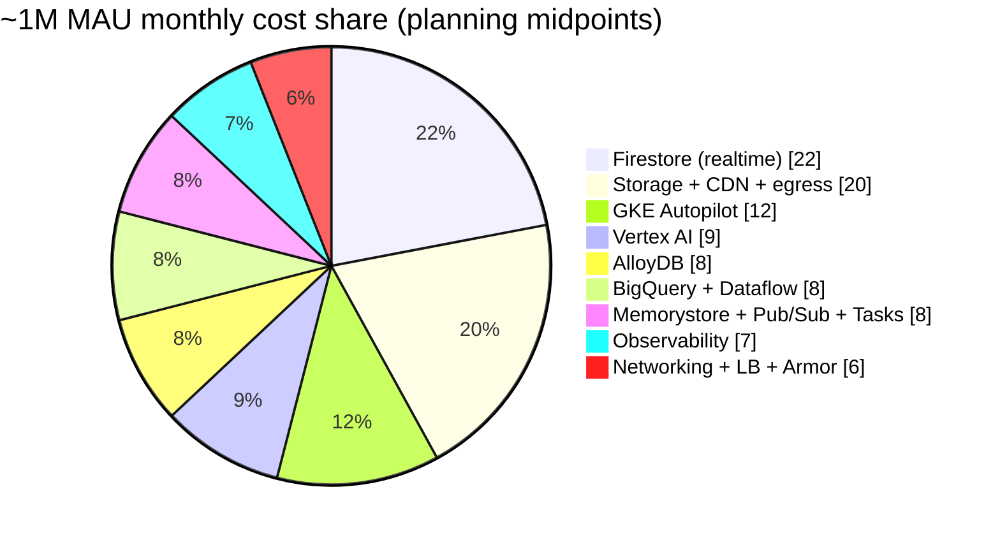

# 11 — Cost & FinOps

> **Audience:** Engineering leadership (VP/Eng, Head of Platform, Finance/FinOps) and the SRE / Platform squad.
> **Companion docs:** [02-target-architecture.md](02-target-architecture.md) (service topology & names), [03-gcp-service-catalog.md](03-gcp-service-catalog.md) (SKUs), [05-iac-terraform.md](05-iac-terraform.md) (labels & project layout), [08-observability-slo.md](08-observability-slo.md) (sampling & SLOs that gate cost).

---

## 1. Purpose & disclaimer

This document is the FinOps cost model for the hybrid GKE + managed-data platform described in [02-target-architecture.md](02-target-architecture.md). It exists so that leadership can reason about **gross-margin trajectory** and so SRE can reason about **which knobs move the bill**.

**Read every number here as a planning estimate, not a quote.**

| What this doc IS | What this doc IS NOT |
|---|---|
| An order-of-magnitude cost model to size budgets and headroom | A binding quote or a committed spend figure |
| A ranked list of the levers that actually move the bill | A billing export or an invoice reconciliation |
| A framework for unit economics (cost/MAU, cost/message) | A guarantee that per-user cost lands at any stated point |
| Input to CUD (Committed Use Discount) purchasing decisions | A substitute for the GCP Pricing Calculator on real SKUs |

**Mandatory validation gates before any figure here is treated as real:**

1. **Load tests (P1)** — synthetic traffic at 1M-MAU-equivalent shapes must produce a measured cost-per-hour, extrapolated and compared to this model. See the migration phase plan; P1 is the first gate.
2. **Billing export → BigQuery** — the moment any production traffic runs on GCP, the [billing export](https://cloud.google.com/billing/docs/how-to/export-data-bigquery) becomes the source of truth. This model is retired in favour of measured data per service.
3. **Ranges, not points** — every figure is a range. If a single number is ever quoted from this doc, it has been misquoted. The spread (typically 2–4×) reflects genuine uncertainty in per-MAU activity, cache-hit ratios, and egress patterns that only real usage resolves.

All dollar figures are **USD per month**, illustrative, and assume **single region europe-west1** unless stated. Multi-region Americas expansion (roadmap phase P7) is explicitly **out of scope** for these numbers and materially increases egress, replication, and node cost.

---

## 2. Cost model assumptions

Every dollar in Section 3 is derived from the per-MAU activity assumptions below. **These are the numbers to challenge first** — if activity is 2× what we assume, the variable cost lines roughly double. They are deliberately stated so Finance and Product can push back with real analytics from the current Firebase app.

### 2.1 Per-user activity (the drivers)

| Driver | Assumption (per active user) | Basis / notes | Sensitivity |
|---|---|---|---|
| Sessions / day | 3.0 | Social-discovery app, multiple check-ins | Drives Firestore listener-hours, GKE QPS |
| Session length | ~6 min | Foreground realtime listener attached | **High** — listener-minutes ≈ Firestore reads |
| Messages sent / day | 4 | 1:1 + group chat combined | **High** — fan-out multiplies this |
| Message fan-out factor | ×1.8 avg | Group chat delivery amplification | Multiplies message writes/reads |
| Discovery swipes / day | 40 | Card deck browsing | **High** — candidate_pools mitigates (see §4a) |
| Media uploads / user / day | 0.3 | Profile pics, chat images | Drives Storage GB + transcode + egress |
| Media *views* / user / day | 25 | Feed + profile + chat image loads | **Highest egress driver** — CDN-cacheable |
| Avg delivered image size | ~180 KB | After resize/WebP (see §4b) | Pre-optimization ~1.2 MB |
| Push notifications / user / day | 8 | Messages, matches, events, re-engagement | Pub/Sub + FCM + Cloud Tasks |
| Vector/discovery ML calls / day | 2 | Re-rank + embedding refresh | Vertex AI serving |
| MAU → DAU ratio | ~35% | Concurrency = DAU × peak factor | Sets Autopilot floor |
| Peak : average concurrency | ~4× | Evening + timezone clustering (single region) | Sets Autopilot ceiling & HPA headroom |

### 2.2 Modelling conventions

| Convention | Value | Why it matters |
|---|---|---|
| Firestore read cost | ~$0.036 / 100k reads (europe-west1 tier) | Listener re-reads dominate; see §4a |
| Cloud CDN cache-hit target | **≥ 92%** for media | Every missed % point = egress + origin fetch |
| Network egress (internet, EU) | ~$0.08–0.12 / GB tiered | Media views are the volume driver |
| AlloyDB unit | vCPU-hour on primary + read pool | Ledger + graph; node count is the lever (§4c) |
| CUD assumption in "optimized" cols | 1-yr CUD where noted | Section 5 quantifies |
| FX / list price date | Planning snapshot, unvalidated | Refresh against live SKUs at P1 |

> If any single assumption in §2.1 is materially wrong, **update it here and let the tables in §3 flow from it** — do not patch the totals directly.

---

## 3. Monthly cost estimate by service

Two scale points: **~1M MAU** and **~5M MAU**, single region europe-west1. Ranges are order-of-magnitude planning estimates per §1. Totals are **not** a simple sum of midpoints — they carry independent uncertainty.

| Service (see [03-gcp-service-catalog.md](03-gcp-service-catalog.md)) | Primary unit driver | ~1M MAU / mo | ~5M MAU / mo | Cost character |
|---|---|---:|---:|---|
| **GKE Autopilot** (all domain services) | vCPU/mem-seconds of running pods | $3–8k | $12–30k | Scales with QPS; CUD-eligible |
| **Firestore** (realtime chat, presence, live reads) | Document reads (listener re-reads) | **$10–35k** | **$40–120k** | **Top lever** — see §4a |
| **AlloyDB** (coins ledger + social graph) | Primary + read-pool vCPU-hours | $2–8k | $10–35k | Node count is the lever (§4c) |
| **BigQuery + Dataflow** (analytics, ELT) | Slots / bytes scanned + streaming | $2–8k | $8–25k | On-demand→reservation crossover |
| **Storage + Cloud CDN + egress** | GB stored + GB egress + cache-miss | **$5–20k** | **$25–80k** | **Top lever** — see §4b |
| **Memorystore (Redis) + Pub/Sub + Cloud Tasks** | Redis GB-hr + msg volume + ops | $2–6k | $8–20k | Redis is also a Firestore-read *saver* |
| **Vertex AI** (vector search + re-rank ML) | Index serving + prediction nodes | $2–8k | $10–30k | Discovery quality vs cost trade |
| **Observability** (Cloud Ops, traces, logs) | Ingested log/trace GB | $1–4k | $5–15k | **Sampling-controlled** — see [08](08-observability-slo.md) |
| **Networking / LB / Cloud Armor / API GW** | Forwarding rules + WAF requests | $1–3k | $4–12k | Mostly fixed + per-request |
| **Rounded platform total** | — | **~$30–90k** | **~$120–340k** | Planning estimate — validate |

> The observability and networking lines were implicit in the baseline "rough total"; they are broken out here so nothing hides in the totals. The overall envelope still lands at **~$30–90k (1M)** and **~$120–340k (5M)**.

### 3.1 ~1M MAU cost breakdown (midpoint shares)

**Reading the chart:** two slices — **Firestore realtime reads** and **media Storage+CDN+egress** — together are ~40%+ of the bill. They are also the two most *elastic* to design. That is why Section 4 spends its depth there and everything else gets a lever table.

---

## 4. Cost drivers deep-dive — the big three

### 4a. Firestore reads / listeners

Firestore bills on **document reads**, and in a realtime chat + presence + discovery app the dominant read source is **snapshot listeners re-reading documents** on every change, multiplied by fan-out and by how many clients hold a listener open. Naive listener design is the single biggest way to accidentally 3× the bill.

| Lever | Mechanism | Est. read-cost reduction |
|---|---|---|
| **Scoped listeners + pagination** | Listen to last-N messages / visible window only, not whole collections | 30–50% |
| **Redis (Memorystore) read-through cache** | Presence, profile cards, group metadata served from Redis; Firestore read only on miss | 25–45% |
| **`candidate_pools` precomputation** | Discovery deck served from a materialized pool (Vertex re-rank) instead of live per-swipe queries | 40–60% on discovery reads |
| **Debounce / coalesce presence writes** | Throttle typing/online churn that triggers listener re-reads | 10–20% |
| **Move analytical reads off Firestore** | History, exports, aggregates go to BigQuery/AlloyDB, not Firestore scans | 10–15% |
| **Combined realistic envelope** | Stacked, non-additive | **~50–65% vs naive** |

> **SRE note:** the difference between the low ($10k) and high ($35k) end of the Firestore line at 1M MAU is *almost entirely* listener design and cache-hit ratio — not user count. Instrument `reads/DAU` as a first-class SLO-adjacent metric in [08-observability-slo.md](08-observability-slo.md).

### 4b. Media storage + CDN + network egress

Media **egress to the internet** — chat images, profile photos, feed thumbnails viewed ~25×/user/day — is the volume driver, not storage-at-rest. The cost formula is roughly `views × avg_delivered_bytes × egress_rate × (1 − cache_hit)`. Every lever attacks one factor.

| Lever | Mechanism | Est. saving on media cost |
|---|---|---|
| **Cloud CDN cache-hit ≥ 92%** | Most views served from edge; origin egress collapses | 40–70% of egress |
| **Server-side image resize + WebP/AVIF** | Deliver ~180 KB not ~1.2 MB; fewer bytes per view | 50–80% on bytes |
| **Adaptive/transcoded delivery** | Right-size per device/network; thumbnails for feeds | 20–40% |
| **Object lifecycle → Nearline/Coldline** | Old media & backups tier down after 30/90 days | 40–60% on cold GB |
| **Signed-URL + long cache-control TTLs** | Immutable content URLs maximize edge reuse | Raises hit-ratio → compounds CDN saving |
| **Combined realistic envelope** | Stacked, non-additive | **~55–75% vs naive delivery** |

> The `$5–20k` (1M) storage/CDN range maps directly to cache-hit ratio and delivered-byte size. A 92% vs 80% hit ratio is roughly the gap between the low and high end.

### 4c. AlloyDB node sizing + read pool

AlloyDB carries the **coins ledger** (strongly consistent, financial) and the **social graph** (read-heavy adjacency). Cost is `primary vCPU-hours + read-pool vCPU-hours + storage`. The graph is overwhelmingly reads, so the read pool is the sizing lever.

| Lever | Mechanism | Est. saving on AlloyDB cost |
|---|---|---|
| **Right-size read pool to actual QPS** | Add read replicas only to meet graph read latency SLO, autoscale count | 20–40% vs over-provisioned |
| **Redis in front of hot graph reads** | Follower lists / mutual-edge lookups cached | 15–30% |
| **CUD on steady primary** | Ledger primary is 24/7 → 1-yr/3-yr CUD | 25–52% on committed vCPU |
| **Columnar engine for analytical scans** | Keep OLAP off the transactional path (or push to BigQuery) | Avoids scaling primary for reports |
| **Partition/index the graph** | Fewer vCPU-seconds per query | 10–20% |
| **Combined realistic envelope** | Stacked | **~35–55% vs naive** |

---

## 4b — Transitional / dual-run cost (P4 / P5)

During the strangler-fig cutover ([02-target-architecture.md](02-target-architecture.md)), traffic is **dual-written and dual-read** across the old Firestore path and the new AlloyDB/GKE path so we can shadow, compare, and roll back safely. **You pay for both simultaneously.**

| Phase | What runs in parallel | Overlap premium (vs steady-state target) | Typical duration |
|---|---|---|---|
| **P4 — shadow / dual-write** | Firestore (full) + AlloyDB (populated, low read) + GKE services standing up | **+15–25%** on affected domains (mostly AlloyDB + extra GKE, Firestore unchanged) | 4–8 weeks |
| **P5 — dual-read / progressive cutover** | Firestore reads decaying + AlloyDB reads ramping + double observability | **+25–40%** peak on ledger/graph domains | 6–12 weeks |
| **Backfill spikes** | Dataflow one-time historical migration jobs | One-off bursts, not run-rate | Days, per batch |

**Guidance for Finance:** budget a **transitional envelope of roughly +20–35% on the migrating domains** (not the whole platform) for **~3–5 months**. This is temporary and self-terminating: once Firestore traffic for a domain is retired, its read/listener cost falls away and the platform converges toward the Section 3 steady state. The dual-run premium is the *insurance cost of a safe, reversible migration* — cutting it short trades dollars for rollback risk.

---

## 5. Optimization levers

Ranked by typical impact. "Est. savings" is on the **affected line item**, not the whole bill.

| Lever | Applies to | Est. savings | Notes |
|---|---|---:|---|
| **Committed Use Discounts — 3-yr** | GKE Autopilot, AlloyDB, Vertex | **up to ~46–52%** on committed baseline | Commit only the *always-on floor*, not peak |
| **Committed Use Discounts — 1-yr** | GKE, AlloyDB | **~25–37%** | Lower risk; buy first, extend to 3-yr once run-rate proven |
| **Autoscale toward near-zero off-peak** | GKE Autopilot, AlloyDB read pool, Dataflow | 15–35% | Single-region ⇒ real nightly trough; HPA + scheduled floors |
| **CDN cache-hit ratio ≥ 92%** | Storage/CDN/egress | 40–70% egress | See §4b; the highest-leverage single knob |
| **Log & trace sampling** | Observability | 40–70% ingest | Tail-based sampling per [08-observability-slo.md](08-observability-slo.md) |
| **BigQuery slot reservations vs on-demand** | BigQuery | 20–40% at steady scan volume | Crossover ~when on-demand > reservation break-even; flat-rate the predictable ELT |
| **Pub/Sub message batching + compression** | Pub/Sub, egress | 10–25% | Batch fan-out; fewer, larger messages |
| **Storage lifecycle → Nearline/Coldline** | Storage | 40–60% on cold GB | Old media 30d, backups 90d |
| **Redis caching** | Firestore + AlloyDB reads | see §4a/§4c | A *saver* on other lines, at its own modest cost |
| **candidate_pools precompute** | Firestore + Vertex | 40–60% discovery reads | Batch re-rank replaces live per-swipe query storms |

> **CUD discipline:** commit to the measured **P95 always-on baseline**, never the peak. Over-committing turns a discount into stranded spend. Revisit commitments quarterly against billing export.

---

## 6. FinOps operating model

FinOps is a practice, not a spreadsheet. The operating model wires cost into the same loops SRE already runs for reliability.

| Element | Implementation | Owner |
|---|---|---|
| **Budgets & alerts per project** | GCP Budgets at 50/80/100/120% of forecast, per project (prod/stage/dev split from [05-iac-terraform.md](05-iac-terraform.md)) | Platform + Finance |
| **Showback per squad** | Cost allocated via Terraform-enforced labels (`squad`, `domain`, `env`) → BigQuery billing export → Looker dashboard | Squad leads |
| **Monthly cost review** | 60-min review: run-rate vs forecast, anomalies, top movers, lever backlog | FinOps owner (see §9) |
| **Unit economics tracking** | Cost/MAU, cost/message, cost/paying-user computed from billing export ÷ product metrics | FinOps + Data |
| **Anomaly detection** | GCP recommender + BigQuery cost-anomaly query (day-over-day > X% per label) → alert | SRE on-call rotation |
| **Waste sweeps** | Idle read replicas, orphaned disks/IPs, over-provisioned nodes, unattached CUDs | Platform, monthly |

**Label taxonomy (must be enforced in Terraform — [05-iac-terraform.md](05-iac-terraform.md)):** `env`, `squad`, `domain`, `cost-center`, `data-classification`. Untagged resources are a showback blind spot; CI should fail Terraform plans that create untagged billable resources.

---

## 7. Unit economics & margin

The strategic point for leadership: **cost-per-MAU must fall as we scale**, because fixed platform overhead (control plane, LB, baseline observability, always-on primaries) amortizes over more users and because CUDs kick in at committed scale.

### 7.1 Cost per MAU

| Metric | ~1M MAU | ~5M MAU | Direction |
|---|---:|---:|---|
| Platform cost / mo (planning midpoint) | ~$55k | ~$210k | — |
| **Cost per MAU / mo** | **~$0.055** | **~$0.042** | ↓ **~24% cheaper per user** |
| Cost per MAU (low end) | ~$0.030 | ~$0.024 | ↓ |
| Cost per MAU (high end) | ~$0.090 | ~$0.068 | ↓ |
| Cost per message (est.) | ~$0.0004–0.0009 | ~$0.0003–0.0007 | ↓ |

**Why it drops:** fixed overhead amortization + CUD coverage of the now-predictable baseline + higher CDN cache-hit at volume + candidate_pools/Redis efficiencies compounding. The per-user curve bending down is the single most important slide for a scaling narrative.

### 7.2 Margin trajectory (illustrative, revenue is Product-owned)

GreenGo monetizes via **coin purchases** and **subscriptions**. Only a fraction of MAU pay; margin is driven by ARPU across *all* MAU vs cost-per-MAU.

| Scenario (illustrative ARPPU/conversion — **validate with Product**) | Blended ARPU / MAU / mo | Cost / MAU / mo | Gross margin / MAU |
|---|---:|---:|---:|
| Conservative (low paying %) | ~$0.15 | ~$0.055 (1M) | **~63%** |
| Conservative at scale | ~$0.15 | ~$0.042 (5M) | **~72%** |
| Base case | ~$0.30 | ~$0.042 (5M) | **~86%** |

> These ARPU figures are **placeholders for a Product/Finance conversation**, not committed numbers. The load-bearing insight is directional: **infrastructure cost-per-MAU is a small fraction of plausible ARPU, and it shrinks with scale** — so infra is not the margin risk; user-acquisition cost and monetization conversion are. That framing should anchor the leadership discussion.

---

## 8. Firebase-today vs target cost — an honest comparison

The migration is **not** a pure cost-reduction play. It is a **scalability, control, and unit-economics** play. Some lines go up; some efficiency is gained. Told straight:

| Dimension | Firebase today | Hybrid target | Honest direction |
|---|---|---|---|
| **Compute** | Cloud Functions (per-invocation, opaque scaling) | GKE Autopilot (pod-seconds, CUD-eligible) | **Up in absolute $**, but predictable, CUD-discountable, and far cheaper *per request* at scale; Functions cost explodes at high invocation volume |
| **Realtime data** | Firestore (kept) | Firestore (kept) + Redis + candidate_pools | **Down per-read** via caching/pools; same billing model |
| **Relational / ledger** | Simulated in Firestore (expensive reads, no real ledger) | AlloyDB (fit-for-purpose) | **New line item (up)**, but removes costly Firestore anti-patterns and gives real transactional integrity |
| **Analytics** | Ad-hoc Firestore scans / exports | BigQuery + Dataflow | Cleaner + cheaper analytics; scans leave the hot path |
| **Observability** | Basic Firebase/Cloud metrics | Full Cloud Ops + traces + SLOs ([08](08-observability-slo.md)) | **Up (new spend)** — the price of running a real platform |
| **Media** | Firebase Storage + default download | Storage + Cloud CDN + resize/transcode | **Down per-view** via CDN + optimization |
| **Operational risk** | Vendor-managed, low ops cost, hard ceiling on scale/control | Higher ops investment, no scale ceiling | Trade ops cost for headroom to reach millions |

**Bottom line for leadership:** expect the **absolute monthly bill to rise** (new AlloyDB, GKE, and observability lines are real spend), while **cost-per-MAU and cost-per-message fall** and we gain the architectural headroom Firebase alone cannot give at millions of MAU. The migration buys **scalability and margin-per-user**, not a smaller invoice. Anyone promising a lower total bill on day one is mis-selling it.

---

## 9. Cost governance guardrails

| Guardrail | Mechanism | Trigger / cadence |
|---|---|---|
| **Project-level quotas** | GCP quotas on vCPU, GPU, Firestore ops, egress per project | Hard cap; change via review |
| **Budget alerts** | 50 / 80 / 100 / 120% of monthly forecast → email + Slack + PagerDuty at 120% | Continuous |
| **Budget kill-switch (non-prod)** | Budget-triggered Pub/Sub → Cloud Function scales dev/stage GKE to zero at 120% | Non-prod only — **never auto-kill prod** |
| **Prod anomaly response** | >X% day-over-day per label → SRE on-call investigates, does *not* auto-scale-down prod | Same-day |
| **CUD review** | Utilization vs commitment reviewed against billing export | Quarterly |
| **New-service cost gate** | Any new billable service in Terraform requires a cost estimate + label in PR | Per change ([05](05-iac-terraform.md)) |
| **Monthly FinOps review** | Run-rate, forecast, unit economics, lever backlog | Monthly, standing |

### Ownership

| Role | Responsibility |
|---|---|
| **FinOps owner** (Head of Platform or delegate) | Owns the budget, runs monthly review, approves CUD purchases |
| **Squad leads** | Own their showback line; explain their squad's movers |
| **SRE on-call** | First responders to cost anomalies (treated like a reliability alert) |
| **Finance** | Owns forecast vs actual, validates this model against billing export |

> **Golden rule:** production is never auto-scaled-down by a budget event. Kill-switches protect non-prod only. A cost anomaly in prod is a signal to *investigate*, never to *degrade the service* — reliability outranks the monthly bill.

---

### Closing note

Every figure in this document is an **order-of-magnitude planning estimate** that must be validated against load tests (P1) and the BigQuery billing export before it drives a spend commitment. Refine the assumptions in Section 2, and let the tables flow from them. The tables — not the prose — are the deliverable.
