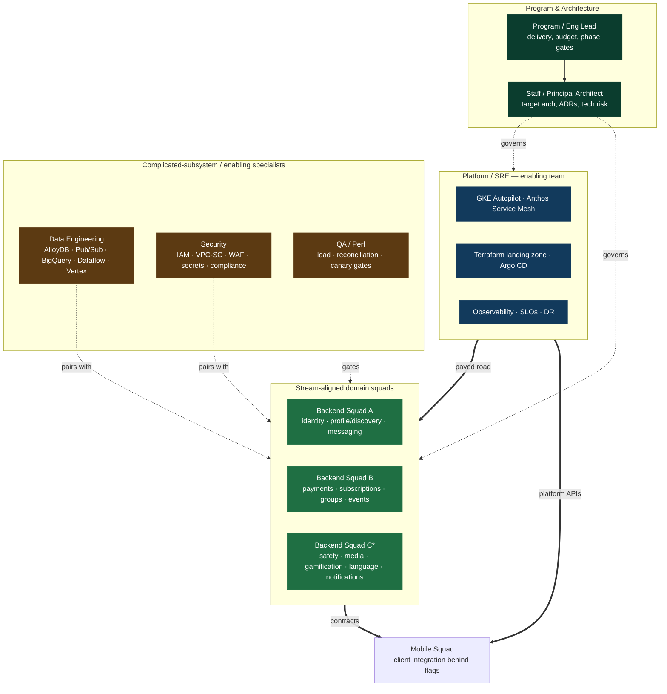

# 12 — Team & RACI

> **Audience:** Engineering leadership (VP Eng, Director), Engineering Managers, Program Lead, Staff/Principal Architect.
> **Purpose:** Define the org topology, ownership, and decision rights required to execute the GreenGo hybrid GKE + managed-data migration ([10-phased-roadmap.md](10-phased-roadmap.md)) across 8 phases and ~12 months, at millions-of-users scale.
> **Scope:** Team of record, roles, per-domain ownership, the RACI matrix (the centerpiece), ways of working, and staffing/governance.

**Related docs:** [00-overview.md](00-overview.md) · [02-target-architecture.md](02-target-architecture.md) · [03-gcp-service-catalog.md](03-gcp-service-catalog.md) · [10-phased-roadmap.md](10-phased-roadmap.md) · [ADRs](adr/)

---

## 1. Team topology

We adopt a **Team Topologies** framing. The migration is delivered by a small number of **stream-aligned domain squads** that own end-to-end slices of business capability, supported by a **platform team (enabling)** that reduces their cognitive load by providing paved-road infrastructure (GKE, IaC, mesh, CI/CD, observability, DR), and specialist **enabling/complicated-subsystem** functions (Data engineering, Security, QA/Perf) that inject deep expertise where it is scarce.

The guiding principle: **domain squads consume the platform as a product; they do not build GKE, mesh, or IaC themselves.** The Platform/SRE team is explicitly an *enabling* team — its success metric is domain-squad flow, not ticket throughput.



> \* Backend Squad C is stood up from ~P3 onward as the strangler surface widens; before that its domains are covered by A/B with Platform support.

### Squad roster

| Squad | Size | Team-topologies type | Mission | Owns |
|---|---|---|---|---|
| **Platform / SRE** | 2–3 | Platform (enabling) | Provide a self-service, secure, observable paved road so domain squads ship without touching raw infra | GKE Autopilot, Terraform landing zone, Anthos Service Mesh, Argo CD/CI-CD, observability stack, SLOs, DR/multi-region runbooks, cost guardrails |
| **Backend Squad A** | 2–3 | Stream-aligned | Own the highest-traffic core: who you are and how you connect | `identity`, `profile/discovery`, `messaging/realtime` |
| **Backend Squad B** | 2–3 | Stream-aligned | Own money and the social graph objects around it | `payments/coins-ledger`, `subscriptions`, `groups`, `events/catalog` |
| **Backend Squad C** | 2–3 | Stream-aligned (from ~P3) | Own trust, content and engagement surfaces | `safety/moderation`, `media`, `gamification`, `language-learning`, `notifications` |
| **Data Engineering** | 1–2 | Complicated-subsystem | Move and model data safely; own the managed-data plane and ML | AlloyDB schemas/migrations, Pub/Sub topology, BigQuery/Dataflow pipelines, Vertex AI embeddings/vector, reconciliation data |
| **Mobile** | 1–2 | Stream-aligned (client) | Integrate the Flutter client against new backends invisibly to users | Feature-flagged client integration, App Check, server-side TTS key removal, contract adherence, `analytics` client events |
| **Security** | 1 | Enabling | Make the paved road compliant and hard to misuse | IAM, VPC Service Controls, WAF/Cloud Armor, Secret Manager, KMS, compliance evidence |
| **QA / Perf** | 1 | Enabling | Prove correctness and capacity before every cutover | Load tests, reconciliation harness, canary/rollback gates, non-functional acceptance |

> **Analytics** and **admin** are cross-cutting: `analytics` is co-owned by Data Engineering (pipelines) + Mobile (client events); `admin` is owned by whichever backend squad owns the underlying domain, with a thin shared admin surface on Platform.

---

## 2. Roles & responsibilities

| Role | Core responsibilities | Key skills |
|---|---|---|
| **Program / Eng Lead** | Own delivery, budget, timeline and phase gates; unblock cross-squad dependencies; report to leadership; own go/no-go recommendation | Program management, GCP cost modelling, stakeholder comms, risk management |
| **Staff / Principal Architect** | Own target architecture and its integrity; author/steward ADRs; adjudicate design reviews; own tech-risk register; final technical arbiter | Distributed systems, GCP (GKE/AlloyDB/Pub/Sub), strangler-fig patterns, data-migration correctness |
| **Platform Engineer** | Build & operate the paved road: Terraform modules, GKE Autopilot, Anthos Service Mesh, Argo CD pipelines; publish golden paths/templates | Terraform, Kubernetes/Autopilot, Istio/ASM, GitOps (Argo CD), Go/scripting |
| **Backend Engineer** | Extract domain services from the monolith; own APIs/contracts, dual-write/backfill, service-level correctness and SLOs | Service design, Postgres data modelling, event-driven patterns, the service language (e.g. Go/Node), API/gRPC contracts |
| **Data Engineer** | Design AlloyDB schemas & migrations; build Pub/Sub topology, Dataflow/BigQuery pipelines, Vertex embedding/vector; own reconciliation datasets | AlloyDB/Postgres at scale, Pub/Sub, Dataflow/Beam, BigQuery, Vertex AI, CDC/backfill |
| **Mobile Engineer** | Integrate Flutter client behind flags; App Check; remove client TTS keys; keep UX unchanged during cutovers | Flutter/Dart, feature flags, Firebase App Check, client observability, contract testing |
| **Security Engineer** | IAM/least-privilege, VPC-SC perimeters, WAF/Cloud Armor, Secret Manager/KMS, PCI/GDPR evidence, threat modelling | Cloud IAM, network security (VPC-SC, private service connect), secrets/KMS, compliance frameworks |
| **SRE** | Define SLOs/error budgets, on-call, incident command, DR drills, capacity & canary automation, cost/FinOps guardrails | Observability (Cloud Ops/Prometheus/Grafana), SLO engineering, incident mgmt, chaos/DR, FinOps |
| **QA / Perf Engineer** | Build & run load tests, the reconciliation harness, canary gates; own non-functional acceptance criteria per phase gate | Load testing (k6/Locust), data reconciliation, test automation, performance analysis |

---

## 3. Domain-service ownership map

Every one of the 14 domain services has exactly one **owning squad** (single-threaded ownership) and a named **on-call** rotation.

| # | Domain service | Owning squad | On-call rotation |
|---|---|---|---|
| 1 | `identity` | Backend Squad A | Squad A + Platform/SRE (shared, tier-1) |
| 2 | `profile/discovery` | Backend Squad A | Squad A (Data Eng secondary for graph/index) |
| 3 | `messaging/realtime` | Backend Squad A | Squad A + Platform/SRE (tier-1) |
| 4 | `groups` | Backend Squad B | Squad B |
| 5 | `events/catalog` | Backend Squad B | Squad B |
| 6 | `payments/coins-ledger` | Backend Squad B | Squad B + Security (tier-1, money) |
| 7 | `subscriptions` | Backend Squad B | Squad B |
| 8 | `notifications` | Backend Squad C | Squad C |
| 9 | `safety/moderation` | Backend Squad C | Squad C + Security |
| 10 | `media` | Backend Squad C | Squad C |
| 11 | `gamification` | Backend Squad C | Squad C |
| 12 | `language-learning` | Backend Squad C | Squad C (Data Eng secondary for TTS/Vertex) |
| 13 | `analytics` | Data Engineering (+ Mobile client events) | Data Engineering |
| 14 | `admin` | Owning backend squad per surface (+ Platform shared shell) | Platform/SRE |

---

## 4. RACI matrix

The centerpiece. **R** = Responsible (does the work) · **A** = Accountable (single owner, sign-off) · **C** = Consulted (two-way) · **I** = Informed (one-way). **Exactly one A per row.**

Columns: **PL** = Program/Eng Lead · **ARCH** = Architect · **PLAT** = Platform/SRE · **BE** = Backend squads · **DATA** = Data Eng · **MOB** = Mobile · **SEC** = Security · **QA** = QA/Perf.

| Workstream / deliverable | PL | ARCH | PLAT | BE | DATA | MOB | SEC | QA |
|---|:--:|:--:|:--:|:--:|:--:|:--:|:--:|:--:|
| **Landing zone / IaC** (Terraform, projects, networking) | I | C | **A** · R | I | C | I | C | I |
| **GKE platform** (Autopilot clusters, namespaces, autoscaling) | I | C | **A** · R | C | I | I | C | C |
| **Service mesh** (Anthos Service Mesh, mTLS, traffic policy) | I | C | **A** · R | C | I | I | C | I |
| **CI/CD** (Argo CD, GitOps pipelines, golden paths) | I | C | **A** · R | C | C | C | C | C |
| **Event backbone** (Pub/Sub topology, schemas, DLQs) | I | C | C | C | **A** · R | I | C | C |
| **Money migration** (payments/coins-ledger → AlloyDB) | C | C | C | **A** · R | R | C | C | R |
| **Discovery / graph** (profile/discovery → AlloyDB + Vertex) | I | C | C | **A** · R | R | C | I | C |
| **Observability / SLOs** (metrics, tracing, dashboards, alerts) | I | C | **A** · R | C | C | C | I | C |
| **Security / compliance** (IAM, VPC-SC, WAF, secrets, evidence) | I | C | C | C | C | I | **A** · R | C |
| **Cost / FinOps** (budgets, guardrails, rightsizing) | **A** · R | C | R | C | C | I | I | I |
| **Client integration** (flags, App Check, TTS key removal) | I | C | C | C | I | **A** · R | C | C |
| **Data reconciliation** (dual-write parity, backfill audits) | I | C | I | C | R | I | I | **A** · R |
| **DR / multi-region** (backups, failover, region strategy) | I | C | **A** · R | C | C | I | C | C |
| **Decommission legacy** (retire monolith paths, cleanup) | **A** · R | C | C | R | C | C | I | C |

> **Reading notes.** Money migration is *Accountable* to the owning backend squad but **cannot pass its gate without QA (reconciliation) R and Security C** — see phase-gate rules in §10. Cost/FinOps and Decommission are Accountable to the Program Lead because they are cross-squad, budget- and risk-bearing decisions rather than a single team's build.

---

## 5. RACI per phase (lighter)

Each phase has one **Accountable squad** (owns the gate) and a set of **heavily-involved** squads. Full phase definitions in [10-phased-roadmap.md](10-phased-roadmap.md).

| Phase | Theme | Accountable squad | Heavily involved |
|---|---|---|---|
| **P0** | Foundation (landing zone, IaC, org policy) | Platform / SRE | Security, Architect |
| **P1** | De-risk (mesh, CI/CD, observability, first flag) | Platform / SRE | Backend A, QA, Security |
| **P2** | First domain to GKE (identity) | Backend Squad A | Platform/SRE, Security, QA, Mobile |
| **P3** | Pub/Sub backbone (event-driven core) | Data Engineering | Platform/SRE, Backend A/B, QA |
| **P4** | Money → AlloyDB (payments, ledger, subs) | Backend Squad B | Data Eng, Security, QA, Program Lead |
| **P5** | Discovery / graph → AlloyDB + Vertex | Backend Squad A | Data Eng, Platform/SRE, Mobile, QA |
| **P6** | Realtime scale-out + search | Backend Squad A | Platform/SRE, Data Eng, QA, Mobile |
| **P7** | Decommission + multi-region + DR | Program Lead | Platform/SRE, all backend squads, Security, QA |

---

## 6. Ways of working

- **Trunk-based development.** Short-lived branches, merge to `main` daily; everything behind feature flags. No long-running integration branches during the strangler migration.
- **PR review SLAs.** First review within **4 business hours**; two approvals for changes to money, auth, or IaC; one approval elsewhere. Platform-owned golden-path files require a Platform CODEOWNER.
- **ADR / RFC process.** Significant or irreversible decisions get an ADR in [`adr/`](adr/). RFC → design review → ADR accepted/superseded. Architect is the steward; see §10 for how ADRs are decided.
- **Design review.** Every new service or cross-domain contract change goes through a lightweight design review (async doc + 30-min sync if contested) before implementation.
- **Weekly architecture sync.** 60 min, Architect chairs; open ADRs, cross-squad contracts, risk register, dependency conflicts.
- **Incident / on-call rotation.** Follow-the-primary-owner model (§3). Tier-1 services (identity, messaging, payments) carry a dedicated rotation with Platform/SRE secondary. SEV1/SEV2 use an Incident Commander from SRE.
- **Runbooks.** Every service ships a runbook (deploy, rollback, dashboards, top alerts, escalation) before it can carry production traffic — a hard phase-gate item.
- **Blameless postmortems.** Required for every SEV1/SEV2 within 48h; action items tracked to closure; systemic themes fed back into the platform paved road.

---

## 7. Skills & training plan

| Gap | Who needs it | Enablement approach | Pair with |
|---|---|---|---|
| GKE Autopilot + Istio/Anthos Service Mesh | Backend squads (consumers), Platform (deep) | Internal golden-path docs + 2 hands-on workshops; GCP official training for Platform | Platform enabling team |
| AlloyDB / Postgres at scale | Backend + Data Eng | Schema & migration clinics; query/perf review sessions; on-call shadow | Data Engineering |
| Terraform / IaC | Backend (module consumers) | Module catalogue + "infra office hours"; keep raw HCL on Platform | Platform enabling team |
| Argo CD / GitOps | All squads | Paved-road pipeline templates; self-service onboarding guide | Platform enabling team |
| Vertex AI (embeddings, vector search) | Backend A, Data Eng | Spike + reference implementation in P5; Vertex codelab | Data Engineering |
| SLO / error-budget engineering | All squads | SRE-led SLO workshop per domain before its cutover | Platform / SRE |

**Enablement model.** The Platform team runs **weekly office hours** and owns the internal developer portal (golden paths, templates, runbook skeletons). New capability lands first via a **pairing engagement** with the enabling team, then the domain squad self-serves. Success = fewer platform tickets over time, not more.

---

## 8. Hiring & staffing gaps

| Likely hire | Why | Priority | Interim option |
|---|---|---|---|
| **Senior SRE** | Only sustainable way to run tier-1 on-call + DR/multi-region at millions scale | High — needed by P1 | Platform engineer doubles as SRE; buy Google PSO / short-term contractor for SLO setup |
| **Data Engineer (Postgres-at-scale)** | AlloyDB migrations, CDC/backfill, reconciliation are specialist and on the critical path for P4–P6 | High — needed by P3 | Contract AlloyDB specialist; Architect covers schema design short-term |
| **Security Engineer** | Money + PII + compliance (PCI/GDPR) exceeds part-time coverage once P4 (money) starts | Medium — needed by P4 | Fractional/vCISO or Google security assessment; Architect owns threat models interim |
| **3rd Backend squad staffing** | Squad C domains (safety, media, gamification, language, notifications) need dedicated owners from ~P3 | Medium | A/B absorb with Platform support until backfilled |

**Guidance:** prioritise the SRE and Data Engineer hires — both sit on the critical path and are the two roles the current team is thinnest on. Use Google PSO / short-term contractors to de-risk P0–P3 while permanent hires ramp.

---

## 9. Communication & governance cadence

| Forum | Frequency | Audience | Purpose |
|---|---|---|---|
| **Architecture sync** | Weekly | Architect, squad tech leads, Platform lead | Open ADRs, contracts, cross-squad dependencies, risk register |
| **Squad standups** | Daily | Within each squad | Flow, blockers, WIP |
| **Phase-gate review** | Per phase boundary | Program Lead, Architect, Accountable squad, Security, QA | Go/no-go on entering/exiting a phase (§10) |
| **Cost / FinOps review** | Bi-weekly | Program Lead, Platform/SRE, Finance | Budget vs. actual, rightsizing, guardrail breaches |
| **Incident review (postmortem)** | Per SEV1/SEV2 + monthly roll-up | SRE, affected squad, Architect | Blameless RCA, action items, systemic fixes |
| **Stakeholder update** | Monthly | Leadership (VP/Director), Program Lead | Progress vs. roadmap, risks, decisions needed, spend |
| **Security / compliance review** | Monthly (and per money/PII change) | Security, Architect, affected squad | IAM/VPC-SC posture, compliance evidence, threat models |

---

## 10. Decision-making & escalation

**How ADRs get decided.** Anyone may open an RFC. It is discussed at the weekly architecture sync; the **Architect is the decision-maker (Accountable)** for architecture-scoped ADRs, consulting affected squad leads. Reversible ("two-way door") decisions are made fast and locally; irreversible or cross-domain ("one-way door") decisions require an accepted ADR in [`adr/`](adr/) and Architect sign-off. Cost- or budget-bearing decisions escalate to the Program Lead.

**Escalation path:**

```
Squad engineer → Squad tech lead → Architect (technical) / Program Lead (delivery, cost, scope)
                                              ↓
                                   Leadership (VP/Director Eng)
```

- **Technical disputes** (design, contracts, data correctness) escalate to the **Architect**.
- **Delivery, scope, budget, and resourcing** escalate to the **Program Lead**.
- Anything unresolved at that level, or that changes cost/timeline materially, goes to **leadership** at the monthly stakeholder update (or an ad-hoc call for SEV1/critical-path blockers).

**Go/no-go at phase gates.** The **Program Lead owns the go/no-go decision** at each phase boundary, on the joint recommendation of the **Architect** (architecture integrity), **QA/Perf** (reconciliation + load acceptance), **Security** (compliance/posture), and the **Accountable squad** (functional readiness). A phase cannot exit without: green reconciliation, met SLOs under load, runbooks published, and a tested rollback. Full gate criteria per phase live in [10-phased-roadmap.md](10-phased-roadmap.md).

| Gate concern | Recommends | Decides |
|---|---|---|
| Architecture integrity | Architect | Program Lead |
| Data reconciliation / parity | QA/Perf | Program Lead |
| Load / SLO acceptance | QA/Perf + SRE | Program Lead |
| Security / compliance | Security | Program Lead |
| Functional readiness + rollback | Accountable squad | Program Lead |

---

*Cross-references:* [00-overview.md](00-overview.md) · [02-target-architecture.md](02-target-architecture.md) · [03-gcp-service-catalog.md](03-gcp-service-catalog.md) · [10-phased-roadmap.md](10-phased-roadmap.md) · [ADRs](adr/)
